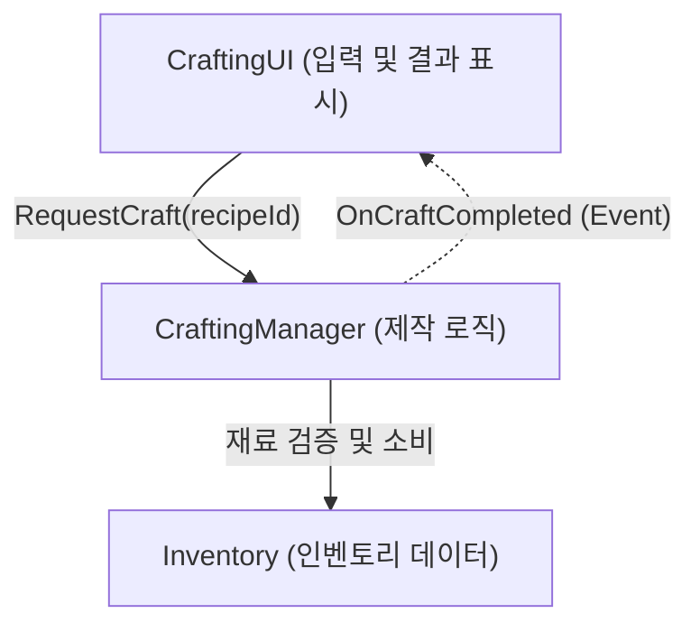

# 🎮 Game Client Developer Portfolio Hub

본 저장소는 유니티(Unity) 게임 클라이언트 개발자로서 설계한 아키텍처, 구현한 핵심 기능, 그리고 기술 문서들을 한눈에 확인하실 수 있는 포트폴리오 허브입니다.

---

## 👤 Profile
* **이름**: [사용자 이름 입력] (Game Client Developer)
* **연락처**: [이메일 / 연락처 입력]
* **GitHub**: [깃허브 프로필 링크 입력]
* **블로그**: [기술 블로그 링크 입력]

---

## 🛠 Core Tech Stack
* **Engine & Language**: Unity (2022.3 LTS), C# (10.0)
* **Architecture**: SOLID, OOP, 이벤트 기반 아키텍처, DIP (의존성 역전 원칙)
* **Graphics & UI**: UGUI, Tailwind CSS (Web UI)
* **Tools**: Git, GitHub Actions (Pages 배포 자동화), Mermaid (다이어그램 설계)

---

## 🗺 Portfolio Navigation (주요 산출물)

아래 링크를 클릭하여 상세 기술 문서 및 발표 자료를 즉시 확인하실 수 있습니다. *(로컬 실행 시 웹 서버 환경 필요)*

1. 📖 **[기술 문서 가이드 본문 (On-site Reader)](guide.html)**
   - 프로젝트 설계, 아키텍처 원칙, SOLID 설계에 대한 상세 가이드 리더.
2. 📊 **[기술 문서 레이아웃 쇼케이스 (13종)](showcase/index.html)**
   - 가독성을 극대화하기 위해 직접 컴포넌트화한 기술 문서용 13가지 레이아웃 패턴.
3. 🖥 **[인터랙티브 발표 슬라이드 (React UMD)](slides/deck.html)**
   - 면접 및 기술 발표용으로 제작된 React 기반 웹 슬라이드 덱 (방향키 조작 가능).

---

## 🚀 대표 프로젝트: 확률 기반 아이템 크래프팅 시스템
* **구현 기간**: 2025.06 ~ 2025.07
* **핵심 목표**: UI와 게임 비즈니스 로직을 완벽히 분리하고, 확률 판정 경로의 100% 단위 테스트 커버리지 달성.

### 1. 시스템 구조 (DIP & Event-Driven)
제작 요청은 `UI -> ICraftingService(Interface) -> CraftingManager -> Inventory` 형태로 안전하게 전달되며, 처리 결과는 이벤트를 통해 역전파됩니다.

### 2. 핵심 설계 판단 (Trade-offs)
* **이벤트 기반 통보**: `CraftingManager`가 UI를 직접 참조하지 않도록 하여 결합도를 낮추었습니다. 결과 통보 대상을 쉽게 늘릴 수 있습니다.
* **의존성 주입**: 확률 판정 기능(`roll()`)을 주입받아 작동하게 하여, 난수 발생 결과를 테스트 코드에서 제어할 수 있게 제작했습니다.

---

## 📁 디렉토리 구조
* [`/src`](src): 기술 문서 가이드 마크다운 소스 코드
* [`/showcase`](showcase): 13종 레이아웃 쇼케이스 웹 소스
* [`/slides`](slides): 발표 슬라이드(React 기반) 소스
* [`guide.html`](guide.html): 마크다운 파일 렌더링용 리더 뷰어
* [`index.html`](index.html): 포트폴리오 메인 랜딩 허브 페이지
