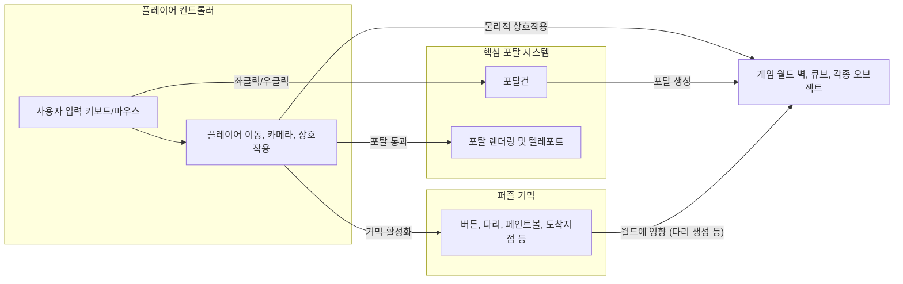
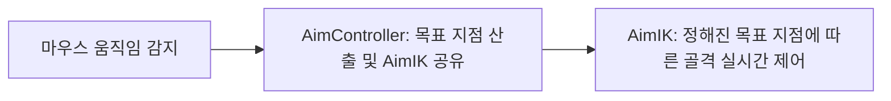
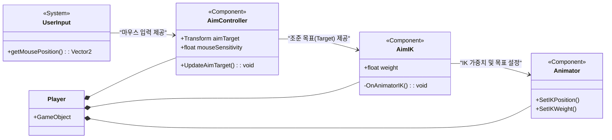
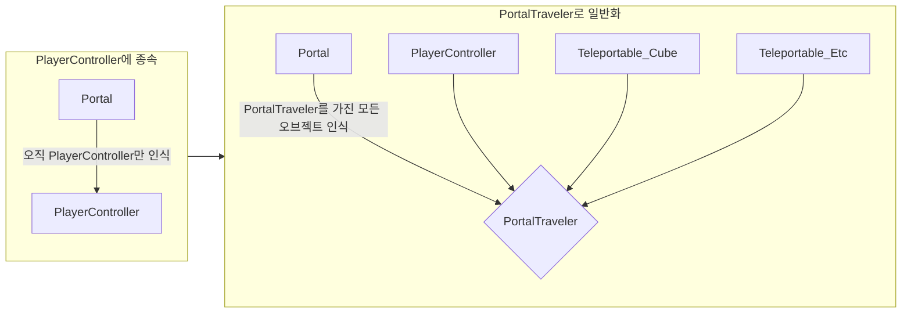
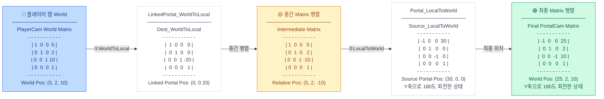
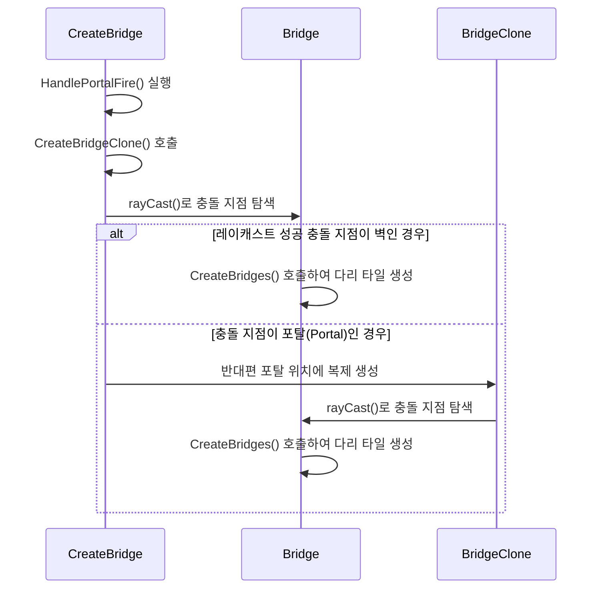
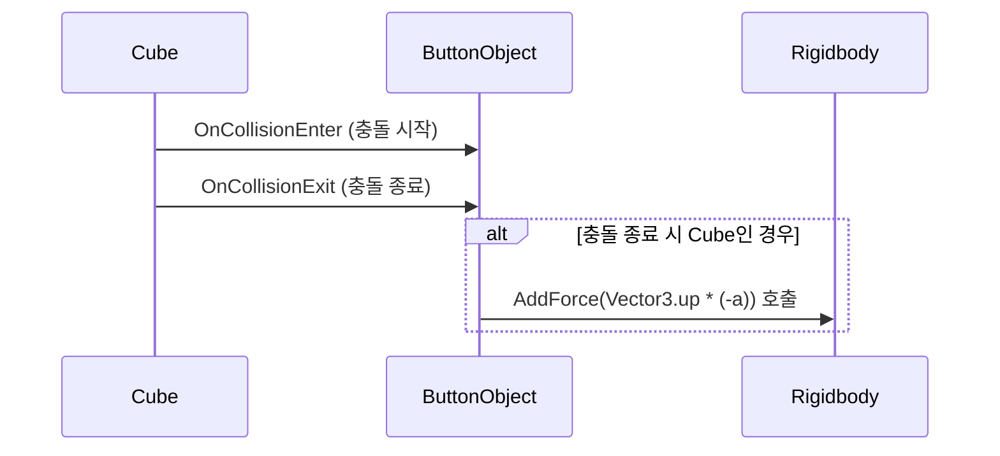

# Portal Lab
### 유니티 엔진 기반 포탈 물리 메커니즘 및 렌더링 최적화 3D 구현 프로젝트

<!-- link-github: https://github.com/WhiteAppleKo/3D-Portal-Project -->
<!-- link-video: https://youtube.com/watch?v=xeFMcETvBb4&feature=youtu.be -->

<div class="meta-grid">
  <div class="meta-item">
    <div class="meta-label">제작 인원</div>
    <div class="meta-val">1인 (개인 프로젝트)</div>
  </div>
  <div class="meta-item">
    <div class="meta-label">개발 기간</div>
    <div class="meta-val">2025.04.13 - 2025.04.30 (18일)</div>
  </div>
  <div class="meta-item">
    <div class="meta-label">핵심 스택</div>
    <div class="meta-val">Unity / C# / Matrix4x4 / Shader / IK</div>
  </div>
</div>

## 1. 개요

### 1.1. 프로젝트 정의 및 배경
* **R&D 배경**: 원작 포탈의 기하학적 공간 이동 연출을 Unity 엔진 환경에서 완벽하게 재현하기 위해 진행한 R&D 모작 프로젝트입니다.
* **핵심 기능**: 기존 트리거 충돌체 기반 순간이동의 프레임 단절 결함과 카메라 오프셋 회전 시의 시각 왜곡 결함을 벡터 기하학(내적 판정) 및 Matrix4x4 대칭 회전 변환 행렬식을 주입하여 심리스한 연출로 극복했습니다.
* **문서의 기술 범위**: 본 문서는 특정 핵심 기믹에 국한되지 않고, 조준 IK 제어, 순간이동 물리, 거울 시점 렌더링 최적화 및 씬 전환을 포함하는 프로젝트 전체 아키텍처 사양을 포괄하여 소개합니다.

<br>

### 1.2. 프로젝트 R&D 기술 매핑 목차
| 장 번호 | 핵심 R&D 주제 | 구현 방식 및 기술 수단 |
| :--- | :--- | :--- |
| **02. Player & IK** | 역운동학 기반 조준선 상체 회전 보정 | AimController 조준점 갱신 및 유니티 OnAnimatorIK 척추/목 가중치 보간 제어 |
| **03. Portal Physics** | 심리스 공간 통과 판정 및 운동 보존 | 오프셋-법선 벡터 내적(Dot Product) 부호 교차 감지 및 리지드바디 물리 속도 선형 회전 변환 |
| **04. Rendering** | 거울형 시각 대칭 동기화 및 최적화 | Matrix4x4 거울 반사 변환 행렬 곱 연산 및 GeometryUtility AABB Bounds Frustum Culling |
| **06. Puzzle Gimmick** | 포탈 경유 연쇄 기믹 및 심리스 씬 전환 | 연쇄 레이캐스트 다리 가교, 발밑 바닥 bilinear 픽셀 해독, 더미 씬 후면 선배치 로드 |

<br>

### 1.3. 전체 시스템 아키텍처 (System Architecture)
플레이어 캐릭터의 조준선 제어 모듈과 포탈 물리/렌더링 동기화 모듈이 서로 유기적으로 작동하는 전체 구조도입니다.



---

## 2. Player System & Inverse Kinematics (역운동학)

### 2.1. 원작 분석 및 구현 목표
원작 포탈에서는 플레이어의 포탈건 조준선(Aim) 높낮이에 따라 캐릭터의 상체가 매우 자연스럽게 회전하고 움직이는 물리적 연출을 보여줍니다. 본 모작 구현에서도 포탈을 통해 실시간으로 비치는 플레이어의 모습이 조준점 위치에 대응하여 유연하게 동적 상체 보정이 이루어지도록 Inverse Kinematics(IK)를 적용하여, 플레이어 조준 각도에 맞춰 상체 회전과 자세 변화가 유기적으로 보정되는 시각 피드백 확보를 최종 구현 목표로 설정했습니다.



### 2.2. AimIK 시스템 아키텍처 및 구현 결과
* **Aim Controller**: 마우스 조준 트래킹에 따라 가상의 월드 좌표 조준점(`aimTarget`) 정보를 갱신하고 AimIK와 연동합니다.
* **AimIK**: 인스펙터 상에서 실시간 제어 대상을 정밀 제어하기 위해 골격을 직접 추가하거나 제거할 수 있으며, Aim Controller에서 전달받은 목표 지점에 맞춰 골격의 상체 회전을 실시간 제어 보정합니다.

  <div>
    <p style="text-align: center; font-weight: bold; margin-bottom: 8px;">AimIK 클래스 의존 관계도</p>


  </div>

---

## 3. Portal System - Teleport & Core Physics

### 3.1. 내적(Dot Product) 기반 물리 통과 판정

물체의 이전 프레임 오프셋 내적 결과와 현재 프레임 내적 결과의 부호 변화를 연속적으로 대조해 경계 통과 시점을 프레임 유실 없이 판정합니다. 기존의 트리거 충돌 판정 대비 성능 과부하가 없으며 매끄러운 통과 연출을 보장합니다.

```csharp
// 플레이어 및 물체의 포탈 중심 상대 거리 **벡터 내적 판정 연산식**
Vector3 offsetFromPortal = travellerT.position - transform.position;
int portalSide = System.Math.Sign(Vector3.Dot(offsetFromPortal, transform.forward));
int portalSideOld = System.Math.Sign(Vector3.Dot(traveller.previousOffsetFromPortal, transform.forward));

// **[임계 통과 판정]** 포탈 면을 지나는 순간 부호 변화 검출
if (portalSide != portalSideOld) {
    traveller.Teleport(transform, linkedPortal.transform, m.GetColumn(3), m.rotation);
}
```

### 3.2. 의존성 결합 완화 및 Traveler 일반화
* **Before (강한 결합 및 책임 초과)**: 초기 텔레포트 로직이 `PlayerController` 클래스 내에 하드코딩되어 작동하여 의존성이 매우 높았습니다. 이로 인해 상자(Cube)나 공 등 플레이어 외의 물리 객체를 포탈에 통과시키려면 통과 로직 스크립트를 중복 작성해야 하는 치명적인 확장성 결함이 있었습니다.
* **After (PortalTraveler 범용화)**: 포탈 통과에 필요한 핵심 로직을 담은 범용 컴포넌트인 **`PortalTraveler`** 클래스를 별도 분리 설계했습니다. `Portal`은 대상이 `PortalTraveler` 컴포넌트를 지니고 있는지 여부만 판단하며, 결합도가 완화되어 임의의 물리 객체에 해당 컴포넌트만 부착하면 코드 한 줄 수정 없이 포탈 이동이 가능합니다.



### 3.3. 운동량(Velocity) 보존 법칙
포탈을 통과하는 순간 물체의 기존 가속 속도(Speed)와 궤적 방향을 그대로 유지하고 튕겨 나가도록 리지드바디의 속도 벡터($v_{velocity}$)를 입출구 포탈 회전 행렬 곱 연산에 대입하여 선형 회전 변환을 수행합니다.
<div class="content-grid vertical">
  <div>

```csharp
// **[운동 에너지 보존]** 리지드바디 트랜스폼 및 속도 벡터의 선형 회전 변환 순간이동
public virtual void Teleport (Transform fromPortal, Transform toPortal, Vector3 pos, Quaternion rot) {
    transform.position = pos;
    transform.rotation = rot;
    
    if (rb != null) {
        rb.velocity = toPortal.TransformDirection(fromPortal.InverseTransformDirection(rb.velocity));
    }
}
```
  </div>
  <div class="image-card">
    
  </div>
</div>

---

## 4. Portal System - Rendering & Optimization

### 4.1. Matrix4x4 변환 행렬 기반 뷰 동기화
플레이어가 바라보는 시점에 맞춰 반대편 출구 포탈에 위치한 가상 카메라(Portal Camera)가 월드를 정확히 매칭 렌더링해야 일그러짐 없는 거울형 공간 착시를 완성할 수 있습니다. 

초기에는 단순히 위치 오프셋(입구 포탈과의 상대 거리) 계산에 의존했으나, 포탈이 회전하거나 기울어질 때 시야가 왜곡되는 심각한 시각적 오류가 발생했습니다. 이를 **거울 반사 변환 행렬(Reflection Matrix)** 계산을 응용한 행렬 결합식으로 완전히 해결했습니다.

```csharp
// **[핵심 알고리즘]** Matrix4x4 좌표계 선형 회전 변환 행렬 곱 연산 구현부
Matrix4x4 localToWorldMatrix = playerCam.transform.localToWorldMatrix;
for (int i = 0; i < recursionLimit; i++) {
    if (i > 0) {
        // **[조기 차단]** 포탈이 서로를 비추고 있는 상황이 아니라면 반복을 중단 (오버헤드 방지)
        if (!CameraUtility.BoundsOverlap (screenMeshFilter, linkedPortal.screenMeshFilter, portalCam)) {
            break;
        }
    }
    // **[대칭 행렬곱]** 현재 포탈의 로컬 좌표계를 연결된 포탈의 로컬 좌표계로 실시간 회전 대칭 변환
    localToWorldMatrix = transform.localToWorldMatrix * linkedPortal.transform.worldToLocalMatrix * localToWorldMatrix;

    int renderOrderIndex = recursionLimit - i - 1;
    // 변환 행렬에서 위치(Position) 정보 GetColumn(3)와 회전(Rotation) 정보를 추출하여 적용
    renderPositions[renderOrderIndex] = localToWorldMatrix.GetColumn (3);
    renderRotations[renderOrderIndex] = localToWorldMatrix.rotation;

    portalCam.transform.SetPositionAndRotation (renderPositions[renderOrderIndex], renderRotations[renderOrderIndex]);
    startIndex = renderOrderIndex;
}
```

#### 📐 좌표계 변환 행렬 곱 연산 순서
1. **WorldToLocal**: 월드 공간의 플레이어 카메라 트랜스폼 정보를 출구 포탈의 로컬 좌표계 공간으로 가압축 변환합니다. 플레이어 카메라가 출구 포탈을 기준으로 어느 각도와 거리에 위치하는지 로컬 상대 좌표를 획득합니다.
2. **LocalToWorld**: 앞서 1단계에서 계산된 로컬 상대 트랜스폼 좌표를 현재 입구 포탈의 로컬 좌표계 공간에 대칭 매핑한 뒤, 이를 다시 월드 좌표계 공간으로 곱하여 복원 확장합니다.
   `localToWorldMatrix = transform.localToWorldMatrix * linkedPortal.transform.worldToLocalMatrix * localToWorldMatrix;`



<p style="text-align:center; font-size:0.85rem; color:#4B5563; margin: 16px 0 12px;">
  <strong>PC</strong> = 플레이어 캠 &nbsp;|&nbsp; <strong>O1</strong> = LinkedPortal_WorldToLocal &nbsp;|&nbsp; <strong>O2</strong> = SourcePortal_LocalToWorld
</p>

<div style="display:flex; gap:16px; margin:16px 0; font-family:var(--font-sans);">
  <div style="flex:1; border:1px solid #E5E7EB; border-radius:10px; padding:16px 20px; background:#F9FAFB; font-size:0.88rem;">
    <p style="font-weight:700; margin-bottom:10px; color:#111827;">① 중간 결과 = O1 × PC</p>
    <table style="width:100%; border-collapse:collapse; font-family:var(--font-mono);">
      <tr><td style="padding:2px 8px; color:#4B5563;">x = (1 × 5) + 0</td><td style="padding:2px 8px; font-weight:700; color:#2563EB;">x = 5</td></tr>
      <tr><td style="padding:2px 8px; color:#4B5563;">y = (1 × 2) + 0</td><td style="padding:2px 8px; font-weight:700; color:#2563EB;">y = 2</td></tr>
      <tr><td style="padding:2px 8px; color:#4B5563;">z = (1 × 10) + (−20)</td><td style="padding:2px 8px; font-weight:700; color:#2563EB;">z = −10</td></tr>
    </table>
  </div>
  <div style="flex:1; border:1px solid #E5E7EB; border-radius:10px; padding:16px 20px; background:#F9FAFB; font-size:0.88rem;">
    <p style="font-weight:700; margin-bottom:10px; color:#111827;">② 최종 결과 = O2 × 중간 결과</p>
    <table style="width:100%; border-collapse:collapse; font-family:var(--font-mono);">
      <tr><td style="padding:2px 8px; color:#4B5563;">x = (−1 × 5) + 30</td><td style="padding:2px 8px; font-weight:700; color:#2563EB;">x = 25</td></tr>
      <tr><td style="padding:2px 8px; color:#4B5563;">y = (1 × 2) + 0</td><td style="padding:2px 8px; font-weight:700; color:#2563EB;">y = 2</td></tr>
      <tr><td style="padding:2px 8px; color:#4B5563;">z = (−1 × −10) + 0</td><td style="padding:2px 8px; font-weight:700; color:#2563EB;">z = 10</td></tr>
    </table>
  </div>
</div>

### 4.2. Frustum Culling 시야 검출 최적화
포탈의 렌더링 카메라는 실시간 Render Texture를 연산하므로 다량의 드로우콜 병목을 동반합니다. 플레이어가 포탈의 단면을 보지 않을 때는 렌더링 연산을 완전히 생략하도록 Bounding Box 기반 Frustum Culling(시야 절두체 선별) 최적화 알고리즘을 작성했습니다.

```csharp
// **[드로우콜 최적화]** GeometryUtility AABB Bounds 교차 검증을 통한 시야 범위 판정식
public static bool VisibleFromCamera (Renderer renderer, Camera camera) {
    Plane[] frustumPlanes = GeometryUtility.CalculateFrustumPlanes (camera);
    return GeometryUtility.TestPlanesAABB (frustumPlanes, renderer.bounds);
}
```

### 4.3. recursionLimit를 활용한 무한 재귀 방어
입출구 포탈이 서로 마주보게 설치될 경우, 두 가상 카메라가 거울 속 거울처럼 무한히 루프 렌더링하여 프레임이 0으로 떨어지며 붕괴합니다. 이를 위해 인스펙터 제어 변수 <code>recursionLimit</code> 한계 값(기본 2~3회)을 설정하고, 한계에 도달하면 검은색 단면 텍스처로 렌더 카운트를 강제 종료해 안전망을 구축했습니다.

```csharp
// **[무한 재귀 방어]** 재귀 제한 카운터 크기 캐싱 및 프로젝션 행렬 동기화 셋업
Vector3[] renderPositions = new Vector3[recursionLimit];
Quaternion[] renderRotations = new Quaternion[recursionLimit];

int startIndex = 0;
portalCam.projectionMatrix = playerCam.projectionMatrix;

Matrix4x4 localToWorldMatrix = playerCam.transform.localToWorldMatrix;
for (int i = 0; i < recursionLimit; i++) {
    if (i > 0) {
        // **[조기 차단]** 포탈이 서로를 비추고 있는 상황이 아니라면 반복을 중단 (오버헤드 방지)
        if (!CameraUtility.BoundsOverlap (screenMeshFilter, linkedPortal.screenMeshFilter, portalCam)) {
            break;
        }
    }
    // **[대칭 행렬곱]** 현재 포탈의 로컬 좌표계를 연결된 포탈의 로컬 좌표계로 실시간 회전 대칭 변환
    localToWorldMatrix = transform.localToWorldMatrix * linkedPortal.transform.worldToLocalMatrix * localToWorldMatrix;

    int renderOrderIndex = recursionLimit - i - 1;
    // 변환 행렬에서 위치(Position) 정보 GetColumn(3)와 회전(Rotation) 정보를 추출하여 적용
    renderPositions[renderOrderIndex] = localToWorldMatrix.GetColumn (3);
    renderRotations[renderOrderIndex] = localToWorldMatrix.rotation;

    portalCam.transform.SetPositionAndRotation (renderPositions[renderOrderIndex], renderRotations[renderOrderIndex]);
    startIndex = renderOrderIndex;
}
```

### 4.4. GraphicsClone 및 셰이더 단면 클리핑
물체가 포탈 경계를 넘어가는 동안 절반은 이쪽 포탈에, 나머지 절반은 저쪽 포탈에 온전히 묘사되어야 공간 연속성을 완성할 수 있습니다. <code>GraphicsClone</code> 복제체를 대칭 생성함과 동시에, 게이트 단면의 월드 위치(<code>sliceCentre</code>)와 법선 벡터(<code>sliceNormal</code>)를 셰이더에 넘겨 평면 뒤의 픽셀을 <code>clip()</code> 함수로 강제 Discard 처리합니다.

```hlsl
// **[픽셀 클리핑 셰이더]** HLSL fragment shader clip 단면 렌더링 소거 연산
half4 frag(Varyings i) : SV_Target
{
    float3 adjustedCentre = sliceCentre + sliceNormal * sliceOffsetDst;
    float3 offsetToSliceCentre = adjustedCentre - i.worldPos;

    // [실시간 소거] 슬라이스 기준면 음수 영역 픽셀 즉시 제외
    clip(dot(offsetToSliceCentre, sliceNormal));
    half4 c = tex2D(_MainTex, i.uv) * _Color;
    return c;
}
```

---

## 5. 고민과 선택 (Trade-offs): 대안 비교 및 결정 근거

### 5.1. 고민 1: 포탈 물리 통과 판정 방식 선택
* **대안 A (유니티 Trigger Collider)** vs **대안 B (Dot Product 벡터 내적 판정)**

| 기술 대안 | 장점 (Pros) | 단점 (Cons) | 선택 여부 및 Rationale |
| :--- | :--- | :--- | :--- |
| **대안 A (Collider)** | 구현 난이도가 낮으며, 내장 물리 시스템을 재활용하므로 빠르고 간편함. | 프레임 밀림 현상 발생. 포탈 경계면에 오브젝트가 걸쳐 통과하는 시각 마스킹 구현 불가. | ❌ 폐기 |
| **대안 B (Dot Product)** | 프레임 유실이 전혀 없음. 매 프레임 기하학적 평면 교차를 검출하므로 걸침 연출 가능. | 매 프레임 Vector 내적 연산 리소스 추가 소비. | ⭕ **최종 채택** (60fps 보장 및 심리스 물리 구현 목적) |

### 5.2. 고민 2: 뷰 카메라 위치 동기화 알고리즘
* **대안 A (상대 좌표 거리 오프셋)** vs **대안 B (Matrix4x4 거울 반사 변환 행렬곱)**

| 기술 대안 | 장점 (Pros) | 단점 (Cons) | 선택 여부 및 Rationale |
| :--- | :--- | :--- | :--- |
| **대안 A (상대 오프셋)** | 단순 벡터 뺄셈과 덧셈으로만 구현 가능하여 수식 연산 부담이 거의 없음. | 포탈이 기울어지거나 회전되어 있을 때 뷰 각도가 꼬여 렌더 텍스처 왜곡 붕괴. | ❌ 폐기 |
| **대안 B (Matrix4x4)** | 포탈이 90도 회전하거나 뒤집혀 있어도 완벽한 1:1 대칭 시점 렌더링 보장. | 행렬 연산 곱셉 2회로 인한 수학적 연산 오버헤드 소량 발생. | ⭕ **최종 채택** (다양한 공간 구조의 레벨 디자인 지원을 위한 필수 선택) |

### 5.3. 고민 3: 텔레포트 관리 아키텍처 의존성 설계
* **대안 A (PlayerController 내 하드코딩)** vs **대안 B (PortalTraveler 범용 컴포넌트 설계)**

| 기술 대안 | 장점 (Pros) | 단점 (Cons) | 선택 여부 및 Rationale |
| :--- | :--- | :--- | :--- |
| **대안 A (하드코딩)** | 단일 파일 관리로 빠른 초기 프로토타입 작성 가능. | 다른 오브젝트(큐브 상자 등) 통과 시 스크립트를 복사 중복 작성해야 하여 결합도 증가. | ❌ 폐기 |
| **대안 B (Traveler)** | SRP(단일책임) 및 확장성 만족. 새로운 사물에 컴포넌트 부착 시 코드 수정 없이 통과. | 컴포넌트 조회(`GetComponent`) 등으로 인한 런타임 캐싱 기법 사전 설계 필요. | ⭕ **최종 채택** (다채로운 퍼즐 기믹과의 확장성 보장을 위해 채택) |

---

## 6. 퍼즐 기믹 및 공간 연속성 UX 개선

### 6.1. 레이캐스트 연쇄 가교(Bridge) 설치 기믹
플레이어가 발사한 가교 형성 광선이 포탈에 부딪힐 경우, 입구 포탈에서 광선의 입사각과 충돌 벡터를 계산한 뒤 출구 포탈에서 연쇄적으로 두 번째 레이캐스트를 발사하여 최종 벽면을 감지하고 끊김 없이 다리 구조를 연결하는 연쇄 가교 기믹입니다.



---

### 6.2. 발밑 픽셀 감지 스탯 변경 페인트볼 기믹
플레이어 발밑 수직 방향으로 실시간 레이캐스트 광선을 발사해 바닥 재질 머티리얼의 UV 좌표 픽셀 컬러 정보를 런타임에 획득(<code>GetPixelColorAtRayHit</code>)하고, 그 색상 결과(R, G, B 각각의 값)를 조건부로 검사해 플레이어의 이동 속도 및 점프력 스탯을 실시간으로 변경하는 기믹입니다.
※ 단, 해당 레이캐스트 및 감지 연산은 페인트볼 기믹이 등장하는 특정 스테이지에서만 제한적으로 활성화되어 동작합니다.

---

### 6.3. 물리 트리거 버튼 기믹
상자 큐브 오브젝트가 버튼 감지 실린더 위에 얹어질 때만 실질적인 트리거가 활성화되며, 이탈 시 복원 스프링 모션과 함께 비활성화됩니다. '트리거', '버튼', '큐브' 3개의 태그 검사를 통해 부정 상호작용을 방지합니다.



---

### 6.4. 더미 스테이지 기법을 통한 심리스 씬 전환
비동기 씬 로드 및 맵 전환 시 발생하는 급격한 프레임 드랍과 화면 블랙아웃을 감추기 위해, 다음 구역의 트랜스폼 및 메쉬 더미 클론들을 포탈 게이트 후면에 선배치 렌더링하는 "더미 스테이지(Dummy Stage)" 기법을 도입하여 끊김 없는 공간 몰입감을 연속 제공합니다.

#### 📐 고민 4: 씬 로드 방식 비교
* **대안 A (비동기 로딩 바 화면 전환)** vs **대안 B (더미 스테이지 선배치 심리스 전환)**

| 기술 대안 | 장점 (Pros) | 단점 (Cons) | 선택 여부 및 Rationale |
| :--- | :--- | :--- | :--- |
| **대안 A (로딩 바)** | 메쉬 복제 공간 배치가 필요 없어 리소스 관리가 쉬움. | 순간이동 장르 고유의 심리스 연속성 몰입감 훼손. | ❌ 폐기 |
| **대안 B (더미)** | 시각적 연속성이 100% 보장되어 최고의 UX 제공. | 다음 스테이지 더미 메쉬 배치로 인한 메모리 일시 점유율 증가. | ⭕ **최종 채택** |

---

## 7. 결과 및 배운 점 (Retrospective): 경험의 자산화

### 7.1. 성능 검증 및 최적화 성과
* **Frustum Culling 기반 카메라 렌더 성능 선별**:
  - **도입 전**: 플레이어가 포탈의 반대 단면을 바라보고 있지 않은 대기 상태나 벽 등판 뒤에서도 가상 카메라 렌더텍스처 연산이 백그라운드에서 매 프레임 상시 구동되어 불필요한 GPU 렌더 패스 및 드로우콜 낭비가 발생함.
  - **도입 후**: <code>GeometryUtility</code> 평면 교차 검증을 도입하여 카메라 시야 범위 내에 포탈 스크린 메쉬 렌더러의 Bounding Box가 겹치지 않는 노출 스킵 대상일 경우, 포탈 카메라 렌더링을 차단하여 불필요한 렌더 연산 누적을 사전에 완벽히 차단함.

### 7.2. 기술 부채 (Limitations) 및 개선 계획
* **고속 낙하 터널링 물리 결함**:
  - **원인**: 수직 낙하 반복을 통해 가속도가 한계 속도(Terminal Velocity)를 초과할 경우, 한 프레임의 이동 거리가 포탈 평면 콜라이더의 두께를 앞질러 내적 부호 교차 판정이 씹히고 바닥에 박혀 죽는 터널링 버그가 발견되었습니다.
  - **개선 계획 (✓ / △ / →)**:
    - **✓ 달성한 성과**: 내적 기반 공간 관통 판정 성공, 드로우콜 낭비 연산 절감, 재귀 렌더링 한계선 및 더미 씬 로드 적용.
    - **△ 한계점**: 물리 프레임 주기를 초과하는 극단적 고속 통과 시 충돌 스킵 현상 존재.
    - **→ 향후 계획**: 차기 버전에서 유니티 <code>Continuous Dynamic</code> 충돌 감지 모드를 활성화하고, 매 프레임 포탈 중심선 방향으로 <code>BoxCastAll</code> 물리 소인(Sweeping) 판정식을 보강하여 터널링을 차단할 예정.
