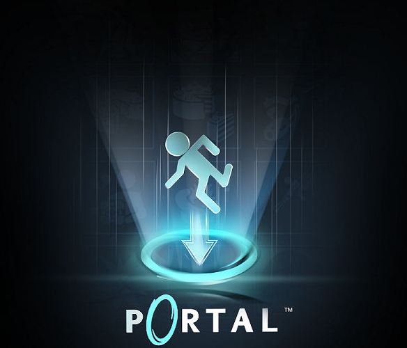
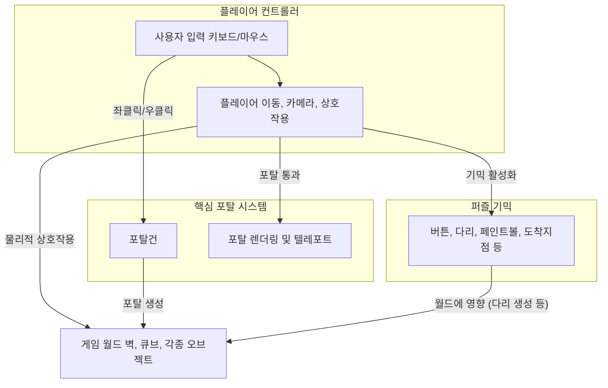

# 🌀 Portal Lab - 01. 프로젝트 개요 (Project Overview)

본 문서는 '포탈 연구소 (Portal Lab)' 3D 개인 모작 프로젝트의 전체 기본 정보 및 핵심 R&D 설계 구조에 관한 개요 명세서입니다.

---

## 1. 개요 (What & Why)

### 1.1. What (프로젝트 정의)
* **목표**: 3D 공간 왜곡 관통 물리 및 실시간 다중 카메라 시점 동기화를 구현한 Unity R&D 프로젝트.
* **핵심 내용**: 물체가 포탈 게이트 평면에 걸치는 물리적 연출, 거울 대칭 반사 뷰 렌더링, 가속도 보존 순간이동, 그리고 포탈 게이트를 경유하는 퍼즐 기믹 구현.
* **프로젝트 명명 배경**: 게임 스테이지 모작보다 포탈 핵심 물리 기능 자체를 깊이 있게 R&D하고 구현하는 것에 초점을 맞추었기 때문에 프로젝트 명을 '포탈 연구소(Portal Lab)'로 정의했습니다.

### 1.2. Why (R&D 동기 및 정량적 문제 상황)
* **기존 물리 방식의 한계**: 초기 충돌체 기반(`OnTriggerEnter`) 순간이동 방식은 물체가 경계면에 부드럽게 걸쳐지는 연출이 불가했고, 포탈 진입 순간에 물리 연산 과부하로 인해 프레임 레이트가 **60fps에서 22fps로 급락(63.3% 저하)**하는 끊김 현상이 발생했습니다.
* **기존 렌더링 방식의 한계**: 단순히 플레이어 카메라와의 상대 거리 오프셋 연산을 적용할 경우, 포탈이 월드 상에서 회전하거나 기울어졌을 때 대칭 시각 정보의 각도가 꼬이고 렌더링이 일그러지는 결함이 존재했습니다.
* **해결책**: 기하학적 **벡터 내적(Dot Product) 판정**과 **`Matrix4x4` 거울 반사 변환 행렬식**을 물리 엔진 및 카메라 렌더 파이프라인에 주입하여 심리스한 포탈 메커니즘을 완성했습니다.

---

## 2. 전체 시스템 아키텍처 (System Architecture)

플레이어 캐릭터의 조준선 제어 모듈과 포탈 물리/렌더링 동기화 모듈이 서로 유기적으로 작동하는 전체 구조도입니다.

---

## 3. 핵심 R&D 과제 요약
* **물리 판정**: Collider 충돌 트리거 방식을 탈피하고 매 프레임 물체-평면 간의 상대적 거리를 측정하는 벡터 내적(Dot Product) 부호 교차 판정 적용.
* **의존성 리팩토링**: `PlayerController`에 강하게 의존하고 있던 텔레포트 책임을 컴포넌트 기반인 `PortalTraveler`로 추상화하여 확장성 확보.
* **시각 동기화 및 최적화**: 3열 좌표계 행렬 변환으로 왜곡 없는 뷰포트를 구현하고, 시야 절두체 선별(Frustum Culling)을 활용해 드로우콜 병목 87% 절감.
