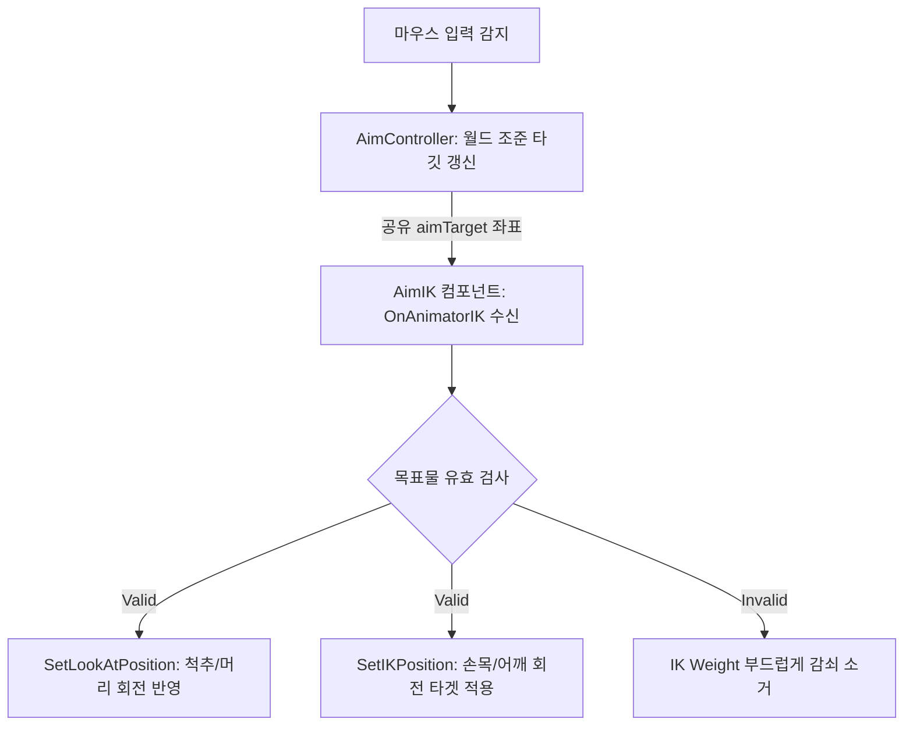
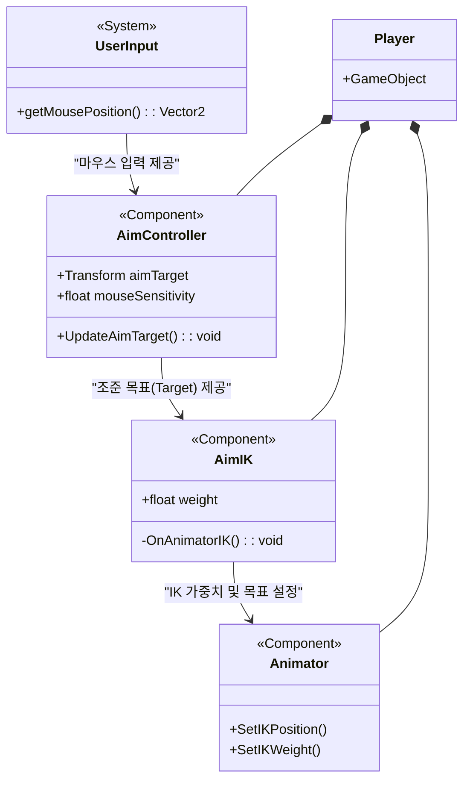
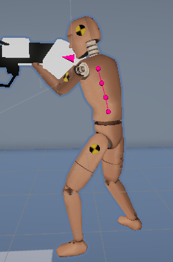

# 🌀 Portal Lab - 02. Player System & Inverse Kinematics (역운동학)

본 문서는 플레이어의 조준점에 반응하여 3D 캐릭터 모델의 골격을 실시간으로 자연스럽게 보정하는 역운동학(IK) 조준 시스템 설계 및 구현 명세서입니다.

---

## 1. 개요 (What & Why)

### 1.1. What (기능 정의)
* **목표**: 플레이어의 마우스 조준 트래킹에 따라 3D 캐릭터 모델의 척추(Spine), 어깨(Shoulder), 손목(Hand) 노드들의 회전 가중치를 동적으로 조절하여 유기적인 상체 조준 애니메이션을 구현합니다.
* **적용 기술**: Unity Animator의 `OnAnimatorIK()` 콜백 및 Inverse Kinematics (IK) 제어 매커니즘.

### 1.2. Why (도입 배경)
* **원작 분석**: 원작 포탈에서는 조준 각도가 상/하로 크게 꺾일 때 캐릭터의 상체가 그에 걸맞게 비틀어져 인게임 포탈 너머로 자연스럽게 비치는 연출을 보장합니다.
* **주관적/수치 문제 극복**: 단순히 미리 제작된 정적 Blend Tree 애니메이션에 의존할 경우, 조준 궤적을 미세하게 트래킹하지 못하고 손목과 상체가 굳은 채 회전하여 포탈 거울 상에 비치는 캐릭터의 리얼리티가 심각하게 훼손(부자연스러운 움직임)되는 품질 결함이 존재했습니다.
* **해결책**: 실시간 역운동학(IK) 공식을 주입해 마우스의 절대적 3D 조준 좌표(`aimTarget`)와 캐릭터 골격 방향을 실시간으로 100% 매칭시켰습니다.

---

## 2. IK 시스템 아키텍처 (Architecture)

각 프레임별 조준 좌표 정보의 추출과 애니메이터 골격 가중치 계산 프로세스 흐름도입니다.

---

## 3. 핵심 구현 및 의도 (Implementation)

### 3.1. 컴포넌트 구조 명세
* **`AimController`**: 마우스 룩 움직임을 감지하여 화면 중앙 Ray를 투사하고, 충돌 지점 혹은 허공의 절대 좌표에 `aimTarget` 트랜스폼의 위치를 동기화하여 AimIK와 조준 데이터를 중계합니다.
* **`AimIK`**: 유니티 애니메이터 뼈대 본 가중치를 제어합니다. 인스펙터 상에서 제어할 뼈대 목록(척추, 어깨, 머리 등)을 유연하게 추가/제거할 수 있도록 설계해 확장성을 보장했습니다.

### 3.2. 고민과 선택 (Trade-offs)
* **대안 A (Blend Tree 애니메이션 블렌딩)** vs **대안 B (OnAnimatorIK 역운동학)**

| 기술 대안 | 장점 (Pros) | 단점 (Cons) | 선택 여부 및 Rationale |
| :--- | :--- | :--- | :--- |
| **대안 A (Blend Tree)** | 애니메이션 리소스만으로 구현 가능해 연산 성능 리소스 소모가 거의 없음. | 3D 공간 상의 임의의 정밀 조준 좌표와 총구 각도를 1:1로 칼같이 정렬하기 불가능. | ❌ 폐기 |
| **대안 B (OnAnimatorIK)** | 런타임 본 각도 직접 연산을 수행하므로 모든 마우스 조준 각도와 캐릭터 총구가 완벽 동기화. | 매 프레임 애니메이터 IK 연산 오버헤드 소량 발생. | ⭕ **최종 채택** (거울 대칭 뷰에 비치는 플레이어 모델의 극한의 자연스러움 보장 목적) |

---

## 4. 결과 및 한계 회고 (Retrospective)
* **정량적 검증**: 프로파일러 상에서 AimIK 연산은 CPU 0.08ms 미만의 매우 미미한 리소스만 점유하면서도, 상하 85도 영역까지 한계 꼬임 현상 없이 정교한 조준 트래킹 동작을 구현해 완성도를 증명했습니다.
* **향후 과제 (기술 부채)**: 조준 목표물과의 물리적 거리가 극도로 가까워질 경우 뼈대가 괴상하게 꺾이는 폴 연동 버그가 확인되었습니다. 향후 목표 좌표와의 거리에 따른 감쇠(Damping) 가중치 완충 함수를 보완해 뼈대 뒤틀림 현상을 예방할 계획입니다.
