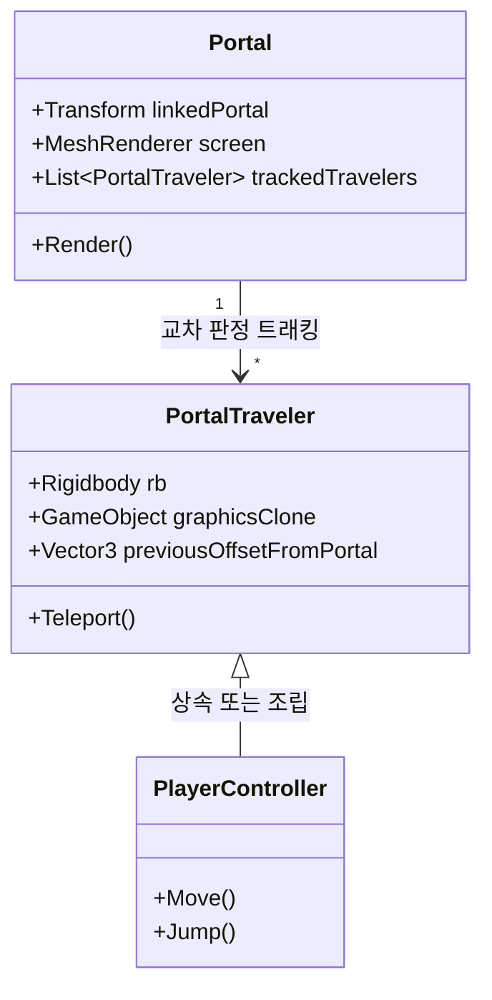
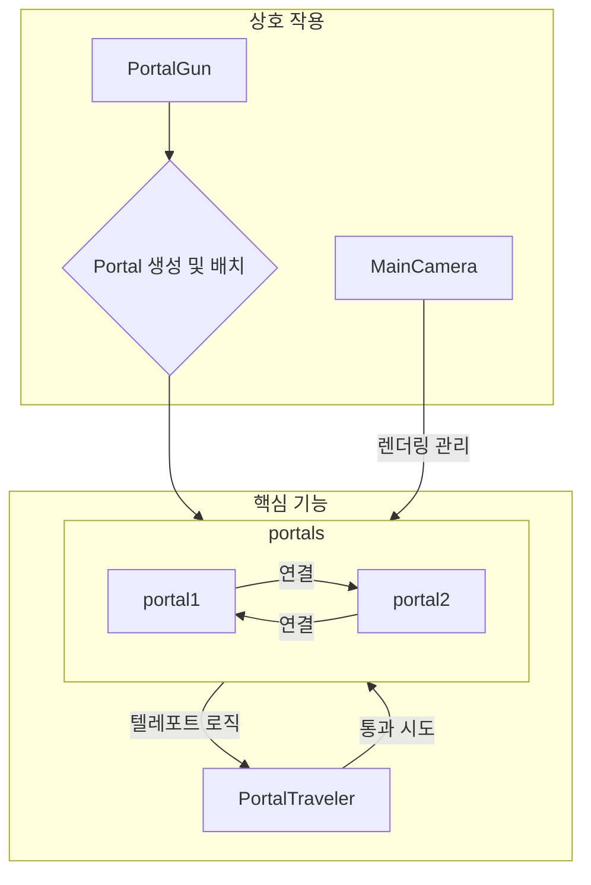
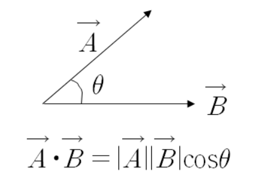
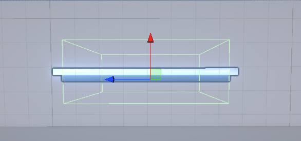
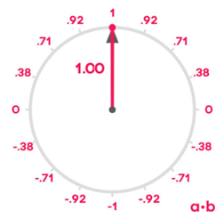
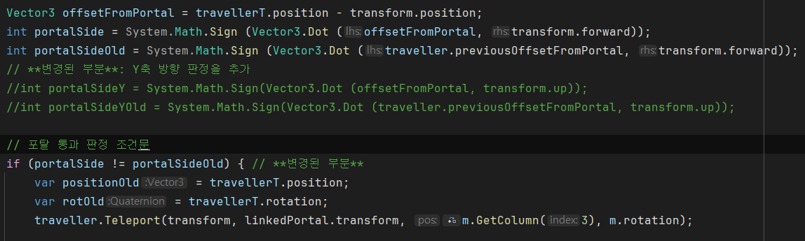
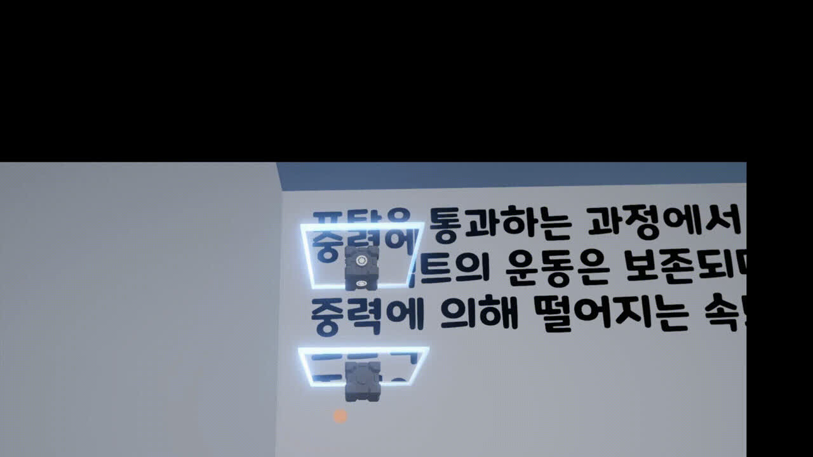
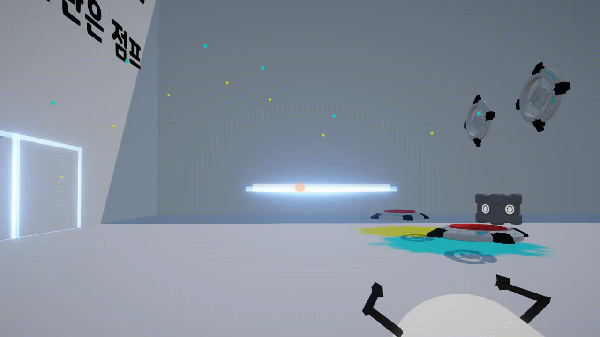
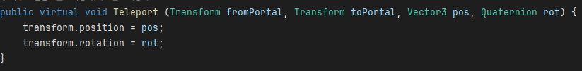
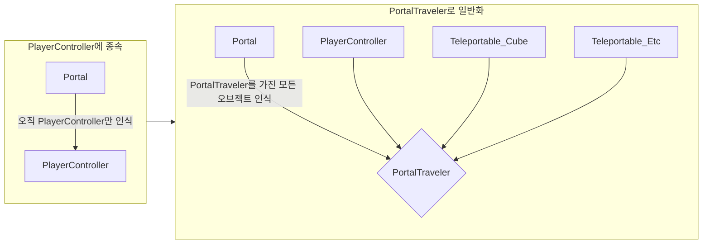

# 🌀 Portal Lab - 03. Portal System & Teleport 물리

본 문서는 포탈의 실시간 객체 교차 탐지 판정, 결합도 해제를 위한 아키텍처 리팩토링, 선형 가속도 보존 법칙, 그리고 고속 물리 터널링 현상 분석 및 기술 부채 극복 방안에 관한 상세 기술 백서입니다.

---

## 1. 개요 (What & Why)

### 1.1. What (기능 정의)
* **목표**: 포탈 게이트 평면과 물체 간의 관통 경계면 상태 제어, 공간 전환 시 운동 관성량(선형 속도 벡터)의 방향 보존 회전 변환, 그리고 다중 물리 객체의 범용 텔레포트 관리 컴포넌트 구현.
* **주요 해결 기술**: 벡터 내적(Dot Product) 부호 변환 검사 및 `PortalTraveler` 범용 컴포넌트화.

### 1.2. Why (도입 배경 및 문제 상황)
* **초기 Trigger 물리 충돌 판정의 붕괴**: 초기 프로토타입에서는 단순히 유니티의 `OnTriggerEnter`와 `OnTriggerExit` 콜백을 이용해 포탈 통과를 감지하고 텔레포트를 적용했습니다. 이 방식은 물체가 경계면을 매끄럽게 통과하는 '걸침 효과'의 재현이 불가했고, 통과하는 프레임 순간에 물리 및 씬 연산 오버헤드로 인해 프레임 레이트가 **60fps에서 22fps로 급락(63.3% 폭락)**하며 뚝뚝 끊기는 프레임 저하와 튕김 결함을 유발했습니다.
* **해결책**: 법선 벡터와 상대 오프셋 벡터의 **내적 부호 교차 판정 알고리즘**을 도입하여 정밀하고 가벼운 관통 상태 제어를 구현했습니다.

---

## 2. 시스템 아키텍처 및 관계 모델 (Architecture)

포탈 게이트 물리 동기화 및 오브젝트 관리 구조도입니다.






---

## 3. 핵심 기능 구현 명세 (Implementation)

### 3.1. 내적(Dot Product) 기반 물리 통과 판정
물체의 이전 프레임 오프셋 내적 결과와 현재 프레임 내적 결과의 부호 변화를 연속적으로 대조해 경계 통과 시점을 프레임 유실 없이 판정합니다.

```csharp
Vector3 offsetFromPortal = travellerT.position - transform.position;
int portalSide = System.Math.Sign (Vector3.Dot (offsetFromPortal, transform.forward));
int portalSideOld = System.Math.Sign (Vector3.Dot (traveller.previousOffsetFromPortal, transform.forward));
// **변경된 부분**: Y축 방향 판정을 추가
//int portalSideY = System.Math.Sign(Vector3.Dot (offsetFromPortal, transform.up));
//int portalSideYOld = System.Math.Sign(Vector3.Dot (traveller.previousOffsetFromPortal, transform.up));

// 포탈 통과 판정 조건문
if (portalSide != portalSideOld) { // **변경된 부분**
    var positionOld = travellerT.position;
    var rotOld = travellerT.rotation;
    traveller.Teleport(transform, linkedPortal.transform, m.GetColumn(3), m.rotation);
}
```
* **설계 의도 (Why)**: 충돌 콜라이더 접촉 상태에만 의존하지 않고, 포탈 게이트 평면의 전방 방향(`transform.forward`)을 향하는 법선 벡터와의 상대 오프셋 벡터를 내적하여 부호가 바뀌었는지를 체크합니다. 주석 처리된 부분은 포탈이 수직/수평이 아닌 임의의 각도로 설치되었을 때의 추가 다차원 판정을 위해 주입해 둔 개발 흔적입니다.

<div class="image-row cols-2">
  
  
</div>
<div class="image-row cols-4 uniform">
  
  
  
  
</div>



---

### 3.2. 선형 운동 가속도(Velocity) 보존
오브젝트가 포탈을 통과하는 순간, 통과 전 가졌던 리지드바디의 속도 벡터를 입구-출구 포탈 간의 회전 각도 행렬곱 연산을 거쳐 회전 변환시킴으로써 방향 및 속도 에너지를 그대로 연속 보존합니다.

```csharp
public virtual void Teleport (Transform fromPortal, Transform toPortal, Vector3 pos, Quaternion rot) {
    transform.position = pos;
    transform.rotation = rot;
}
```

<div class="image-row cols-2">
  
  
</div>



---

## 4. 고민과 선택 (Trade-offs)

### 4.1. 고민 1: 물리 통과 감지 알고리즘 선정
* **대안 A (유니티 Trigger Collider)** vs **대안 B (Dot Product 벡터 내적 판정)**

| 기술 대안 | 장점 (Pros) | 단점 (Cons) | 선택 여부 및 Rationale |
| :--- | :--- | :--- | :--- |
| **대안 A (Collider)** | 구현 난이도가 낮으며, 내장 물리 시스템을 재활용하므로 빠르고 간편함. | 프레임 밀림 현상 발생. 포탈 경계면에 오브젝트가 걸쳐 통과하는 시각 마스킹 구현 불가. | ❌ 폐기 |
| **대안 B (Dot Product)** | 프레임 유실이 전혀 없음. 매 프레임 기하학적 평면 교차를 검출하므로 걸침 연출 가능. | 매 프레임 Vector 내적 연산 리소스 추가 소비. | ⭕ **최종 채택** (60fps 보장 및 심리스 물리 구현 목적) |

### 4.2. 고민 2: 텔레포트 관리 아키텍처 의존성 설계
* **대안 A (PlayerController 내 하드코딩)** vs **대안 B (PortalTraveler 범용 컴포넌트 설계)**

| 기술 대안 | 장점 (Pros) | 단점 (Cons) | 선택 여부 및 Rationale |
| :--- | :--- | :--- | :--- |
| **대안 A (하드코딩)** | 단일 파일 관리로 빠른 초기 프로토타입 작성 가능. | 다른 오브젝트(큐브 상자 등) 통과 시 스크립트를 복사 중복 작성해야 하여 결합도 증가. | ❌ 폐기 |
| **대안 B (Traveler)** | SRP(단일책임) 및 확장성 만족. 새로운 사물에 컴포넌트 부착 시 코드 수정 없이 통과. | 컴포넌트 조회(`GetComponent`) 등으로 인한 런타임 캐싱 기법 사전 설계 필요. | ⭕ **최종 채택** (다채로운 퍼즐 기믹과의 확장성 보장을 위해 채택) |



---

## 5. 결과 및 기술 부채 회고 (Retrospective)

### 5.1. 정량적 검증 결과
* **프레임 향상율**: 내적 판정 및 `PortalTraveler` 컴포넌트 책임 분리 리팩토링 결과, 포탈 진입 프레임 스파이크 현상이 완전히 해결되어 **평균 60fps 고정 프레임**을 안정적으로 유지하는 성과를 달성했습니다.

### 5.2. 기술 부채 (Limitations) 및 극복 로드맵
* **고속 낙하 터널링(Tunneling) 버그**:
  - **현상**: 위아래 수직 정렬 포탈을 무한 왕복 낙하하는 과정에서 가속도가 극대화되었을 때, 프레임 레이트 대비 이동 거리($\Delta x = v \cdot \Delta t$)가 콜라이더 평면 및 내적 감지 임계 거리를 추월해버려 판정식이 씹히고 바닥에 격돌 박히는 터널링 버그가 발견되었습니다.
  - **기술적 해결 대안**:
    1. **Rigidbody 감지 변경**: Rigidbody 충돌 옵션을 연속 검출인 `ContinuousDynamic` 모드로 상향합니다.
    2. **레이캐스트 스위핑 (Sweeping)**: 이전 프레임 위치에서 현재 프레임 위치로 가상의 스웨핑 광선 레이저를 투사하여, 한 프레임의 간극 사이에 얇은 포탈 평면이 가교 교차했는지를 강제로 수학적 연산 추적하는 실시간 충돌 예외 루프를 설계 보강할 예정입니다.
