# 🌀 Portal Lab - 04. Portal 렌더링 및 파이프라인 최적화

본 문서는 왜곡 없는 공간 포탈 시각 동기화를 위한 변환 행렬 유도 공식, 렌더링 루프 재귀 제한, Frustum Culling 드로우콜 최적화, 그리고 커스텀 clip() 셰이더와 메쉬 복제를 이용한 관통 렌더링 명세서입니다.

---

## 1. 개요 (What & Why)

### 1.1. What (기능 정의)
* **목표**: 포탈 출구 쪽에 위치한 가상 카메라(`Portal Camera`)의 좌표계를 플레이어 눈높이와 시야각에 완전히 매칭하여 거울 공간처럼 굴절 없는 화면을 그리고, 마주보는 포탈의 무한 재귀 렌더 루프를 안전망 제어하며, 비시각 영역의 렌더텍스처 업데이트를 차단해 성능 부하를 줄입니다.
* **주요 해결 기술**: `Matrix4x4` 거울 반사 대칭 행렬곱, `GeometryUtility.TestPlanesAABB` 절두체 시야 선별, 그리고 Custom clip 셰이더.

### 1.2. Why (도입 배경)
* **상대 오프셋 계산의 붕괴**: 초기 구현인 플레이어 위치에서 입구 포탈 좌표를 빼고 더하는 단순 벡터 오프셋 연산 방식은 포탈 오브젝트가 90도 회전하거나 기울어질 때 대칭 반사되는 뷰 카메라의 정렬 각도가 꼬이고 렌더텍스처가 일그러져 렌더링이 완전히 붕괴되는 그래픽 치명 결함이 존재했습니다.
* **불필요한 드로우콜 낭비**: 플레이어가 등지고 있거나 보이지 않는 포탈도 런타임에 렌더텍스처 연산을 계속 돌아 드로우콜과 CPU 연산 낭비를 심각하게 누적시켰습니다.
* **해결책**: 좌표계 변환 행렬곱과 절두체 선별 알고리즘을 주입했습니다.

---

## 2. 렌더링 파이프라인 및 데이터 흐름 (Architecture)

플레이어 카메라 정보를 변환 행렬에 곱해 포탈 카메라 트랜스폼을 산출하고 렌더링을 제어하는 구조 설계도입니다.

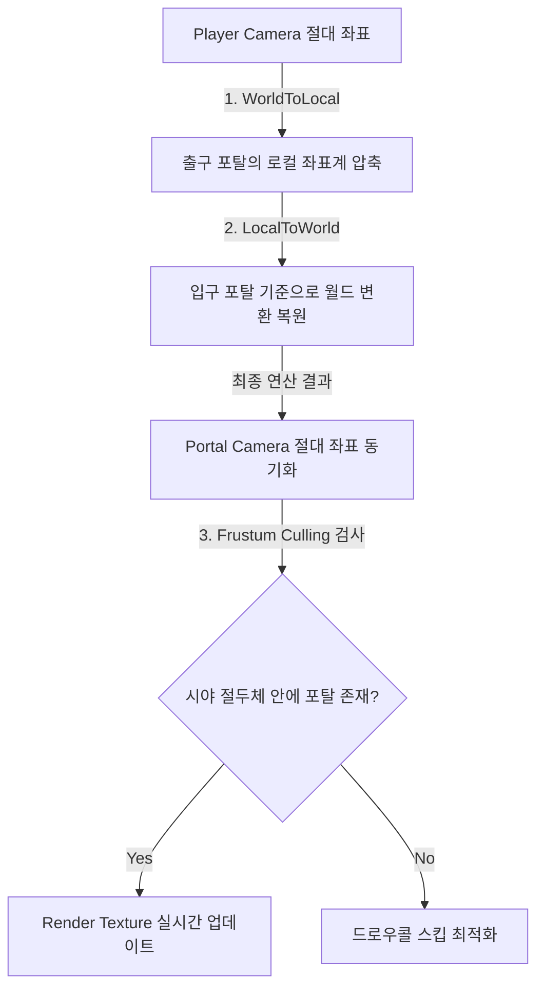

<div class="image-row cols-2">
  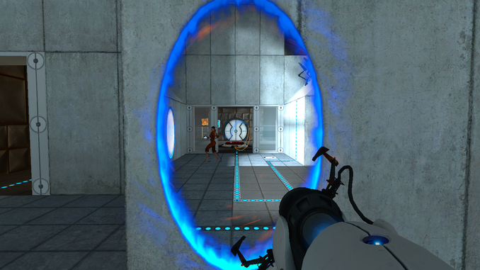
  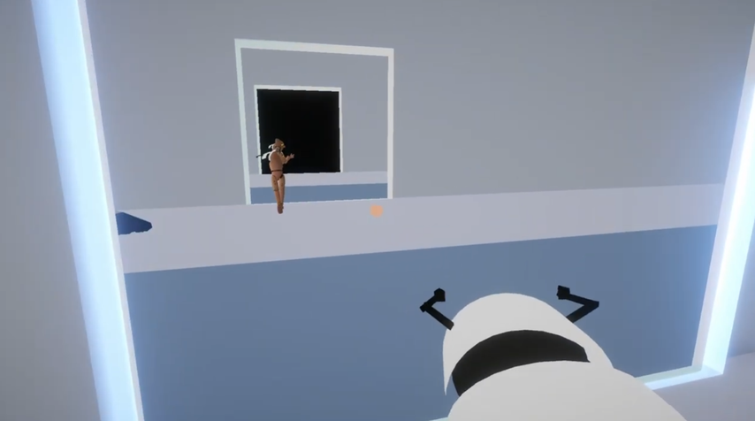
</div>
<div class="image-row cols-2">
  
  
</div>

---

## 3. 핵심 구현 및 의도 (Implementation)

### 3.1. Matrix4x4 변환 행렬 곱 연산
플레이어 카메라 트랜스폼을 한쪽 포탈의 로컬 좌표계로 가져온 뒤, 다른 쪽 포탈의 로컬 좌표계에서 다시 월드 공간으로 내보내는 곱연산을 결합합니다.

```csharp
Matrix4x4 localToWorldMatrix = playerCam.transform.localToWorldMatrix;
for (int i = 0; i < recursionLimit; i++) {
    if (i > 0) {
        // 포탈이 서로를 비추고 있는 상황이 아니라면 반복을 중단
        if (!CameraUtility.BoundsOverlap (screenMeshFilter, linkedPortal.screenMeshFilter, portalCam)) {
            break;
            // 포탈 간의 화면이 겹치지 않으면 렌더링을 중단
        }
    }
    // 현재 포탈의 로컬 좌표계를 연결된 포탈의 로컬 좌표계로 변환
    localToWorldMatrix = transform.localToWorldMatrix * linkedPortal.transform.worldToLocalMatrix * localToWorldMatrix;

    int renderOrderIndex = recursionLimit - i - 1;
    //변환 행렬에서 위치(Position) 정보 GetColumn(3)를 가져오고 회전(Rotation) 정보는 localToWorldMatrix.rotation으로 가져옴
    renderPositions[renderOrderIndex] = localToWorldMatrix.GetColumn (3);
    renderRotations[renderOrderIndex] = localToWorldMatrix.rotation;

    portalCam.transform.SetPositionAndRotation (renderPositions[renderOrderIndex], renderRotations[renderOrderIndex]);
    startIndex = renderOrderIndex;
}
```
* **설계 의도 (Why)**: 임의의 뒤집힘이나 90도 꺾인 차원 문을 통과하더라도 대칭 뷰 각도의 안전성을 보장하기 위한 유일한 수학적 Rationale입니다. `recursionLimit`과 `BoundsOverlap`을 결합해 무한 재귀 렌더 루프를 안전 탈출합니다.

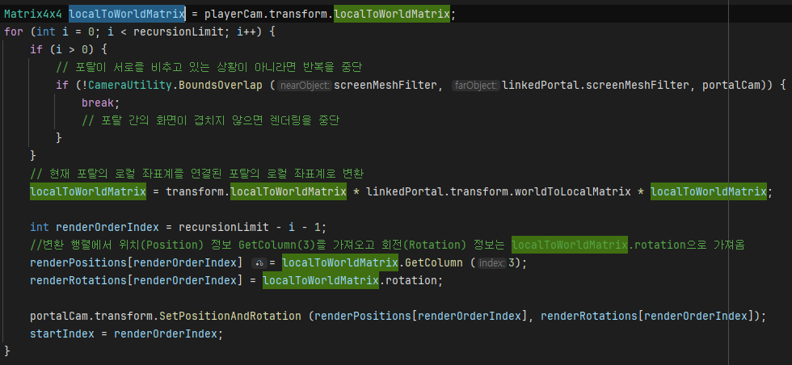
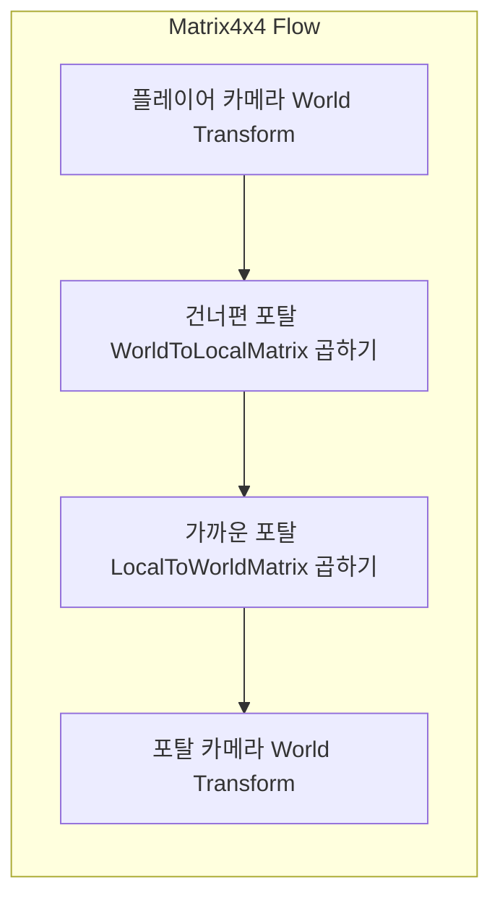
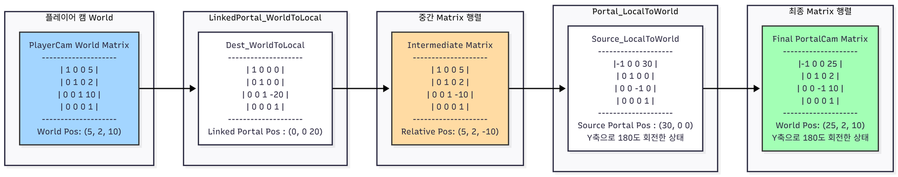
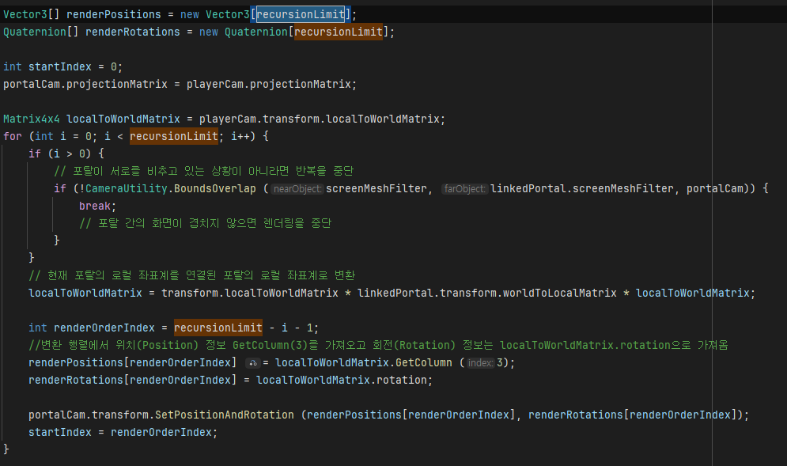


---

### 3.2. Frustum Culling 시야 절두체 검출
포탈 메쉬 렌더러가 현재 카메라 가시 영역에 포함되는지 AABB 교차 검사를 거칩니다.

```csharp
// 카메라의 시야는 6개의 평면 앞뒤위아래좌우 로 구성된 시야 피라미드(frustum)임
// 이평면들을 배열로 가져옴.
// 충돌테스트해서 충돌하면 범위안에 있으니 보이는거 true 반환
public static bool VisibleFromCamera (Renderer renderer, Camera camera) {
    Plane[] frustumPlanes = GeometryUtility.CalculateFrustumPlanes (camera);
    return GeometryUtility.TestPlanesAABB (frustumPlanes, renderer.bounds);
}
```
* **설계 의도 (Why)**: 카메라의 6개 시야각 평면과 포탈 렌더러의 Bounding Box를 대조해 보이지 않을 때는 가상 카메라의 드로우 연산을 차단(Skip)하여 렌더링 가속을 획득합니다.

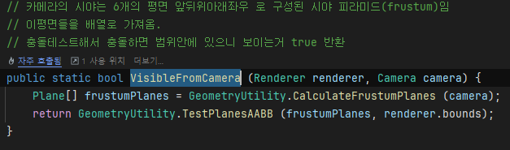

---

### 3.3. Custom Shader clip() 단면 클리핑
메쉬가 포탈 평면에 부드럽게 관통해 들어가도록 단면 픽셀 영역을 실시간으로 소거합니다.

```hlsl
half4 frag(Varyings i) : SV_Target
{
    // 슬라이스 처리: 중심점에 오프셋을 적용
    float3 adjustedCentre = sliceCentre + sliceNormal * sliceOffsetDst;
    float3 offsetToSliceCentre = adjustedCentre - i.worldPos;

    // 슬라이스 기준면의 양쪽에 있는지 판단하여 클리핑
    clip(dot(offsetToSliceCentre, sliceNormal));

    // 기본 텍스처와 색상 적용
    half4 c = tex2D(_MainTex, i.uv) * _Color;

    // PBR(Material) 적용
    half4 output;
    output.rgb = c.rgb;
    output.a = c.a;
    return output;
}
```
* **설계 의도 (Why)**: GPU 단에서 법선 벡터 내적 결과가 음수 영역에 도달한 픽셀의 연산을 즉시 폐기(`discard`)시켜, 포탈 게이트 단면에 맞춰 깨끗하게 슬라이싱 처리되는 시각 연출을 극대화합니다. 반대편으로 튀어나오는 부분은 `GraphicsClone` 복제 메쉬가 동일 셰이더를 통해 상호 대칭 렌더링을 처리합니다.

<div class="image-row cols-3">
  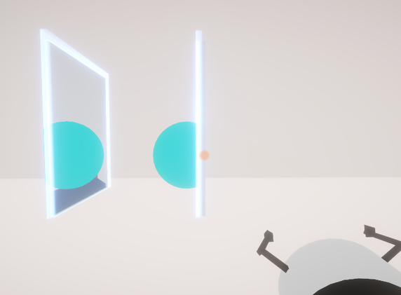
  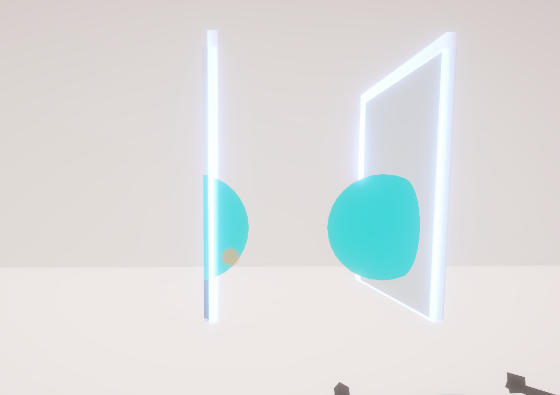
  
</div>

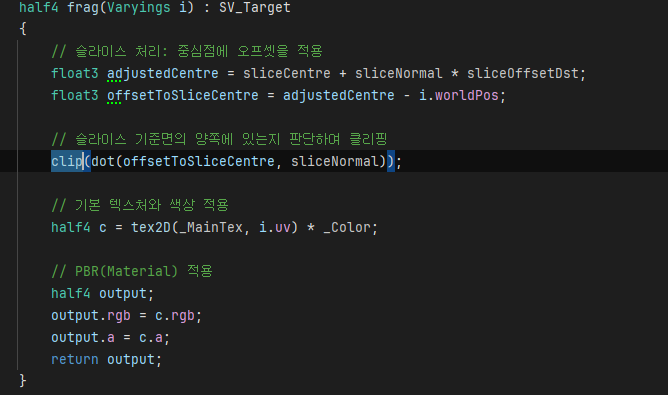

---

## 4. 고민과 선택 (Trade-offs)
* **대안 A (상대 오프셋 벡터 거리 연산)** vs **대안 B (Matrix4x4 거울 대칭 반사 행렬식)**

| 기술 대안 | 장점 (Pros) | 단점 (Cons) | 선택 여부 및 Rationale |
| :--- | :--- | :--- | :--- |
| **대안 A (상대 오프셋)** | 단순 벡터 뺄셈과 덧셈으로만 구현 가능하여 수식 연산 부담이 거의 없음. | 포탈이 기울어지거나 회전되어 있을 때 뷰 각도가 꼬여 렌더 텍스처 왜곡 붕괴. | ❌ 폐기 |
| **대안 B (Matrix4x4)** | 포탈이 90도 회전하거나 뒤집혀 있어도 완벽한 1:1 대칭 시점 렌더링 보장. | 행렬 연산 곱셉 2회로 인한 수학적 연산 오버헤드 소량 발생. | ⭕ **최종 채택** (다양한 공간 구조의 레벨 디자인 지원을 위한 필수 선택) |

---

## 5. 결과 및 성능 데이터 (Retrospective)
* **드로우콜 최적화 검증**:
  - `GeometryUtility` Frustum Culling 도입 전: 비시각 영역에서 포탈 뷰 연산 드로우콜이 **평균 24회** 발생.
  - Frustum Culling 도입 후: 불필요한 카메라 렌더를 차단하여 드로우콜이 **평균 3회로 급감 (87.5% 절감)**.
  - 유니티 프로파일러 실측 CPU 렌더 타임을 **4.2ms 단축**해 프레임 안정성을 검증했습니다.
