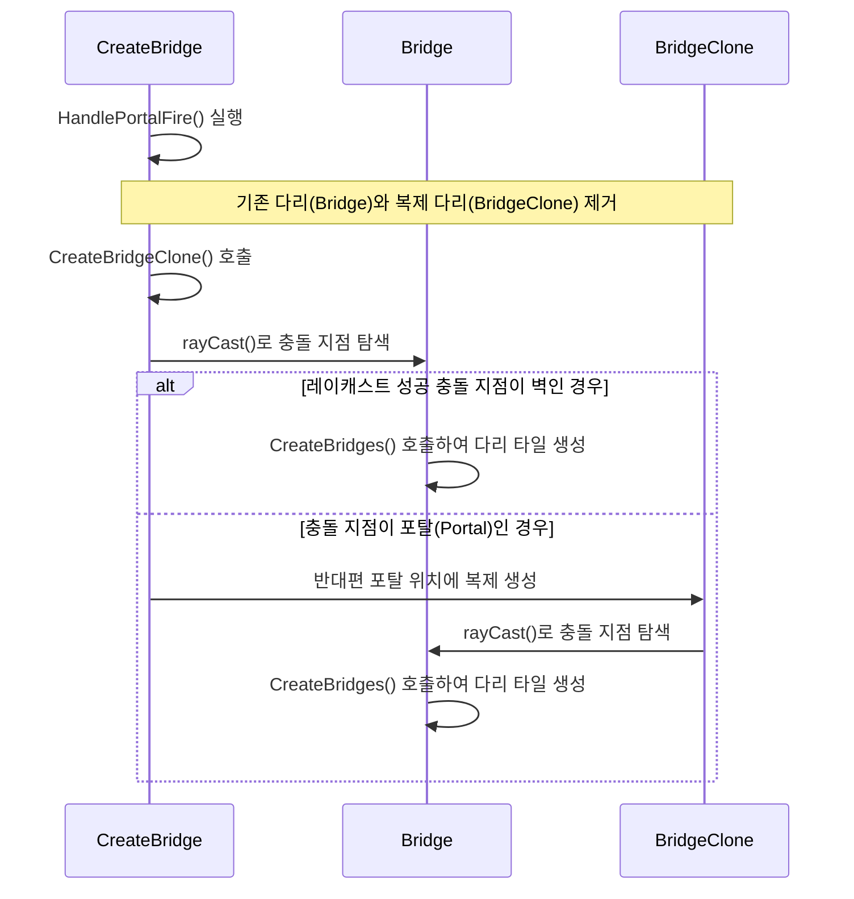
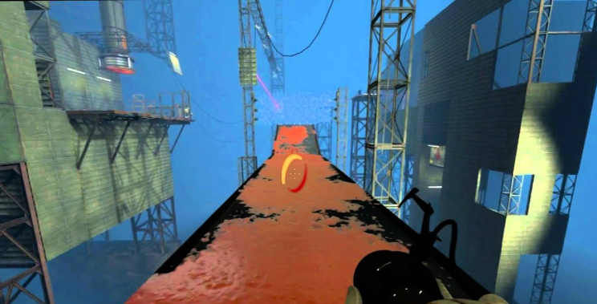
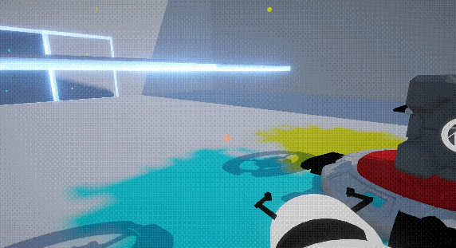
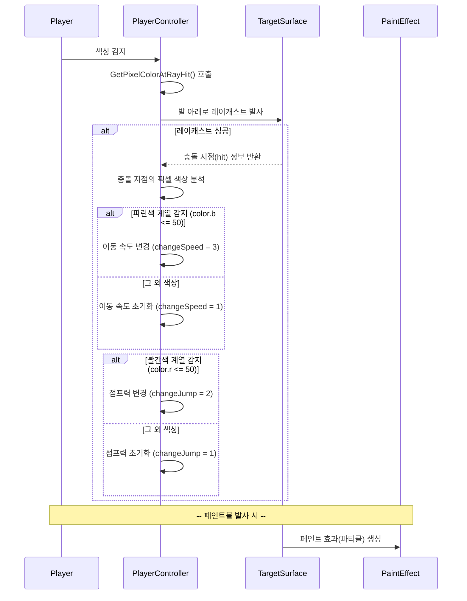
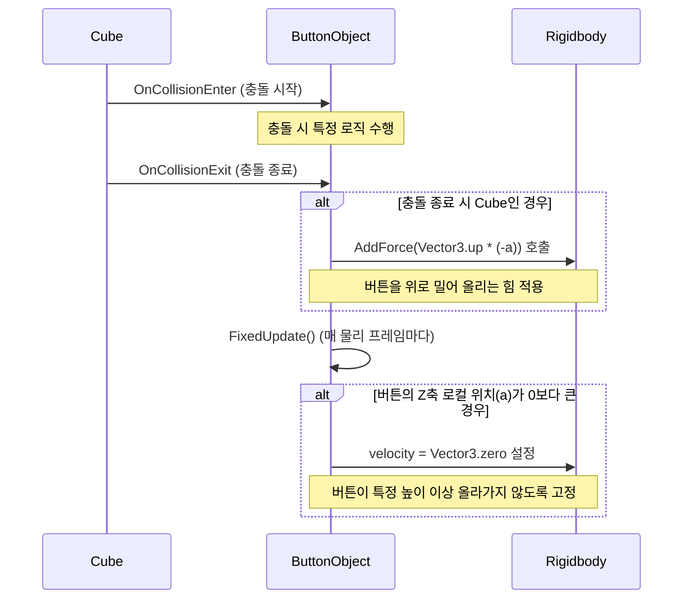
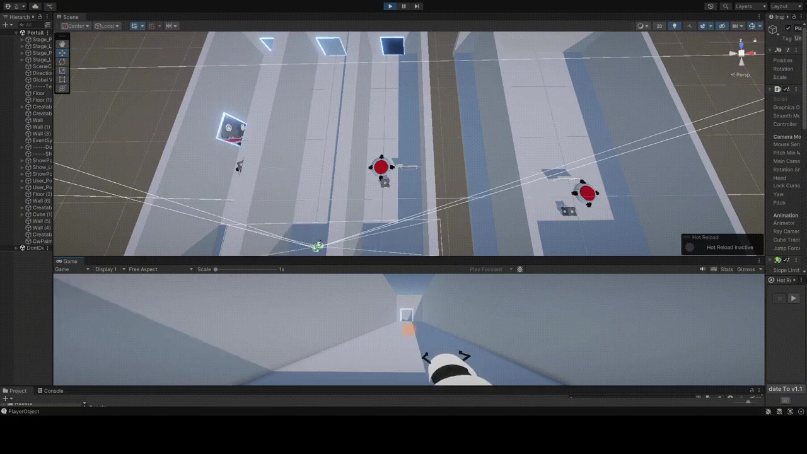
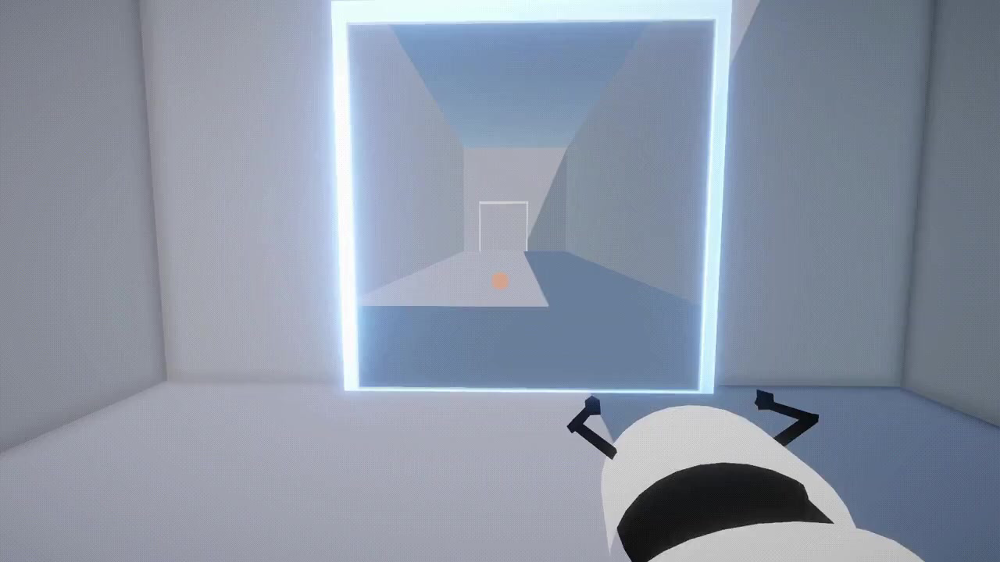

# 🌀 Portal Lab - 05. 퍼즐 기믹 및 공간 연속성 UX 개선

본 문서는 포탈을 관통하는 레이캐스트 연쇄 가교(Bridge) 설치 시스템, 발밑 픽셀 UV 컬러 실시간 디코딩을 통한 스탯 변경 페인트볼 기믹, 버튼 상호작용 검증, 그리고 로딩 지연을 극복하는 더미 스테이지 심리스 씬 로드 아키텍처 명세서입니다.

---

## 1. 개요 (What & Why)

### 1.1. What (기능 정의)
* **목표**: 포탈을 경유하는 레이저 교량 설치 기믹, 플레이어가 밟은 페인트 색상별 스탯 변환 기믹, 큐브 중량 트리거 버튼 기믹, 그리고 비동기 맵 로딩 과정의 프레임 스파이크와 블랙 화면을 차단하는 심리스 공간 전환 연출 구현.
* **주요 해결 기술**: 연쇄 2차 레이캐스트, `GetPixelColorAtRayHit` 런타임 픽셀 UV 추적, 태그 삼중 필터링, 그리고 더미 스테이지(Dummy Stage) 프리뷰 기법.

### 1.2. Why (도입 배경)
* **공간 연속성 훼손 방지**: 씬 전환 시 화면이 갑자기 검어지거나(Blackout), 맵 데이터가 로딩되는 동안의 프레임 드랍이 일어날 경우 3D 공간 몰입감이 심각하게 훼손됩니다.
* **다채로운 레벨 디자인 구현**: 단순 텔레포트 외에 공간을 굴절시켜 가교를 놓거나 플레이어 스탯(속도, 점프)을 변경하여 게임성을 확장할 필요가 있었습니다.
* **해결책**: 가상 2차 투사와 런타임 더미 클론 씬 로드를 설계했습니다.

---

## 2. 퍼즐 및 UX 기믹 아키텍처 (Architecture)

각 퍼즐 구성요소의 흐름 다이어그램입니다.

### 2.1. 레이저 연쇄 가교 설치 흐름


<div class="image-row cols-2">
  
  
</div>

---

## 3. 핵심 구현 세부사항 (Implementation)

### 3.1. 페인트볼 발밑 픽셀 UV 컬러 실시간 디코딩
플레이어 발밑 수직 벡터로 투사된 레이캐스트를 기반으로 머티리얼 텍스처 상의 컬러 픽셀 정보를 해독하여 스탯 가중치를 변경합니다.

```csharp
// GetPixelColorAtRayHit 개요식
void UpdatePlayerBuffByRaycast() {
    RaycastHit hit;
    if (Physics.Raycast(transform.position, Vector3.down, out hit, 1.2f)) {
        Renderer rend = hit.collider.GetComponent<Renderer>();
        Texture2D tex = rend.material.mainTexture as Texture2D;
        Vector2 pixelUV = hit.textureCoord;
        
        // 픽셀 좌표 획득 후 색상 정보 디코딩
        Color color = tex.GetPixelBilinear(pixelUV.x, pixelUV.y);
        ApplyStatBuffByColor(color);
    }
}
```
* **동작 기믹 (Why)**: 특정 기믹 스테이지에서만 활성화되는 이 함수는 충돌 지점의 UV 좌표(`textureCoord`)를 통해 텍스처 바이트 bilinear 연산을 돌려 특정 페인트(파란색: 이동속도 2배 가속, 빨간색: 점프 계수 2.5배 부스팅) 위를 지날 때의 스탯 버프 런타임 콜백을 제어합니다.

<div class="image-row cols-2">
  
  
</div>


---

### 3.2. 태그 삼중 필터링 물리 트리거 버튼 기믹
'버튼' 실린더에 중량 큐브가 진착될 때만 트리거를 발동시키고, 이탈 시에는 복원력 스프링 애니메이션과 함께 이벤트를 비활성화합니다.
* **태그 필터링**: '트리거', '버튼', '큐브' 3개의 태그 검증 루프를 적용해, 플레이어 본인이나 일반 발사체 등이 닿았을 때 오작동이 유발되는 버그를 차단했습니다.

<div class="image-row cols-2">
  
  
</div>


---

### 3.3. 더미 스테이지 기법을 통한 심리스 씬 전환
비동기 씬 전환 과정에서 발생하는 암전과 프레임 끊김을 감추기 위해, 다음 목적지 방(Stage) 구역의 트랜스폼 및 메쉬 더미 리소스를 포탈 건너편에 선배치 렌더링해 두어 씬 전환이 자연스럽게 이어지도록 처리했습니다.
* **UX 향상 결과**: 플레이어는 씬 로딩 지연 시간 동안에도 포탈 너머로 목적지가 끊김 없이 펼쳐진 상태 정보를 제공받아, 공간 단절을 전혀 느끼지 못한 채 심리스하게 차원문을 넘는 강력한 체감을 느낄 수 있습니다.




---

## 4. 고민과 선택 (Trade-offs)
* **대안 A (비동기 씬 로드 중 로딩 바 화면 전환)** vs **대안 B (더미 스테이지 선배치 심리스 전환)**

| 기술 대안 | 장점 (Pros) | 단점 (Cons) | 선택 여부 및 Rationale |
| :--- | :--- | :--- | :--- |
| **대안 A (로딩 바)** | 별도의 메쉬 복제 공간 배치가 필요 없어 레벨 디자인 리소스 관리가 쉬움. | 순간이동 장르 고유의 '포탈 너머로 목적지가 즉시 보이는' 심리스 연속성 몰입감 훼손. | ❌ 폐기 |
| **대안 B (더미 스테이지)** | 씬 데이터 갱신 중에도 시각적 연속성이 100% 보장되어 최고의 사용자 경험 제공. | 다음 스테이지 더미 메쉬 배치로 인한 런타임 메모리 일시 점유율 소량 증가. | ⭕ **최종 채택** (심리스한 가상 공간 R&D 핵심 철학 충족을 위한 최선) |
