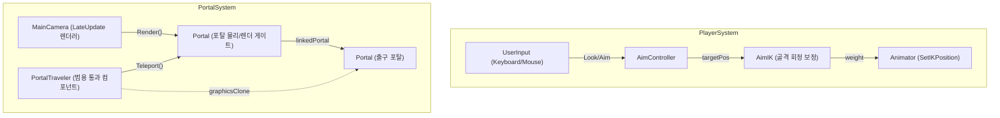

# Portal Lab — 3D Portal System & Physics

**Unity (2022.3 LTS) · C# (10.0) · 3D 개인 모작 프로젝트**

본 문서는 명작 퍼즐 게임 '포탈(Portal)'의 핵심 공간 이동 물리 아키텍처, 실시간 시점 렌더링, 셰이더 그래픽 클론 마스킹 및 물리 퍼즐 기믹을 구현하고 최적화한 기술 명세서입니다.

---

## 1. 프로젝트 개요

* **목표**: 단순 순간이동을 넘어, 물체가 포탈 게이트에 물리적으로 자연스럽게 걸쳐지는 통과 연출과 실시간 렌더링 시점 동기화를 구현하고 성능 병목을 최소화합니다.
* **개발 범위**: 캐릭터 IK(역운동학) 조준 제어, 내적 기반 텔레포트 판정, Matrix4x4 변환 행렬 기반 뷰 동기화, Frustum Culling 최적화, 픽셀 셰이더 클리핑 단면 처리.

> **핵심 설계 지표**:
> - **의존성 결합 해제**: 플레이어에 묶여 있던 텔레포트 책임을 범용 컴포넌트(`PortalTraveler`)로 분리하여 큐브 등 모든 리지드바디 물체에 일관 적용 가능하도록 리팩토링.
> - **렌더링 드로우콜 최적화**: 보이지 않는 포탈 건너편 카메라의 불필요한 연산을 시야 선별(Frustum Culling) 공식을 사용해 원천 차단.

---

## 2. 시스템 아키텍처

포탈 시스템의 구성 모듈은 카메라 렌더링 조율부(`MainCamera`), 물리 게이트 객체(`Portal`), 통과 가능 대상 추상 인터페이스(`PortalTraveler`), 조준점 제어기(`AimController`)로 디커플링되어 유기적으로 맞물려 동작합니다.



---

## 3. 핵심 기술 구현

### 3.1. Inverse Kinematics (IK) 조준 시스템
포탈을 통과하여 비치는 플레이어의 모습이 조준점 위치에 따라 유연하게 상체가 보정되도록 역운동학을 적용했습니다.

* **AimController**: 마우스 조준에 따라 월드 공간 상에 가상의 목표물(`aimTarget`) 트랜스폼을 위치시키고 좌표를 갱신합니다.
* **AimIK**: 유니티 `OnAnimatorIK()` 콜백을 수신하여 지정된 상체 골격 체인들의 회전 가중치(`weight`)를 조준점에 맞춰 동기적으로 보정 제어합니다.

---

### 3.2. 내적(Dot Product) 기반 텔레포트 물리 판정
단순 콜라이더 충돌(Trigger Enter)은 순간이동 시 뚝뚝 끊기는 부자연스러운 프레임 끊김 현상을 유발합니다. 이를 보완하기 위해 포탈 평면의 법선 벡터(Forward)와 물체 위치 오프셋의 **내적 연산 부호 변화**를 프레임마다 체크하여 경계를 통과하는 찰나를 판정합니다.

```csharp
// 포탈 통과 여부 매 프레임 판정 루틴
Vector3 offsetFromPortal = travelerT.position - transform.position;
int portalSide = System.Math.Sign(Vector3.Dot(offsetFromPortal, transform.forward));
int portalSideOld = System.Math.Sign(Vector3.Dot(traveler.previousOffsetFromPortal, transform.forward));

// 이전 프레임과 현재 프레임의 부호가 달라진 경우 평면 통과(Cross)로 인지
if (portalSide != portalSideOld)
{
    var positionOld = travelerT.position;
    var rotOld = travelerT.rotation;
    
    // 출구 포탈(linkedPortal)의 좌표계 공간으로 텔레포트 연산 호출
    traveler.Teleport(transform, linkedPortal.transform, m.GetColumn(3), m.rotation);
}
```

* **결과**: 결합도를 해소하여 `Portal`은 `PortalTraveler` 컴포넌트 유무만을 판단하며, 플레이어뿐만 아니라 상자, 공 등 다양한 물리 개체가 동일한 로직으로 포탈을 통과합니다.

---

### 3.3. Matrix4x4 변환 행렬 기반 뷰 동기화
플레이어가 한쪽 포탈을 바라볼 때 반대편 포탈(출구)에 배치된 가상 카메라가 플레이어 시점과 동일한 각도/거리로 월드를 비추어야 거울과 같은 착시 공간 효과가 형성됩니다. 포탈이 월드 상에서 회전하거나 기울어졌을 때의 절대 시점 동기화를 위해 거울 반사 변환 행렬식을 응용하여 좌표축을 연산합니다.

```csharp
// 플레이어 카메라의 로컬 행렬을 출구 포탈 좌표계로 변환한 후, 입구 포탈 좌표계로 복귀시켜 최종 카메라 Matrix 획득
Matrix4x4 localToWorldMatrix = playerCam.transform.localToWorldMatrix;

// 1. linkedPortal의 월드 좌표계를 로컬(WorldToLocal)로 압축
// 2. 현재 포탈의 로컬 좌표계를 월드(LocalToWorld)로 확장 변환하여 행렬 곱연산 수행
localToWorldMatrix = transform.localToWorldMatrix * linkedPortal.transform.worldToLocalMatrix * localToWorldMatrix;

// 3. 변환된 행렬에서 가상 카메라의 월드 위치(Position) 및 회전(Rotation) 추출 대입
portalCam.transform.SetPositionAndRotation(
    localToWorldMatrix.GetColumn(3), 
    localToWorldMatrix.rotation
);
```

---

### 3.4. Frustum Culling 시야 검출 최적화
포탈 너머를 비추는 가상 카메라는 리소스를 대량 소비하므로, 플레이어가 포탈의 단면을 직접 시야 내에 담고 있을 때만 렌더링이 가동되도록 Frustum(시야 절두체) 선별 알고리즘을 구축하여 드로우콜 병목을 제거했습니다.

```csharp
// 포탈 단면의 Mesh Bounding Box가 카메라의 6개 절두체 평면 안에 걸쳐 있는지 교차 검사
public static bool VisibleFromCamera(Renderer renderer, Camera camera)
{
    // 카메라의 시야 평면 6개 획득
    Plane[] frustumPlanes = GeometryUtility.CalculateFrustumPlanes(camera);
    
    // Bounds와 평면 간 충돌 테스트 결과 반환 (시야 밖일 경우 false 반환하여 렌더링 skip)
    return GeometryUtility.TestPlanesAABB(frustumPlanes, renderer.bounds);
}
```
* **재귀 제한**: 마주보는 포탈 배치 시 무한 카메라 루프를 돌지 않도록 `recursionLimit` 한계 정수값(기본 2~3회 제한)을 셰이더 렌더 카운트에 두어 안전망을 제공합니다.

---

### 3.5. GraphicsClone & Custom Shader 클리핑 단면 렌더링
물체가 포탈 경계면을 관통하는 동안 단면이 자연스럽게 잘려 나가고 동시에 출구 포탈 단면에서 튀어나오도록 하는 그래픽 최적화 셰이더입니다.

* **GraphicsClone**: 진입 물체의 스킨드 메쉬 렌더러와 애니메이터 정보를 실시간 복제하여 출구 포탈 측에 평행 생성시킵니다.
* **Custom Shader**: 포탈 게이트 평면의 월드 위치와 법선 벡터를 셰이더 변수로 전달받아 픽셀 렌더링 전 `clip()` 명령어로 픽셀을 버립니다.

```hlsl
// 커스텀 픽셀 셰이더 단면 클리핑 연산
half4 frag(Varyings i) : SV_Target
{
    // 슬라이스 기준면에서 픽셀 월드 위치까지의 거리 벡터 산출
    float3 adjustedCentre = sliceCentre + sliceNormal * sliceOffsetDst;
    float3 offsetToSliceCentre = adjustedCentre - i.worldPos;

    // 내적값 부호에 따라 음수 평면 영역의 픽셀 렌더링을 폐기(Discard)
    clip(dot(offsetToSliceCentre, sliceNormal));

    // 기본 텍스처 컬러링 및 PBR 광원 연산 수행
    half4 c = tex2D(_MainText, i.uv) * _Color;
    return c;
}
```

---

### 3.6. 운동량 보존 법칙 및 터널링 현상 회고
물체가 포탈을 통과하는 순간의 회전 변환 행렬값을 기존 물리 속도 벡터(Velocity)에 내장 곱연산하여, 포탈 탈출 시 속도 손실 없이 방향과 중가속도를 완벽히 이전 및 보존합니다.

```csharp
// PortalTraveler.cs 내부 속도 및 회전 동기화
public virtual void Teleport(Transform fromPortal, Transform toPortal, Vector3 pos, Quaternion rot)
{
    transform.position = pos;
    transform.rotation = rot;
    
    // 리지드바디가 존재할 경우, 출구 포탈 회전 행렬 곱 연산으로 속도 벡터 방향 전환 동기화
    if (rb != null)
    {
        rb.velocity = toPortal.TransformDirection(fromPortal.InverseTransformDirection(rb.velocity));
    }
}
```

* **터널링(Tunneling) 한계 및 회고**:
  - **문제**: 포탈 통과 후 중력 가속도가 임계치 이상으로 극대화되면, 한 프레임의 이동 거리가 포탈 두께를 추월하여 순간이동 통과 판정을 뛰어넘고 벽에 박히는 현상 발생.
  - **개선안**: 다음 업데이트 시 `Rigidbody.collisionDetectionMode`를 `Continuous` 또는 `ContinuousDynamic`으로 변경 적용하고, 이전 프레임 위치에서 현재 프레임 위치 방향으로 별도 레이캐스트 소인(Sweeping)을 가동하는 로직 리팩토링 검토 중.

---

## 4. 퍼즐 기믹 및 UX 개선

* **포탈 연쇄 레이캐스트 다리 설치**: 플레이어가 발사한 가교 형성 광선이 포탈을 통과할 경우, 반대편 포탈 위치에서 동일 레이캐스트를 연쇄 연동 발사해 최종 벽면을 감지하여 다리를 설치하는 시퀀스 설계.
* **픽셀 감지 스탯 변경 페인트볼**: 캐릭터 하향 레이캐스트 지점의 텍스처 UV 픽셀 컬러값을 읽어 `switch` 분기 처리하여, 파란색(이동 가속), 빨간색(점프력 점프 부스트) 등 캐릭터의 이동 스탯을 동적 통제하는 런타임 콜백 기믹 구현.
* **더미 스테이지 심리스 씬 전환**: 다음 구역 로드 시 발생하는 화면 끊김을 방지하기 위해, 포탈 게이트 후면에 다음 씬에 배치된 오브젝트의 더미 클론을 미리 배치 렌더링하여 두 공간이 하나로 이어진 것과 같은 극적 공간 연속성 연출.
