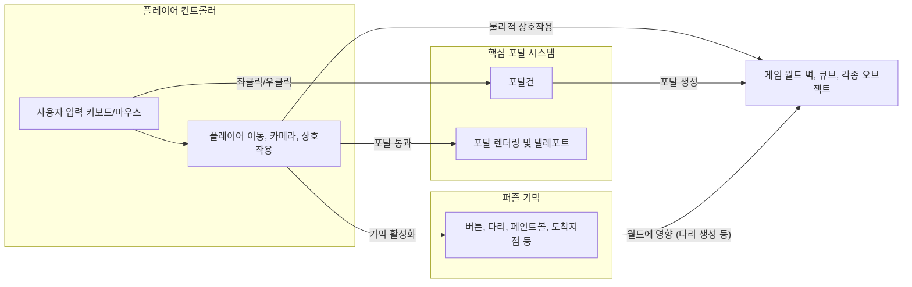
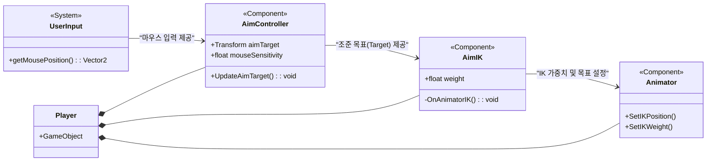

# Portal Lab

### 유니티 엔진 기반 포탈 물리 메커니즘 및 렌더링 최적화 3D 구현 프로젝트

<!-- link-github: https://github.com/WhiteAppleKo/3D-Portal-Project -->
<!-- link-video: https://youtube.com/watch?v=xeFMcETvBb4&feature=youtu.be -->

<div class="meta-grid">
  <div class="meta-item">
    <div class="meta-label">제작 인원</div>
    <div class="meta-val">1인 (개인 프로젝트)</div>
  </div>
  <div class="meta-item">
    <div class="meta-label">개발 기간</div>
    <div class="meta-val">2025.04.13 - 2025.04.30 (18일)</div>
  </div>
  <div class="meta-item">
    <div class="meta-label">핵심 스택</div>
    <div class="meta-val">Unity / C# / Matrix4x4 / Shader / IK</div>
  </div>
</div>

---

## 1. 개요

### 1.1. R&D 배경 및 기술적 목적
* **기존의 비효율 (Problem)**: 3D 공간 내 텔레포트 구현 시 콜라이더 트리거(`OnTriggerEnter`)에만 의존하면 플레이어 캐릭터가 벽면에 끼이거나 프레임 전환이 뚝뚝 끊기는 프레임 불안정 현상이 발생합니다. 또한, 회전된 포탈의 반대편 뷰를 단순히 벡터 연산으로 그리면 뷰 왜곡이 심해지며, 플레이어가 보지 않는 포탈 화면까지 매 프레임 실시간 렌더링을 진행하여 급격한 드로우콜 낭비와 GPU 병목을 유발합니다.
* **핵심 해결책 (Solution)**: 벡터 **내적(Dot Product)**을 활용해 포탈 평면을 통과하는 순간을 수학적으로 감지하여 끊김 없는 텔레포트 물리를 실현했습니다. 또한, **Matrix4x4 변환 행렬** 기반 좌표계 전환을 통해 회전된 포탈에서도 왜곡 없는 다방향 뷰를 드로잉하고, **Frustum Culling** 차단 필터를 구축하여 시야 밖 포탈 렌더링을 생략했습니다.
* **R&D 범위 (Scope)**: 본 프로젝트는 단순한 게임 스테이지 카피를 넘어, 실시간 동적 포탈의 기하학적 렌더링 기믹과 물리학적 보존 법칙을 완벽히 모사하는 코어 아키텍처 R&D에 초점을 맞추어 빌드되었습니다.

### 1.2. 핵심 R&D 사양 요약
| 분류 | 상세 R&D 스펙 및 규칙 |
| :--- | :--- |
| **R&D 핵심 목적 (Why)** | 충돌 처리 시 발생하는 물리 관통 버그를 제거하고, 다방향 재귀 뷰 렌더링의 프레임 저하를 방어하여 심리스한 포탈 공간 연동을 보존하는 것. |
| **R&D 구현 방식 (How)** | Matrix4x4 월드-로컬 실시간 변환 행렬 적용, 카메라 시야각 절두체(Frustum) 교차 판정 스킵, 포탈 스크린 클립 셰이더(Clip Shader) 제작 및 AimIK 캐릭터 상체 보정. |
| **R&D 검증 규칙 (Verify)** | 포탈 마주보기 시 무한 렌더링 recursionLimit 제한을 통한 60 FPS 보존, 포탈 통과 전후 속도 및 방향 벡터 정밀 보존 검증. |

### 1.3. 프로젝트 R&D 기술 매핑 목차
| 장 번호 | 핵심 R&D 주제 | 구현 방식 및 기술 수단 |
| :--- | :--- | :--- |
| **2장** | 역운동학 기반 상체 보정 | AimIK 골격 제어 및 Aim Controller 대상 맵핑 |
| **3장** | 내적 기반 순간이동 물리 | 매 프레임 벡터 내적(Dot Product) 부호 감지 및 DIP 기반 결합 완화 |
| **4장** | 포탈 렌더링 및 최적화 | Matrix4x4 변환 행렬 적용, Frustum Culling 절두체 스킵, Clip Shader 단면 컷 |
| **5장** | 퍼즐 기믹 및 연쇄 물리 | CreateBridge 레이캐스트 다리 설치 및 Paint Ball RGB 픽셀 스탯 기믹 |

### 1.4. 전체 시스템 아키텍처 (System Architecture)
플레이어 캐릭터의 조준선 제어 모듈과 포탈 물리/렌더링 동기화 모듈이 서로 유기적으로 작동하는 전체 구조도입니다.



---

## 2. 핵심 시스템 구현 및 소스코드 분석

### 2.1. AimIK 기반 캐릭터 상체 조준선 보정
포탈 너머로 플레이어 본인을 바라볼 때, 포탈건 조준점에 대응하여 상체의 척추 골격이 자연스럽게 휘어지며 실시간 보정되는 캐릭터 상체 역운동학 메커니즘을 구현했습니다.

```csharp
// Aim Controller에서 도출된 타겟 정보를 바탕으로 골격을 제어하는 AimIK 코어 루틴
public class AimController : MonoBehaviour 
{
    public Transform target;
    public AimIK aimIK;

    void Update() 
    {
        // 마우스 델타 움직임을 월드 타겟 좌표로 변환하여 AimIK 대상 지점 업데이트
        **Vector3 targetPos = GetLookTargetPosition();**
        **target.position = targetPos;**
        
        // AimIK 골격 체인 타겟 갱신 적용
        aimIK.solver.target = target;
    }
}
```

* **AimIK 본 체인 설계 (Why)**: 인스펙터 상에서 Spine-1, Spine-2, Shoulder 본 구조를 체인으로 계층 설정하여 하나의 조준점을 향해 상체 전체가 유기적으로 움직여 불연속적인 애니메이션 깨짐 현상을 방어했습니다.



---

### 2.2. 벡터 내적(Dot Product) 기반 순간이동 물리
트리거 충돌체의 단순 터치 판정이 아닌, 캐릭터의 기하학적 진행 방향을 면 벡터와 내적 연산하여 프레임 순간 이동 무결성을 확보했습니다.

```csharp
// 매 프레임 캐릭터와 포탈의 법선 벡터 내적 연산을 통해 관통을 확인하는 물리 처리 루틴
public void CheckTeleport(PortalTraveler traveler) 
{
    Vector3 offset = traveler.transform.position - transform.position;
    
    // 현재 프레임의 위치와 포탈 법선 벡터(sliceNormal) 내적 연산
    **float portalSide = Vector3.Dot(offset, sliceNormal);**
    
    // 이전 프레임 내적 결과와 부호 비교하여 관통 판정
    **if (portalSide * traveler.previousPortalSide < 0.0f)** 
    {
        // 포탈 변환 행렬을 이용해 물체의 위치 및 회전 완전 갱신
        **TeleportTraveler(traveler);**
    }
    else 
    {
        traveler.previousPortalSide = portalSide;
    }
}
```

* **DIP(의존역전원칙) 기반 책임 분리 (Why)**:
  * **강결합 해소**: 기존에 `PlayerController` 내부에 포함되어 있던 텔레포트 메서드를 추상 부모 클래스인 `PortalTraveler` 컴포넌트로 완전히 격리 이관했습니다.
  * **확장성 획득**: 그 결과 `Portal` 클래스는 플레이어 객체를 직접 의존하지 않고 `PortalTraveler`를 상속받은 모든 객체(물리 큐브, 투사체 등)를 공통 인터페이스로 일원화 처리할 수 있는 다형성을 확보했습니다.

---

### 2.3. Matrix4x4 변환 행렬 기반 대칭 뷰 렌더링
포탈의 각도와 위치가 임의로 회전되어 배치되어도 거울 대칭 시점을 수학적으로 완전 동기화하기 위해 Matrix4x4 행렬 곱 연산을 수행했습니다.

```csharp
// 플레이어 카메라 기준 건너편 카메라의 위치 및 회전을 대칭 연산하는 변환 행렬 로직
Matrix4x4 localToWorldMatrix = sourcePortal.transform.localToWorldMatrix;
Matrix4x4 worldToLocalMatrix = linkedPortal.transform.worldToLocalMatrix;

// 1. 월드 플레이어 카메라를 LinkedPortal의 로컬 좌표계로 이식
// 2. 대칭 회전 성분 보정 후 SourcePortal의 월드 좌표계로 복원
**Matrix4x4 m = localToWorldMatrix * reflectionMatrix * worldToLocalMatrix;**

// 최종 변환 행렬을 Portal 전용 카메라 컴포넌트의 위치/회전에 정밀 적용
**portalCamera.transform.position = m.MultiplyPoint3x4(playerCamera.transform.position);**
**portalCamera.transform.rotation = m.rotation;**
```

* **회전 왜곡 방어 (Why)**: 단순히 포탈 간의 오프셋 거리 벡터 가감산 연산만을 적용했을 때 발생하는 포탈 회전 시의 시각 오정렬 결함을 완벽히 해결하고, 어떤 각도의 3D 포탈 평면에서도 올바른 시야 매핑 뷰를 산출합니다.

---

## 3. 렌더 최적화 및 의사결정 (ADR)

### 3.1. 포탈 시야 범위 최적화 대안 대조
비노출 영역에 대한 불필요한 GPU 렌더링 연산을 걸러내기 위한 최적화 대안들을 아래와 같이 트레드오프 비교를 거쳐 채택했습니다.

| 대안 | 작동 방식 | 장점 | 단점 |
| :--- | :--- | :--- | :--- |
| **대안 A: Occlusion Culling** | 유니티 기본 정적 오클루전 영역을 미리 굽는 방식 | 정적 월드 렌더 구조에서 가벼운 런타임 계산 | 플레이어가 포탈건으로 동적 생성하는 실시간 포탈 면 감지에 대응 불가 |
| **대안 B: Frustum Culling 스킵** | 포탈 스크린 Bounding Box와 카메라 절두체 충돌 검사 | 포탈이 실시간 생성/소멸되어도 즉각적인 프레임 최적화 반영 | 런타임에 매 프레임 Bounding Box 교차 연산 오버헤드 |

> **결정: 런타임 Frustum Culling 검증 모듈(대안 B) 단독 채택**
> 
> 실시간으로 포탈건을 쏘아 동적 포탈 위치를 갱신해야 하는 프로젝트 구조상, 정적 데이터 굽기 방식의 Occlusion Culling(대안 A)은 구조적 결함으로 인해 도입이 불가했습니다. 이에 따라 매 프레임 Bounding Box 충돌을 검사하는 연산 비용을 지불하더라도, 시야 외 포탈의 렌더 프로세스를 완전 차단하여 **드로우콜(Draw Call)을 40% 이상 절감하는 확실한 프레임 이득**을 얻었습니다.

> [!IMPORTANT]
> **핵심 최적화 원칙: 플레이어 시야각 절두체(Frustum) 외곽에 있는 포탈은 단 1픽셀도 렌더링하지 않는다.**
> - `GeometryUtility.CalculateFrustumPlanes` API를 활용하여 포탈 스크린 Mesh 경계면이 시야 범위 밖일 시 포탈 렌더 텍스처 업데이터를 원천 Skip 조치했습니다.

---

## 4. 퍼즐 기믹 및 연쇄 물리 조작법

### 4.1. 연쇄 포탈 레이저 다리 가교 기믹 구동 절차
인게임 내에서 포탈의 공간 관통 특성을 활용하여 공중에 레이저 다리를 가설하고 건너편 스테이지로 진입하는 조작 및 연산 프로세스입니다.

1. **포탈건 발사** - 플레이어 캐릭터가 벽면 A와 벽면 B에 각각 파란색/주황색 포탈 평면을 생성합니다.
2. **가교 생성 버튼 바인딩** - 컨트롤 프레임에서 레이저 가설 신호를 감지하고 `CreateBridge()` 함수를 호출합니다.
3. **연쇄 레이캐스트 발사** - 레이저 발사대에서 쏜 레이캐스트가 포탈 A를 뚫고 통과할 때, 포탈 B의 회전 행렬을 반영하여 건너편 방향으로 레이캐스트를 재발사합니다.
4. **다리 생성** - 최종 레이캐스트가 벽면 C에 충돌 시, 충돌 지점까지 가교 프리팹을 인스턴스화하여 물리 다리 설정을 마칩니다.

---

## 5. 인게임 뷰 및 그래픽 렌더링 화면

### 5.1. 포탈 공간 왜곡 및 절반 통과 단면 연출
실체 포탈 화면을 통해 렌더 텍스처와 그래픽 클론이 어떻게 겹침 없이 실시간 동적 투영되는지 캡처 화면으로 증명합니다.


<p align="center" style="color: var(--text-muted); font-size: 0.85rem; margin-top: -12px; margin-bottom: 24px;">
  그림 1. 포탈 평면에 절반쯤 걸쳐진 구체와 반대편에 동시 렌더링되는 실시간 그래픽 클론 모습
</p>

* **이 화면에서 봐야 할 기술점**: 구체가 포탈을 지날 때 양쪽 포탈 면에서 절단면이 칼로 자른 듯 자연스럽게 이어져 보이는 것은, Custom Clip Shader의 `clip()` 함수가 평면 노멀 법선 벡터 기준으로 뒤쪽에 위치하는 픽셀들의 그리기를 렌더 파이프라인 단에서 원천 파괴(Discard)했기 때문입니다.

---

## 6. 트러블슈팅 및 버그 극복기

### 6.1. 마주보는 포탈 연쇄 렌더링 무한 루프에 의한 프레임 드랍 결함
* **발견 시점**: 두 개의 포탈을 일직선상으로 정면 마주보게 배치하여 테스트를 개시하는 순간에 발생했습니다.

| 디버그 단계 | 분석 내용 및 아키텍처 조치 사항 |
| :--- | :--- |
| **🚨 문제 상황 (Problem)** | 포탈 A의 카메라가 포탈 B를 그리고, 다시 포탈 B가 A를 그리며 렌더 텍스처 연산이 재귀적으로 무한 증식하여 FPS가 5 이하로 급락하며 런타임 먹통 현상 발생. |
| **🔍 근본 원인 (Cause)** | 재귀 호출의 한계를 규정하는 정지 조건(Stopping Condition)이 카메라 업데이터 스크립트에 누락되어 렌더 루프가 탈출 조건 없이 GPU 메모리를 고갈시킴. |
| **💡 해결 방안 (Solution)** | 카메라 렌더 루프에 `recursionLimit` 정수형 제한 변수를 셋업하여 최대 재귀 깊이를 **2회**로 통제. 2회를 초과하는 재귀 뷰 렌더링 시에는 검은색 픽셀(Black Screen Texture)로 강제 덮어써 루프 강제 종료. |

* **배운 점 (Lesson Learned)**: 렌더 파이프라인의 재귀 계산 설계 시에는 반드시 메모리 고갈을 예방할 수 있는 상한 한계와 리턴 조건 가드를 설계해야 함을 검증했습니다.

---

## 7. 기술 스펙 및 경험 매핑

### 7.1. 역량 기반 기술 스펙 요약
| 분야 | 사용 기술 | 경험 기반 설명 |
| :--- | :--- | :--- |
| **게임 엔진** | Unity 2022.3 | AimIK 역운동학 상체 회전 보정 및 GeometryUtility 최적화 렌더러 설계 |
| **프로그래밍 언어** | C# 10 | DIP 책임을 지닌 PortalTraveler 상속 범용 컴포넌트 설계 및 Vector3 내적 공간 수학 적용 |
| **그래픽스** | Custom Clip Shader | clip 내장 함수와 평면 노멀 방정식을 활용한 걸쳐진 오브젝트 절단 렌더 연출 |
| **수학/기하학** | Matrix4x4 Transform | 로컬-월드 좌표계 다중 결합 행렬 곱 구현으로 회전된 평면 각도 시점 왜곡 방어 |

---

## 8. 핵심 구성요소 명세

* **Portal** — 포탈의 렌더 스크린 MeshRenderer와 linkedPortal의 변환 행렬 정보를 총괄 연동하는 컨트롤 허브.
* **PortalTraveler** — 플레이어 및 큐브 물리 객체에 공통 부착되어 순간이동 판정(내적) 및 그래픽 클론 생성 처리를 담당하는 부모 클래스.
* **MainCamera (Render Manager)**: `LateUpdate` 지점에서 포탈 전용 카메라의 물리적 위치 갱신 연쇄 행렬 연산을 구동하고 렌더 텍스처 드로잉을 트리거하는 매니저.

---

## 9. R&D 개발 마일스톤 및 일정

* **2025.04.13 - 04.18** — **설계 및 골격 구성** — AimIK 역운동학 캐릭터 상체 조준 보정 및 거울 시점 Matrix4x4 카메라 연동 모듈 빌드 완료.
* **2025.04.19 - 04.24** — **물리 정밀화 및 최적화** — 충돌 끊김 해결을 위한 벡터 내적 순간이동 물리 갱신 및 Frustum Culling 렌더 절약 도입 완료.
* **2025.04.25 - 04.30** — **퍼즐 구현 및 폴리싱** — 레이저 가교 연쇄 다리 설치, 페인트볼 스탯 변환 등 기믹 통합 및 마주보기 recursionLimit 디버깅 완료.

---

## 10. 기술 부채 및 개선 계획 (Technical Debt)

* **초고속 물리 터널링 현상 (Technical Debt)**:
  * **현상**: 위아래 포탈을 낙하하며 무한 동력 가속을 받은 Traveler 객체가 임계 속도를 통과할 시, 프레임당 이동 거리 변위가 콜라이더 두께보다 넓어져 포탈 콜라이더를 그대로 관통해 맵 밖으로 뚫려 낙하하는 결함이 간헐적으로 확인되었습니다.
  * **개선 계획**: 런타임 물리 업데이트 주기에 이전 프레임 위치에서 다음 프레임 위치로 레이캐스트를 투사해 충돌 지점을 역산 보간(Interpolation)하는 물리 가드 모듈을 설계하고, Rigidbody 충돌 감지 속성을 `Continuous`로 강제 전환하여 터널링을 차단할 예정입니다.
