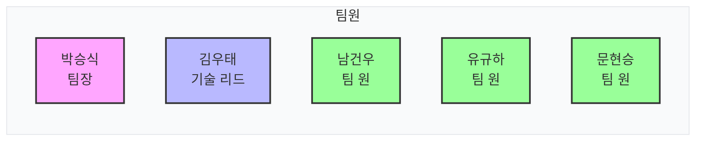
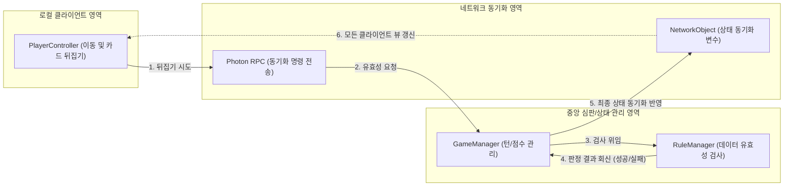
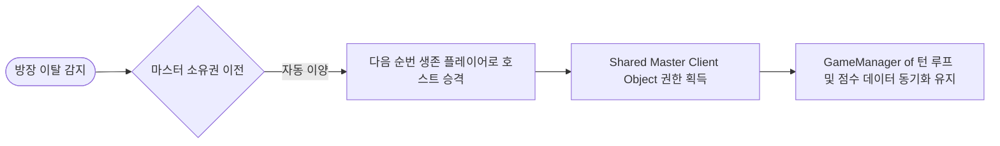
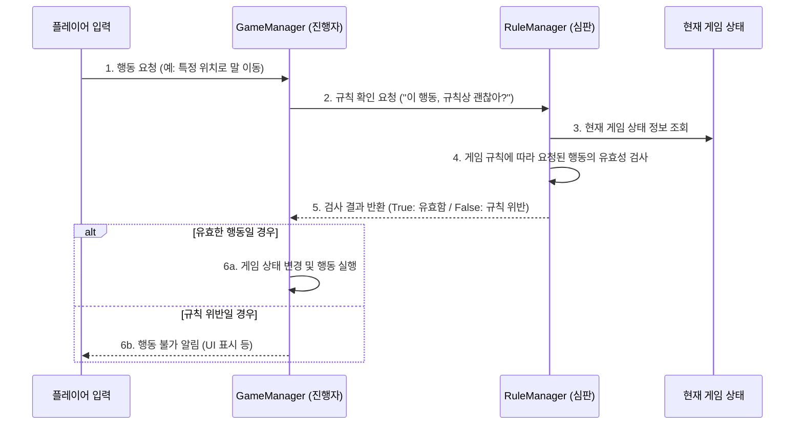

# Chicken Cha Cha
### Photon Fusion 2 기반 3D 온라인 멀티플레이어 보드게임 이식 프로젝트

<!-- link-github: https://github.com/WhiteAppleKo/Chicken-Cha-Cha-Project -->
<!-- link-video: https://youtube.com/watch?v=SomeVideoUrl -->

<div class="meta-grid">
  <div class="meta-item">
    <div class="meta-label">제작 인원</div>
    <div class="meta-val">5인 (팀 프로젝트)</div>
  </div>
  <div class="meta-item">
    <div class="meta-label">개발 기간</div>
    <div class="meta-val">2025.05.21 - 2025.05.30 (17일)</div>
  </div>
  <div class="meta-item">
    <div class="meta-label">핵심 스택</div>
    <div class="meta-val">Unity / C# / Photon Fusion 2 / Firebase</div>
  </div>
</div>

**Unity · C# · Photon Fusion 2**

---

## 1. 개요

### 1.1. 프로젝트 정의 및 배경
* **프로젝트 배경**: 전통 보드게임 '치킨 차차'의 규칙을 멀티플레이 환경으로 디지털 이식한 3D 온라인 멀티플레이어 팀 프로젝트입니다.
* **핵심 구현**: Photon Fusion 2 상태 동기화 기반 턴 제어 시스템 그리고 예기치 않은 네트워크 단절 대응 세션 유지 프레임워크 구축을 구현했습니다.
* **문서의 기술 범위**: 본 문서는 UI 시스템에 국한되지 않고, 실시간 네트워크 환경에서 방장(Master Client)을 포함한 임의의 플레이어 이탈 시 세션 폭파를 예방하고 중단 없는 플레이를 보장하기 위해 설계된 멀티플레이어 상태 동기화를 소개합니다.

#### 👥 팀원 구성 및 역할

### 1.2. 프로젝트 목차
| 장 번호 | 핵심 주제 | 구현 방식 |
| :--- | :--- | :--- |
| **02. 기술 리드 및 협업 표준화** | 개발 환경 표준화 및 네트워크 토폴로지 선정 | Rider IDE 환경 공유, Shared Mode 선정 및 예외 복구 아키텍처 수립 |
| **03. 플레이어 이탈 대응** | 실시간 플레이어 세션 이탈 및 마스터 권한 자동 이양 | Shared Master Client Object 상태 복구 아키텍처 및 턴 스킵 로직 구현 |
| **04. GameManager & RuleManager 분리 설계** | 게임 진행 상태 관리와 룰 유효성 검증의 분리 | SRP(단일책임) 설계를 통한 GameManager 및 RuleManager 컴포넌트 이원화 |
| **05. 고민과 선택 : 대안 비교 및 결정 근거** | 개발 중 발생한 설계 트레이드오프 분석 | 데이터 패킷 전송 모델, 협업 마일스톤 비교 결정 |
| **06. 프로젝트 회고** | 성능 검증 및 팀 개발 표준화 성과 | 턴 스킵 및 동기화 안전성 검증 결과 요약 |

### 1.3. 전체 시스템 아키텍처
플레이어 캐릭터의 이동/입력 모듈과 서버/동기화 관리 모듈이 어떻게 유기적으로 작동하는지 나타내는 아키텍처 다이어그램입니다.



---

## 2. 기술 리드: 협업 표준화 및 토폴로지 결정 (Tech Leadership)

### 2.1. 개발 환경 표준화 (Rider IDE & 코드 컨벤션)
<div class="image-card-text hover-image" data-image="portfolio/project2/images/2.1-1.png, portfolio/project2/images/2.1-2.png">
<p>팀 단위 협업 시 발생하는 코드 스타일 격차를 예방하고 개발 가독성을 확보하기 위해 코딩 스탠다드 및 Rider 에디터 설정을 통일했습니다.</p>
<p>- <strong>코드 스타일 정립</strong>: C# 및 Unity 코딩 규격을 정립(Private 변수 <code>m_</code> 접두사, bool 변수 <code>b</code> 접두사 등)하고 Notion을 활용해 규격 공유.</p>
<p>- <strong>Rider IDE 환경 공유</strong>: 정적 분석 규칙을 구성한 Rider 설정 파일을 통일 및 배포하여 5인 협업에서 흔히 발생하는 스타일 파편화 원천 차단.</p>
</div>

### 2.2. Photon Fusion 2 네트워크 토폴로지 선택
게임 중 일부 플레이어 또는 방장(마스터 클라이언트)이 네트워크 접속 단절로 세션을 이탈하더라도 잔여 클라이언트만으로 중단 없는 인게임을 지속하기 위해 네트워크 토폴로지 모드를 분석했습니다.

| 대안 | 방식 | 장점 | 단점 |
| :--- | :--- | :--- | :--- |
| **대안 A: Host Mode** | 공식 문서 권장 소규모 모드 | 상태 권한 일원화에 유리함 | **호스트(마스터) 이탈 시 방이 즉각 폭파되어 게임 세션이 강제 종료됨** |
| **대안 B: Shared Mode** | 각 클라이언트가 권한을 공유 | **마스터 클라이언트가 게임에서 이탈하더라도 잔여 클라이언트들이 동기화 상태를 유지하며 끊김 없이 진행 가능** | 공유 상태 관리를 위한 네트워크 동기화 설계 난이도 증가 |

> **결정: 대안 B (Shared Mode) 채택**
> 
> 마스터 클라이언트(호스트)가 비정상 이탈하더라도 세션이 강제 폭파되지 않고, 남은 플레이어들만으로 게임 동기화를 유지하며 중단 없이 인게임을 지속하기 위해 대안 B를 최종 채택했습니다.

---

## 3. 플레이어 이탈 대응 아키텍처 (Network Session Handling)

### 3.1. Shared Master Client Object 기반 세션 보존
마스터 클라이언트(방장)가 게임 룸에서 돌발 이탈하더라도 잔여 인원만으로 끊김 없는 플레이를 지속하기 위해, 마스터 권한 소실 시 즉각 다음 생존 마스터에게 게임 상태가 자동 이양되는 **공유 모드(Shared Mode)**를 프로젝트 핵심 구조로 선정했습니다.



### 3.2. 이탈자 처리 및 턴 자동 스킵 구현
<div class="image-card-text hover-image" data-image="portfolio/project2/images/3.2-1.png, portfolio/project2/images/3.2-2.png">
플레이어가 네트워크 단절로 이탈하면, <code>IPlayerLeft</code> 콜백을 수신하여 해당 플레이어 캐릭터를 유령 상태로 비주얼 소거하고, 활성 턴 대상에서 제외해 대기 없이 게임을 지속시키는 구조를 설계했습니다.
</div>

```csharp
// NetworkPlayer.cs - 이탈 감지 및 턴 스킵 처리
public void PlayerLeft(PlayerRef player)
{
    1. 이탈한 플레이어의 네트워크 오브젝트와 컴포넌트 정보 검색
    var leftPlayer = Runner.GetPlayerObject(player).GetComponent<NetworkPlayer>();
    
    2. 세션 동기화에서 해당 플레이어 이탈 상태 플래그를 **true로 즉시 활성화**
    leftPlayer.bHasLeft = true;
    
    3. 비주얼 소거: 플레이어 셰이더를 유령(soulShader)으로 변경하고 반투명 처리
    leftPlayer.mRenderer.material.shader = BoardManager.Instance.soulShader;
    leftPlayer.mRenderer.material.color = new Color(0.3f, 0.3f, 0.3f, 0.8f);
    
    4. 이탈 상태 애니메이션(앉아서 대기하는 잠자기 모션)을 네트워크 전체에 재생 명령
    leftPlayer.RPC_PlayAnimation(EChickenAnimation.Left);
    
    5. 이탈한 플레이어가 현재 **액티브 턴 플레이어**인지 검사
    if (GameManager.Instance.IsActivePlayer(player))
    {
        6. 방장(StateAuthority)에게 해당 플레이어의 **턴 강제 이양(MoveTurn) RPC 요청**
        RPC_LeftPlayer();
    }
}
```

```csharp
// GameManager.cs - 턴 관리 및 이탈자 건너뛰기
public void MoveTurn()
{
    1. 이전 플레이어의 이동 권한 회수 처리
    ActivePlayer.RPC_ReceiveMovePermission(false);
    
    2. 다음 턴의 플레이어로 기본 인덱스 갱신
    ActivePlayer = players[(ActivePlayer.Index + 1) % playerCount];
    
    3. 네트워크 상에서 나간 플레이어(bHasLeft = true)가 아닐 때까지 **턴을 무한 스킵 연산**
    while (ActivePlayer.bHasLeft)
    {
        ActivePlayer = players[(ActivePlayer.Index + 1) % playerCount];
    }
    
    4. 다음 생존 플레이어에게 **인게임 이동 권한 부여**
    ActivePlayer.RPC_ReceiveMovePermission(true);
}
```

---

## 4. GameManager & RuleManager 분리 설계 (SRP)

### 4.1. 의존성 분리 및 역할 위임
단일 매니저 클래스에 진행 통제와 룰 판정 책임이 혼재될 경우 발생하는 코드 비대화를 차단하고자, 진행을 담당하는 **GameManager**와 유효성을 전담 판정하는 **RuleManager** 컴포넌트로 분리 설계하여 결합도를 낮췄습니다.



### 4.2. 핵심 규칙 검증 및 매칭 처리
플레이어가 뒤집은 타일의 유효성을 실시간 판정하고 승리 상태를 검증하는 코드 스펙입니다.

```csharp
// RuleManager.cs - 타일 일치 유효성 검사
public bool OpenTile(SteppingTile tile, SelectingTile selectTileInfo)
{
    1. 다음 이동할 타일 뒤의 사진과 플레이어가 뒤집어 선택한 타일의 사진이 일치하는지 비교
    if (tile.Next.IsSamePicture(selectTileInfo))
    {
        return true;
    }
    return false;
}
```

```csharp
// GameManager.cs - 타일 매칭 결과 및 꼬리/모자 뺏기 동기화
public bool OpenTile(SteppingTile tile, SelectingTile selectTileInfo)
{
    1. 뒤집은 타일의 그림 정보가 다음 타일과 일치하는지 심판 검사 실행
    if (tile.IsSamePicture(selectTileInfo))
    {
        2. 성공 결과에 따라 액티브 플레이어 추가 동작 보장 동기화
        RPC_OpenTileResult(true);
        var takeCount = 0;
        
        3. 밟은 타일에 다른 플레이어들이 서 있는 경우 **꼬리 및 모자 수집 루프**
        foreach (var netplayers in mTailPlayers)
        {
            takeCount += netplayers.ScoreCount;
            for (int i = 0; i < netplayers.activeHatNumber.Count; i++)
            {
                mActiveHatNumber.Add(netplayers.activeHatNumber[i]);
            }
            netplayers.RPC_ResetHat();
            RPC_ResetTails(netplayers);
        }
        
        4. 수집된 꼬리와 모자 정보를 **액티브 플레이어에게 최종 대입**
        TakeHats(Runner.LocalPlayer, mActiveHatNumber);
        TakeTails(Runner.LocalPlayer, takeCount);
        mActiveHatNumber = new List<int>();
        mTailPlayers = new List<NetworkPlayer>();
        return true;
    }
    mTailPlayers = new List<NetworkPlayer>();
    
    5. 오답인 경우 RPC 오답 처리 및 턴 넘기기 동작 위임
    RPC_OpenTileResult(false);
    return false;
}
```

---

## 5. 고민과 선택 : 대안 비교 및 결정 근거

### 5.1. 데이터 동기화 패킷 전송 모델
실시간 보드 타일 매칭 이벤트 전송 시 대역폭 오버헤드를 최적화하기 위한 비교입니다.

| 대안 | 방식 | 장점 | 단점 |
| :--- | :--- | :--- | :--- |
| **대안 A: 구조체(Struct) 일괄 전송** | 연관된 모든 상태(선택 타일 정보, 턴, 모자 목록 등)를 단일 구조체 패킷으로 래핑하여 송수신 | 일괄 통신으로 수신 측 파싱 처리가 간편함 | 데이터 모델 변경 시 패킷 마이그레이션 복잡성이 높고, 미사용 데이터 전송으로 인한 불필요 패킷 오버헤드 유발 |
| **대안 B: 원시 변수(Primitive) 개별 전송** | 타일 인덱스, 꼬리 개수 등 개별 원시 데이터 변수들을 필요 시점에 독립 동기화 | 꼭 필요한 데이터만 핀포인트로 전송하여 트래픽 오버헤드 최소화 | 데이터 구조 다양화 시 동기화해야 할 변수 관찰 지점(OnChangedRender) 개수가 다수 늘어남 |

> **결정: 대안 B (원시 변수 개별 전송) 채택**
> 
> 프로젝트 사양 검토 결과 **동기화할 공유 데이터의 구조가 복잡하지 않고 원시 타입 범위 내에서 충분히 해결 가능**함을 확인하여, 네트워크 트래픽 오버헤드를 원천 방지하고 동기화 갱신 시점을 세밀하게 제어하기 위해 대안 B를 채택했습니다.

### 5.2. 협업 아키텍처 마일스톤 설계
팀 프로젝트 초기 빌드 시 상호 개발 병목을 예방하기 위한 프로세스 선택입니다.

| 대안 | 방식 | 장점 | 단점 |
| :--- | :--- | :--- | :--- |
| **대안 A: 세분화된 칸반 마일스톤 계획** | 초기 기획 단계에서 모든 기능 단위 일정을 세밀하게 칸반 태스크로 분할하여 전개 | 예측 일관성이 높고 마일스톤 일정 산출이 용이함 | 세세한 계획으로 인해 개발 자율성이 저하되고, 특정 파트 일정 딜레이 발생 시 연동된 타 파트 개발 전체가 병목 상태에 빠짐 |
| **대안 B: 인터페이스 명세화 기반 분할 협업** | public 상호작용 속성을 인터페이스로 최우선 문서화하고, 실제 기능 완성 전에 Mock 객체로 병렬 개발 수행 | 타 파트의 실제 구현 완료 시점을 기다릴 필요 없이 독립적인 개발 및 모의 테스트가 가능하여 병목 해소 | 협업 초기 단계에서 상호 규격 조율 및 인터페이스 문서 설계 공수 추가 소요 |

> **결정: 대안 B (인터페이스 명세화 기반 분할 협업) 채택**
> 
> 초기 명세화 작업에 따르는 **설계 소요 시간**을 감수하고서라도, 5인 팀원 간의 결합성 병목을 원천 방지하여 **전체 개발 속도를 비약적으로 확보하고 병렬적인 독립 테스트 환경을 실현**하기 위해 대안 B를 채택했습니다.

---

## 6. 프로젝트 회고

### 6.1. 성과 및 검증
* **세션 이양 복구 동작 확인**: 방장(Master Client)의 강제 접속 해제 테스트 진행 시, 네트워크가 멈추지 않고 차순위 생존 클라이언트로 방장 지위 및 `Shared Master Client Object` 소유권이 끊김 없이 매끄럽게 인계됨을 확인했습니다.
* **개발 환경 표준화**: Rider IDE 설정 통일 및 C# 코드 스타일/코딩 컨벤션 공유를 통해 5인 협업에서 흔히 발생하는 스타일 및 환경 파편화 분쟁을 개발 초기 단계에서 차단했습니다.

### 6.2. 회고
* **달성한 성과 (✓)**:
  * 5인 팀 프로젝트의 기술 리드로서 인터페이스 명세 기반 분할 작업 프로세스를 성공적으로 정착시켜 완성도 높은 병렬 개발 완수.
  * Shared Mode 이점 극대화를 통한 방장 탈퇴 예외 복구 아키텍처 실현.
