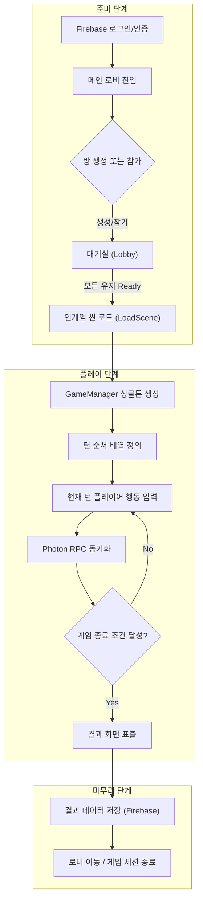
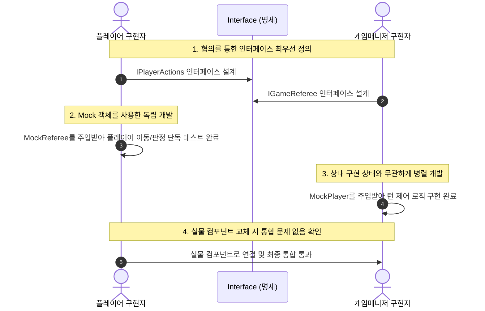

# Chicken Cha Cha — Online Multiplayer Board Game

**Unity (2022.3 LTS) · C# (10.0) · Photon Fusion 2 · 5인 팀 프로젝트 (기술 리드)**

본 문서는 전통 메모리 보드게임 '치킨 차차'의 물리 보드판과 실시간 카드 매칭 로직을 온라인 멀티플레이어 환경으로 이식하고, 기술 리드로서 설계한 네트워크 분산 구조 및 협업 워크플로우를 정리한 기술 명세서입니다.

---

## 1. 프로젝트 개요

* **목표**: 룸 환경에서 마스터 클라이언트(방장)의 강제 이탈 시에도 게임 방 세션이 끊기지 않는 고신뢰성 보드게임 환경을 구축하고, 5인 개발진의 코드 품질 및 병렬 개발 생산성을 극대화합니다.
* **개발 기간**: 2025.05.21 ~ 2025.05.30 (총 17일)
* **담당 역할**: 기술 리드 (Technical Lead) — 개발 환경 설정, 인터페이스 설계, Photon Fusion 2 연동 및 예외 처리 아키텍처 설계.

---

## 2. 시스템 구조

게임의 수명 주기는 크게 **준비 단계**, **플레이 단계**, **마무리 단계**로 분산 정렬되며, 모든 트랜잭션 흐름은 GameManager 싱글톤 매니저가 제어합니다.



---

## 3. 기술 리드 및 협업 프로세스 개선

### 3.1. 코드 컨벤션 정립 및 Rider IDE 환경 통일
프로젝트 초기, 팀원 간의 비표준적 명명 스타일로 인한 병합 충돌과 가독성 문제를 해결하기 위해 Notion에 공용 개발 표준을 명문화 배포하고 Rider 서식 설정을 고정 관리했습니다.

> **김우태 개발자 정립 주요 코딩 표준**:
> - **클래스 및 구조체**: 파스칼 표기법 (`PascalCase`)
> - **지역 변수 및 매개 변수**: 카멜 표기법 (`camelCase`)
> - **private 멤버 필드**: `m_` 접두사 적용 (`m_memberField`)
> - **불리언(Boolean) 식별자**: `b` 소문자 접두사 적용 (`bIsReady`)

---

### 3.2. 인터페이스 기반 병렬 개발 프로세스 (Mock Object 활용)
* **문제 상황**: 초기 칸반 보드 기획 시 세부 태스크 위주의 결합된 계획 수립으로 인해, 특정 팀원의 구현 완료 시점까지 다른 팀원이 대기하여 개발 병목 및 속도 저하 현상이 발생했습니다.
* **해결 방안**: 상호 통신할 기능에 대한 public 인터페이스를 최우선 명세화하고 공유했습니다. 이를 통해 기능의 실무 코드가 완성되기 전이라도 **인터페이스 모듈 규격**과 **임시 목 객체(Mock Object)**를 사용해 팀원들이 독립적으로 연계 파트의 개발 및 단독 테스트를 동시 병렬 수행했습니다.



---

## 4. Photon Fusion 2 네트워크 아키텍처

### 4.1. 공유 모드 (Shared Mode) 선정을 통한 고신뢰성 룸 유지
소규모 캐주얼 멀티플레이 게임 구현 시 공식 문서에서 권장하는 두 가지 연결 프로토콜 모델을 비교 분석하여 Rationale을 도출했습니다.

| 특징 | 클라이언트 호스트 모드 (Host Mode) | 공유 모드 (Shared Mode) - **선택** |
| :--- | :--- | :--- |
| **상태 권한 (Authority)** | 호스트 1인에게 서버 및 게임 상태 권한 집중 | 객체 단위로 분산 관리 (State Authority 위임 가능) |
| **방장(Master) 이탈 시** | 세션이 완전히 폭파되거나 무거운 호스트 마이그레이션 필요 | **방장이 나가도 세션은 유지되며 권한만 타 클라이언트로 즉시 승계** |
| **구현 난이도** | 클라이언트-서버 간 물리 동기화 최적화 난이도 높음 | 로비 매칭 및 분산 권한 구조 제공으로 빠른 프로토타이핑 가능 |

* **선정 사유**: 본 보드게임의 특성상 턴 상태 및 점수 동기화의 **연속성 보장**이 핵심이었기 때문에, 마스터 클라이언트 이탈 시에도 게임 방이 파괴되지 않고 다음 유저에게 권한이 부드럽게 양도되는 **공유 모드(Shared Mode)**를 탑재하여 안정성을 보증했습니다.

---

### 4.2. 개별 변수(Networked Properties) 중심 동기화
* **고려 사항**: 특정 이벤트 데이터 전송 시 커스텀 구조체(Struct)를 정의해 패킷을 교환하려 기획했습니다.
* **최적화 결정**: 데이터 복잡도와 동기화가 필요한 매개 변수 개수를 실시간 진단한 결과, 불필요한 패킷 바이트 낭비를 방지하고자 Photon의 `[Networked]` 어트리뷰트가 바인딩된 개별 변수 동기화 모델로 단순화 설계하여 대역폭 최적화 및 레이턴시를 대폭 감소시켰습니다.

---

## 5. 인게임 시스템 및 플레이어 이탈 예외 제어

### 5.1. GameManager와 RuleManager(심판)의 책임 디커플링
GameManager 싱글톤에 턴 스택 관리와 규칙 정합성 판단 로직이 모놀리식(Monolithic)하게 응집되는 구조를 방지하기 위해 역할을 디커플링 분리했습니다.

* **GameManager (싱글톤 매니저)**: 씬 이동 생명주기 관리, 플레이어 배열 데이터 동기화, UI 표출 및 턴 소유권 이전 흐름 관리.
* **RuleManager (규칙 검사기)**: 플레이어 액션(카드 매칭)의 정합성 유효성 검사만을 수행하는 고유 규칙 판정 컴포넌트. GameManager의 서브 컴포넌트로 부착되어 심판 역할을 전문 대행합니다.

---

### 5.2. 실시간 플레이어 이탈 방어 로직 (턴 승계 안전망)
멀티플레이 진행 도중 예기치 못한 세션 단절(네트워크 불량 등)로 플레이어가 퇴장할 경우를 대비하여 아래와 같이 상태 복구 시퀀스를 구현했습니다.

```csharp
// GameManager.cs 내 플레이어 이탈 감지 시 콜백 핸들러
public override void OnPlayerLeft(NetworkRunner runner, PlayerRef player)
{
    // 1. 이탈한 플레이어의 캐릭터를 찾아 반투명 머티리얼로 시각 변경 처리
    var leftPlayerObj = GetPlayerObject(player);
    leftPlayerObj.SetTransparentMode(true);

    // 2. 턴 스택 제어 리스트에서 해당 플레이어를 완전히 배제
    m_activePlayers.Remove(player);

    // 3. 만약 이탈한 유저가 '현재 턴을 소유하고 진행 중인 플레이어'였을 경우
    if (m_currentTurnPlayer == player)
    {
        // 턴 중단 및 즉시 턴 인덱스를 다음 살아있는 플레이어에게 강제 이탈 위임
        ForcePassNextTurn();
    }
}
```

* **턴 표시 피드백**: 현재 활성화된 턴 소유자의 UI 프레임을 강조 표시하고, 월드 상의 캐릭터 발밑에 노란색 턴 원형 링(Turn Indicator Indicator)을 동적으로 점등시켜 플레이 가독성을 증대시켰습니다.
