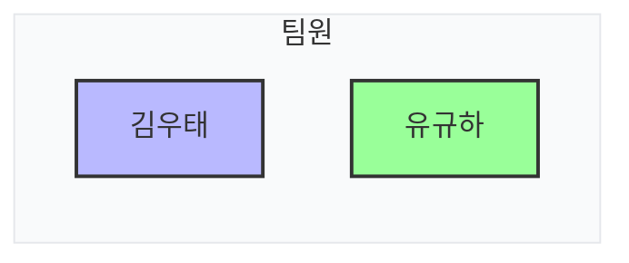
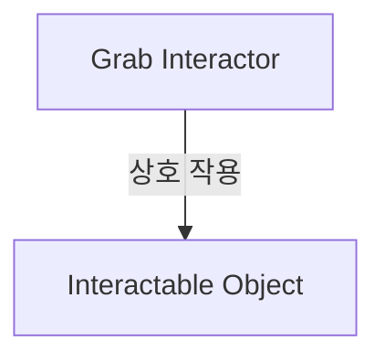
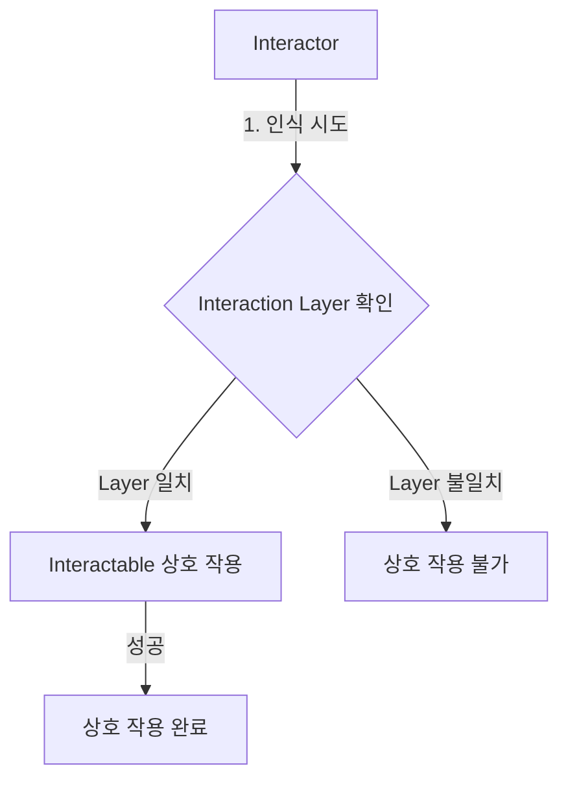
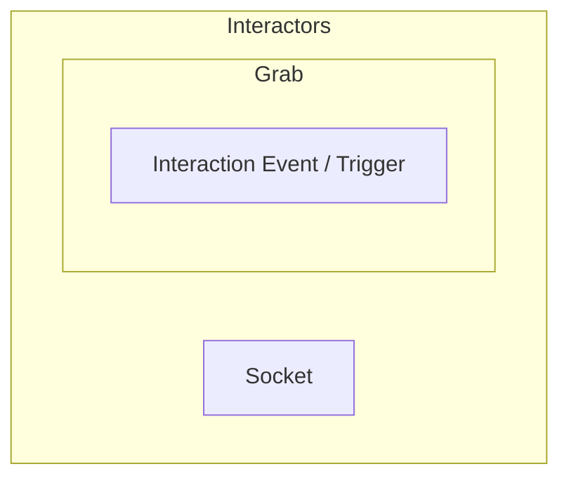
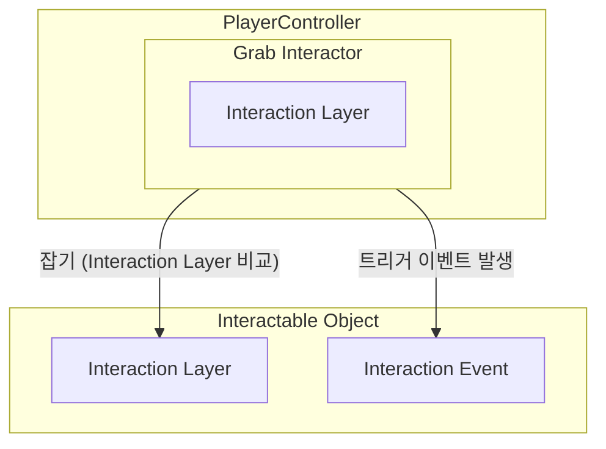
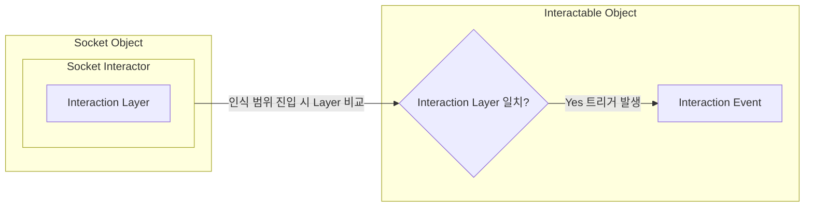
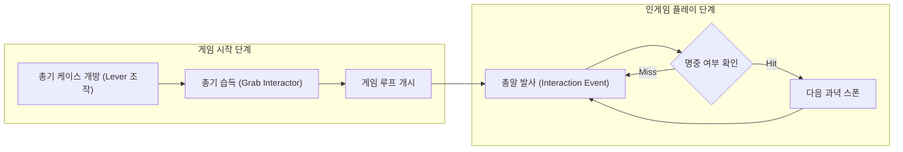
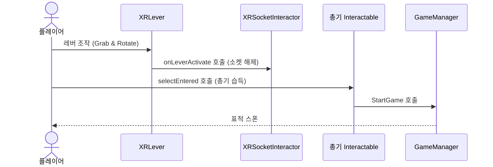
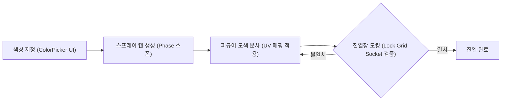

# XR Lab
### Unity XR Interaction Toolkit 기반 가상현실 물리 상호작용 및 내장 Lock Grid 소켓 필터링 기술 검증 프로젝트

<!-- link-github: https://github.com/Trouble-Shooting-Script/VRLab -->
<!-- link-video: https://youtu.be/pWH_7CpxJMc -->

  

    
제작 인원

    
2인 (팀 프로젝트)

  

  

    
개발 기간

    
2025.06.09 - 2025.06.27 (18일)

  

  

    
핵심 스택

    
Unity / C# / XR Interaction Toolkit / Shader Graph

  

**Unity · C# · XR Interaction Toolkit**

---

## 1. 개요

### 1.1. 프로젝트 정의
* **프로젝트 정의**: Unity의 공식 XR Interaction Toolkit 라이브러리를 기반으로 가상현실(VR) 환경 내 가상 객체의 정밀 물리 상호작용 시스템을 연구하기 위해 진행한 R&D 팀 프로젝트입니다.
* **핵심 구현**: 기본 XR 소켓의 Interaction Layer 필터링 한계를 극복하기 위해 XR Interaction Toolkit 내장 기능인 **Lock Grid Socket** 시스템을 도입하고 매핑했으며, Shader Graph를 연동해 소품 생성 연출(Phase) 및 심리스한 씬 룸 전환 효과(Dissolve)를 가상현실에 구현했습니다.

#### 👥 팀원 구성 및 역할

### 1.2. R&D 동기 및 개발 배경
* **R&D 동기**: XR Interaction Toolkit을 사용해 XR에 대한 기술을 학습하고 미니 게임을 만드는 것이 목적이며, 가상 공간 내에서의 현실적인 Grab(잡기), Socket(거치), Lever(회전 기믹) 동작 구현 원리를 학습하고 시각 효과(Phase/Dissolve)를 적용하기 위함입니다.
* **문서의 기술 범위**: 본 문서는 사격 기믹 및 피규어 도색 기믹에 국한되지 않고, XR 물리 컨트롤러 연동, 다중 키-락 대조 메커니즘, 머티리얼 월드 픽셀 소거 셰이더 및 도색 룸의 상태 머신 활용 사양을 통합하여 소개합니다.

### 1.3. 프로젝트 목차
| 장 번호 | 핵심 주제 | 구현 방식 |
| :--- | :--- | :--- |
| **02. XR 상호작용 프레임워크** | 상호작용 기본 개념 및 5대 컴포넌트 연동 | Interactor, Interactable, Layer, Event 필터링 및 매핑 |
| **03. 프로젝트 주요 컴포넌트** | Grab, Socket, Lever 물리 제어 및 Lock Grid 활용 | XR Interaction Toolkit 내장 소켓 물리 및 회전 조인트 제어 |
| **04. 고민과 선택 : 대안 비교 및 결정 근거** | 기본 소켓과 내장 Lock Grid 소켓 간 구성 트레이드오프 | 오브젝트 인스턴스 정밀 수납 필터링 방식 비교 결정 |
| **05. VR 시각 효과 및 공간 제어** | 스폰 및 공간 이동 시의 시각적 자연성 확보 | Shader Graph를 활용한 Alpha Clip 기반 Phase 및 Dissolve 셰이더 구축 |
| **06. 미니게임 콘텐츠 및 진행 흐름** | 사격 게임 및 피규어 룸 공간 연동 | 레버 잠금 해제 연쇄 및 스프레이 분사 도색 FSM 결합 |
| **07. 프로젝트 회고** | 성능 검증 및 기술 부채 개선 계획 | 단기 마일스톤 일정 준수 성과 및 협동 도색 멀티플레이 확장 계획 |

---

## 2. XR 상호작용 프레임워크

### 2.1. 상호작용 시스템 개요
가상 환경 내 객체와 상호 작용을 구현하기 위해 감지 주체인 Interactor와 상호 작용 대상인 Interactable 컴포넌트를 연동하여 통제하였습니다.

### 2.2. Interactor 및 종류
Interactor는 컨트롤러에 부착되어 사용자의 상호 작용을 감지하고 처리하는 컴포넌트입니다. 컴포넌트 종류별로 물리적 물체 인식 메커니즘이 상이합니다.

| Interactor 종류 | 설명 |
| :--- | :--- |
| **Near-Far Interactor** | 가깝거나 멀리 있는 Interactable을 터치 또는 조준하여 상호작용 수행 |
| **XR Direct Interactor** | 사용자가 손으로 물리적 물체를 직접 만졌을 때 상호작용 수행 |
| **XR Poke Interactor** | 손가락 찌르기(Poke) 등의 특정 물리 동작을 통해 단추/버튼 상호작용 수행 |
| **XR Ray Interactor** | 가상의 레이저 포인터를 방출하여 원거리의 물체와 상호작용 수행 |
| **XR Gaze Interactor** | 사용자의 시선(Eye Gaze) 입력을 감지해 대상 선택 및 트리거 수행 |
| **XR Socket Interactor** | 소켓 중심 기준 범위 내에 진입한 특정 물체를 도킹/거치하는 소켓 수행 |
| **AR Gesture Interactor** | (Deprecated) 모바일 터치 스크린 제스처를 통해 가상 오브젝트 상호작용 수행 |

### 2.3. Interactable
Interactable은 사용자가 상호 작용할 수 있는 가상 오브젝트에 부착되는 컴포넌트입니다. 잡거나 던지는 일반 프롭(Prop), 물리 레버, 조작 버튼 등에 공통으로 상속 매핑되어 동작합니다.

### 2.4. Interaction Layer
Interactor와 Interactable 간의 상호 작용 범위를 필터링하고 격리하기 위해 레이어를 활용하여 제어했습니다. 동일한 Interaction Layer에 속한 컴포넌트끼리만 상호작용 판정이 발생합니다.

### 2.5. Interaction Event (Trigger)
물리를 잡거나 떼는 특정 입력이 발생하는 타이밍을 감지하여 활성화 신호를 넘겨주기 위해 Interaction Event 설정을 바인딩했습니다. 이를 통해 잡고 있는 무기의 격발(Activate), 스프레이 분사 등의 기믹 이벤트를 트리거합니다.

---

## 3. 프로젝트 주요 컴포넌트

### 3.1. 주요 컴포넌트 개요
프로젝트에 핵심으로 사용된 상호작용 감지부는 Socket Interactor와 Grab Interactor로 구조화됩니다.

### 3.2. Grab Interactor
사용자의 손을 대변하는 컨트롤러 위치에 부착되어 물리적 잡기(Grab) 동작을 수신하고 처리합니다.

### 3.3. Socket Interactor
물체를 지정 홈/슬롯에 자동으로 진입 및 고정하여 수납하는 기능을 제어합니다.

  
총기 수납 케이스(Socket)와 총기(Interactable Object)의 물리 탈착 예시입니다. (좌측) 소켓 내부에 장착되어 고정된 물리 상태, (우측) 소켓 결합 해제 후 총기를 꺼내 쥔 모습입니다.

### 3.4. Lever 기믹
XR Interaction Toolkit의 회전식 관절 컴포넌트인 Lever 기능을 적용하여 총기 케이스 덮개의 물리 개폐를 구동했습니다. 물리적으로 손으로 잡아 특정 임계 회전 각도 이상을 당기면 개방 신호가 트리거되도록 구성했습니다.

  
레버 기능을 활용한 총기 케이스 개폐 물리 구현 예시입니다. (좌측) 닫힌 상태, (우측) 레버 조작에 의해 덮개가 개방된 상태입니다.

### 3.5. Lock Grid Socket
툴킷 기본 `XRGridSocketInteractor`의 기능을 상속 확장하여, Interaction Layer 조건뿐 아니라 삽입 물체의 고유 키 데이터(`Key`)를 추가 매치하는 Lock Grid Socket 방식을 채택했습니다. 일치하는 올바른 고유 Key 리스트를 지닌 물체만 소켓 장착을 승인합니다.

  
Lock Grid Socket 기능이 탑재된 진열장 격자(Grid) 구조의 기믹 예시입니다. 등록된 고유 키값을 가진 물체만 감지하여 특정 칸에만 정밀 수납되도록 통제합니다.

---

## 4. 고민과 선택 : 대안 비교 및 결정 근거

### 4.1. 가상 진열장 조립용 오브젝트 필터링 방식 선택
피규어 진열 메카닉 구현 시, 오배치를 완전히 차단하고 결합 안정성을 확보하기 위한 최적 필터링 방식 비교입니다.

| 대안                                 | 방식                                                                      | 장점                                                               | 단점 |
|:-----------------------------------|:------------------------------------------------------------------------|:-----------------------------------------------------------------| :--- |
| **대안 A: 기본 XRSocketInteractor 사용** | Unity 내장 XR 소켓 컴포넌트를 활용해 물리 레이어(Interaction LayerMask) 단위로만 필터링 수행      | 구현 난이도가 낮고 추가 세팅이 발생하지 않아 초기 기획 단계 검증에 유리함                       | **오브젝트 인스턴스별 개별 필터링 불가**. 여러 피규어 부품들이 아무 소켓에나 중복 도킹되어 기믹 꼬임 유발 |
| **대안 B: Lock Grid Socket 기능 매핑**   | 툴킷의 Lock Grid Socket의 expectedKey 속성 및 진입 오브젝트의 Key 컴포넌트 데이터를 실시간 매칭 검사 | **정밀한 1:1 오브젝트 도킹 보장**. 별도 커스텀 코드 최소화 및 툴킷 기능 최적화 활용으로 안전한 조립 구현 | 개별 수납용 오브젝트마다 Key 컴포넌트를 부착하여 관리해야 하므로 데이터 세팅 공수 추가 소요 |

> **결정: 대안 B (Lock Grid Socket 기능 매핑) 채택**
> 
> 피규어 데이터 세팅에 따르는 **추가 관리 공수**를 감수하더라도, 피규어 룸의 수납 기믹 오동작을 100% 차단하고 **프레임워크가 공식 지원하는 Lock Grid Socket 기능을 적극 매핑하여 논리적이고 안전한 1:1 조립 퍼즐 유효성을 검증**하기 위해 대안 B를 최종 채택했습니다.

---

## 5. VR 시각 효과 및 공간 제어

### 5.1. Phase 효과

  
Shader Graph로 구현된 물체 스폰 효과입니다. 본 프로젝트에서는 스프레이 캔 등의 작은 소품들을 생성할 때 사용합니다.

### 5.2. Dissolve 효과

  
Shader Graph로 구현된 공간 전환 효과입니다. 본 프로젝트에서는 플레이어가 위치한 룸(방)을 전환할 때 사용합니다.

---

## 6. 미니게임 콘텐츠 및 진행 흐름

### 6.1. 사격 게임
레버 동작을 시발점으로 하여 소켓 릴리즈, 플레이어 총기 획득 감지를 거쳐 최종 사격 게임 모듈이 구동되는 생명주기 제어 흐름입니다.

### 6.2. 피규어 룸
ColorPicker를 활용해 커스텀 스프레이를 생성하고, 이를 사용해 가상 피규어를 정밀 도색하여 수집대에 보관하는 실시간 공정 콘텐츠입니다.

---

## 7. 프로젝트 회고

### 7.1. 성과 및 검증
* **XR 물리 프레임워크 검증**: XR Interaction Toolkit의 물리 컴포넌트 연동을 마스터하여 Grab, Socket, Lever 물리 제어를 성공적으로 완수하고, 내장 `LockGridSocket` 기믹의 엄격한 유효성 검증 완료를 수동 확인했습니다.
* **디지털 셰이더 시각화**: Shader Graph 기반의 Phase 및 Dissolve 셰이더 2종을 빌드하여 3D VR 환경에서의 시각 연속성을 대폭 향상했습니다.
* **마일스톤 준수**: 2025.06.09 ~ 2025.06.27 (총 18일) 동안 R&D 일정을 밀림 없이 100% 정시 준수하여 완수했습니다.

### 7.2. 기술 부채 및 개선 계획
* **✓ 달성한 성과**: VR 내 손 물리 잡기, 회전 레버 개폐, 소켓 탈착 시스템 완수 및 Shader Graph 기반 특수 효과 구현 완료.
* **△ 한계점**: 18일간의 타이트한 단기 개발 일정 제약으로 인해, 사격 게임과 피규어 도색 룸 이외에 추가적인 미니게임 콘텐츠 풀을 폭넓게 다변화하지 못함. 단일 로컬 플레이 환경으로만 제한되어 있어 다자간의 물리 협동 인터랙션 요소 부재.
* **→ 향후 계획**: 본 프로젝트에서 검증된 공간 전환(Dissolve) 메카닉을 실시간 네트워크 동기화 솔루션과 접목하여, 여러 사용자가 동일 가상 공간 내에서 피규어를 동시 조립하고 도색을 연계 진행하는 **실시간 멀티플레이 피규어 협동 룸 확장**을 추진할 계획입니다.
