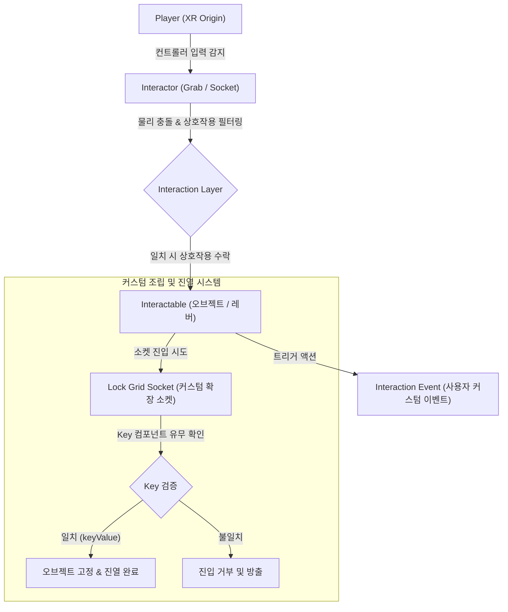
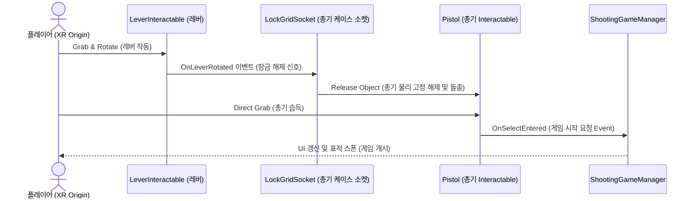
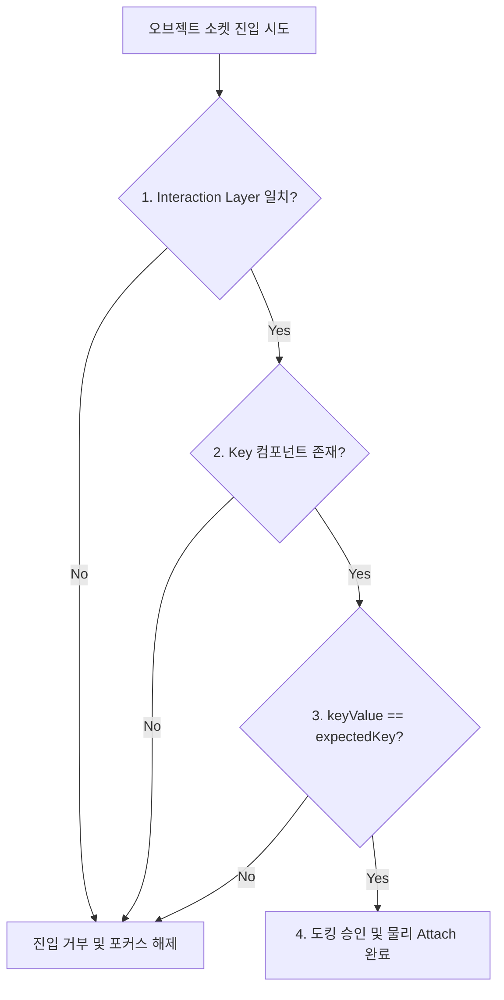
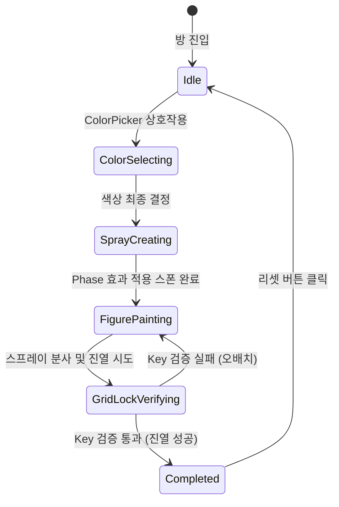

# XR Lab
### Unity XR Interaction Toolkit 기반 가상현실 물리 상호작용 및 커스텀 소켓 필터링 기술 검증 프로젝트

<!-- link-github: https://github.com/WhiteAppleKo/XR-Lab-Project -->
<!-- link-video: https://youtube.com/watch?v=SomeXRVideoUrl -->

<div class="meta-grid">
  <div class="meta-item">
    <div class="meta-label">제작 인원</div>
    <div class="meta-val">2인 (팀 프로젝트)</div>
  </div>
  <div class="meta-item">
    <div class="meta-label">개발 기간</div>
    <div class="meta-val">2025.06.09 - 2025.06.27 (18일)</div>
  </div>
  <div class="meta-item">
    <div class="meta-label">핵심 스택</div>
    <div class="meta-val">Unity / C# / XR Interaction Toolkit / Shader Graph</div>
  </div>
</div>

**Unity · C# · XR Interaction Toolkit**

---

## 1. 개요

### 1.1. 프로젝트 정의 및 배경
* **프로젝트 배경**: Unity의 공식 XR Interaction Toolkit 라이브러리를 기반으로 가상현실(VR) 환경 내 가상 객체의 정밀 물리 상호작용 및 개별 오브젝트 정밀 수납을 위한 조립식 진열 시스템을 연구하고 검증하기 위해 진행한 R&D 팀 프로젝트입니다.
* **핵심 기능**: 기본 XR 소켓의 Interaction Layer 필터링 한계를 극복하기 위해 Key 스크립터블 오브젝트 대조 기반의 커스텀 **Lock Grid Socket**을 설계하였으며, Shader Graph를 연동해 소품 생성 연출(Phase) 및 심리스한 씬 룸 전환 효과(Dissolve)를 가상현실에 구현했습니다.
* **문서의 기술 범위**: 본 문서는 사격 기믹 및 피규어 도색 기믹에 국한되지 않고, XR 물리 컨트롤러 연동, 다중 키-락 대조 메커니즘, 머티리얼 월드 픽셀 소거 셰이더 및 도색 룸의 상태 머신 설계 사양을 통합하여 소개합니다.

### 1.2. 프로젝트 목차
| 장 번호 | 핵심 주제 | 구현 방식 |
| :--- | :--- | :--- |
| **02. XR 물리 상호작용** | 잡기(Grab), 소켓(Socket), 레버(Lever) 물리 제어 | XR Interaction Toolkit의 물리 조작 컴포넌트 커스텀 매핑 |
| **03. Lock Grid Socket 검증** | Key-Value 대조 기반의 조립 진열장 필터링 | XRSocketInteractor 상속 확장 및 Lock 데이터 대조 로직 구현 |
| **04. 고민과 선택 : 대안 비교 및 결정 근거** | 기본 소켓과 커스텀 소켓 간 설계 트레이드오프 | 오브젝트 인스턴스 정밀 수납 필터링 방식 비교 결정 |
| **05. VR 시각 효과 및 공간 제어** | 스폰 및 공간 이동 시의 시각적 자연성 확보 | Shader Graph를 활용한 Alpha Clip 기반 Phase 및 Dissolve 셰이더 구축 |
| **06. 프로젝트 회고** | R&D 성능 검증 및 기술 부채 개선 계획 | 단기 마일스톤 일정 준수 성과 및 협동 도색 멀티플레이 확장 계획 |

### 1.3. 전체 시스템 아키텍처
플레이어의 입력 신호가 XR Interactor 및 커스텀 Lock Grid Socket을 거쳐 상호작용 이벤트와 도킹 판정으로 연결되는 전체 데이터 흐름도입니다.



---

## 2. XR 물리 상호작용 및 기믹 설계 (XR Interaction Architecture)

### 2.1. XR 상호작용 프레임워크 설계 및 주요 컴포넌트
가상현실 물리 상호작용 시스템을 구현하고 기믹을 통제하기 위해 활용한 핵심 컴포넌트들의 역할과 정의는 다음과 같습니다.

* **상호작용 기본 요소**:
  - **Interactor**: 컨트롤러(주로 사용자의 손)에 부착되어 물리적 입력을 감지하고 상호작용을 처리하는 컴포넌트입니다.
  - **Interactable**: 잡기, 던지기, 누르기 등 상호작용 대상이 되는 물리 가상 오브젝트입니다.
  - **Interaction Layer**: Interactor와 Interactable 간의 상호작용 필터링 및 제어 규칙을 규정합니다.
  - **Interaction Event**: 물체가 잡히거나 놓쳤을 때 특정 트리거 행동을 바인딩하기 위한 사용자 정의 커스텀 이벤트입니다.
* **주요 컴포넌트 메카닉**:
  - **Socket Interactor**: Interactable 물체를 특정 슬롯/소켓 위치에 자동으로 도킹 및 배치하는 컴포넌트입니다 (예: 총기 케이스 내부 거치).
  - **Lever**: 회전 기믹을 지원하는 Interactable을 응용하여 총기 케이스의 개폐 문을 여닫는 상호작용 구현에 활용됩니다.
  - **Lock Grid Socket (커스텀 확장)**: 기본 Socket Interactor 기능을 확장하여, Interaction Layer 검증 외에도 삽입되는 오브젝트의 Key 컴포넌트 내 특정 문자열 값(Key)을 직접 검사하여 필터링하는 컴포넌트입니다.


### 2.2. 사격 게임 시작 시퀀스 흐름
레버 동작을 시발점으로 하여 소켓 릴리즈, 플레이어 총기 획득 감지를 거쳐 최종 사격 게임 모듈이 구동되는 생명주기 제어 흐름입니다.



<div class="image-row cols-2">
  
  
</div>

---

## 3. 커스텀 Lock Grid Socket 검증 시스템

### 3.1. Lock-Key 기반 정밀 필터링 매커니즘
기본 소켓(XRSocketInteractor)이 제공하는 광범위한 Layer 수준의 필터링 방식에서 나아가, 도킹 대상 물체의 스크립터블 오브젝트 키(`Key`) 데이터를 일대일 검사하여 특정 진열 슬롯에 정확한 피규어 부품만 삽입되도록 설계했습니다.



### 3.2. 핵심 소스코드 스냅샷
진입하는 오브젝트의 키체인 컴포넌트 데이터를 심층 검증하는 `XRLockGridSocketInteractor`와 필수 키들의 소유 여부를 판정하는 `Lock` 검증부의 핵심 구현 코드입니다.

```csharp
// XRLockGridSocketInteractor.cs - 그리드 락 소켓 인터랙터 구현
public class XRLockGridSocketInteractor : XRGridSocketInteractor
{
    [SerializeField] Lock m_Lock;

    public override bool CanHover(IXRHoverInteractable interactable)
    {
        1. 베이스 클래스(XRGridSocketInteractor)의 기본 레이어 호버 가능 여부 1차 검사
        if (!base.CanHover(interactable))
            return false;

        2. 진입한 오브젝트로부터 **IKeychain 컴포넌트 정보 검색**
        var keyChain = interactable.transform.GetComponent<IKeychain>();
        
        3. 소켓이 요구하는 Lock 키 조건에 부합하는지 **최종 호버 유효성 판정**
        return m_Lock.CanUnlock(keyChain);
    }

    public override bool CanSelect(IXRSelectInteractable interactable)
    {
        1. 베이스 클래스의 기본 레이어 도킹 가능 여부 1차 검사
        if (!base.CanSelect(interactable))
            return false;

        2. 진입한 오브젝트로부터 **IKeychain 컴포넌트 정보 검색**
        var keyChain = interactable.transform.GetComponent<IKeychain>();
        
        3. 소켓이 요구하는 Lock 키 조건에 부합하는지 **최종 셀렉션 유효성 판정**
        return m_Lock.CanUnlock(keyChain);
    }
}
```

```csharp
// Lock.cs - 키 리스트 및 유효성 대조 검증 핵심 로직
[Serializable]
public class Lock
{
    [SerializeField] List<Key> m_RequiredKeys;

    public bool CanUnlock(IKeychain keychain)
    {
        1. 키체인 정보가 비어 있는 경우 요구하는 키가 없을 때만 잠금 해제 승인
        if (keychain == null)
            return m_RequiredKeys.Count == 0;

        2. 소켓 잠금 해제에 필요한 **모든 필수 키 목록 순회 검사**
        foreach (var requiredKey in m_RequiredKeys)
        {
            if (requiredKey == null)
                continue;

            3. 키체인이 특정 필수 키(requiredKey)를 하나라도 누락한 경우 **즉시 실패(false) 반환**
            if (!keychain.Contains(requiredKey))
                return false;
        }

        4. 모든 필수 키 대조를 성공적으로 통과한 경우 **도킹 승인(true) 반환**
        return true;
    }
}
```

---

## 4. 고민과 선택 : 대안 비교 및 결정 근거

### 4.1. 가상 진열장 조립용 오브젝트 필터링 방식 선택
피규어 진열 메카닉 구현 시, 오배치를 완전히 차단하고 결합 안정성을 확보하기 위한 최적 필터링 방식 비교입니다.

| 대안 | 방식 | 장점 | 단점 |
| :--- | :--- | :--- | :--- |
| **대안 A: 기본 XRSocketInteractor 사용** | Unity 내장 XR 소켓 컴포넌트를 활용해 물리 레이어(Interaction LayerMask) 단위로만 필터링 수행 | 구현 난이도가 낮고 추가 스크립트 작성 비용이 발생하지 않아 초기 기획 단계 검증에 유리함 | **오브젝트 인스턴스별 개별 필터링 불가**. 여러 피규어 부품들이 아무 소켓에나 중복 도킹되어 기믹 꼬임 유발 |
| **대안 B: 커스텀 Lock Grid Socket 확장 개발** | 소켓에 기대 키(expectedKey)를 등록하고, 진입 오브젝트의 Key 컴포넌트 데이터를 실시간 매칭 검사 | **정밀한 1:1 오브젝트 도킹 보장**. 피규어 슬롯마다 고유 부품만 수납되도록 논리적 격리 완수 | 개별 수납용 오브젝트마다 Key 컴포넌트를 부착하여 관리해야 하므로 데이터 세팅 공수 추가 소요 |

> **결정: 대안 B (커스텀 Lock Grid Socket 확장 개발) 채택**
> 
> 피규어 데이터 세팅에 따르는 **추가 관리 공수**를 감수하더라도, 피규어 룸의 수납 기믹 오동작을 100% 차단하고 **논리적이고 엄격한 1:1 조립 퍼즐 유효성 검증을 보증**하기 위해 대안 B를 최종 채택했습니다.

---

## 5. VR 시각 효과 및 공간 제어 (Visual Effects)

### 5.1. Phase 효과 (물체 스폰 셰이더)
스프레이 캔 등의 소품 생성 시 서서히 나타나는 효과입니다.
- **연산 메커니즘**: Shader Graph 내부에서 3D 픽셀의 월드 좌표계를 기준으로 3D Simple Noise 노이즈 맵을 합성합니다.
- **Alpha Clip 제어**: 진행률 파라미터(0 ➡️ 1)를 수축/팽창시켜 임계값(Threshold)을 연산하고, 픽셀의 Alpha 값을 Alpha Clip Threshold와 비교하여 조건을 만족하지 못하는 경계를 Emission Edge로 발광시킨 후 투명 처리(Clip)하여 연출을 극대화합니다.

### 5.2. Dissolve 효과 (공간 전환 셰이더)
도색 룸 전환 및 씬 전환 시 공간 전체가 분해되며 전환되는 디졸브 연출을 구현했습니다.
- **연산 메커니즘**: 3D 메시 표면 위에 3D 노이즈 노드를 투사하고, 씬 전환 트리거 시 파라미터 보간 연산(Lerp)을 수행합니다.
- **픽셀 소거 방식**: Shader Graph의 `Master Stack - Alpha Clip Threshold` 노드를 활용합니다. 시간 경과에 따라 노이즈 텍스처 값에서 씬 전환 보간 값을 감산(Subtract)하여 결과가 0 이하가 된 픽셀의 드로우를 Discard(생략) 처리해 공간의 해체를 시각화합니다.

### 5.3. 피규어 룸 전체 상태 머신 (FSM)
도색 룸 내 스프레이 생성 및 피규어 진열까지의 유기적인 기믹 흐름을 제어하는 유한상태기계 다이어그램입니다.



<div class="image-row cols-2">
  
  
</div>

---

## 6. 프로젝트 회고

### 6.1. 성과 및 검증
* **XR 물리 프레임워크 검증**: XR Interaction Toolkit의 물리 컴포넌트 연동을 마스터하여 Grab, Socket, Lever 물리 제어를 성공적으로 완수하고, 커스텀 `LockGridSocket` 기믹의 엄격한 유효성 검증 완료를 수동 확인했습니다.
* **디지털 셰이더 시각화**: Shader Graph 기반의 Phase 및 Dissolve 셰이더 2종을 빌드하여 3D VR 환경에서의 시각 연속성을 대폭 향상했습니다.
* **마일스톤 준수**: 2025.06.09 ~ 2025.06.27 (총 18일) 동안 R&D 일정을 밀림 없이 100% 정시 준수하여 완수했습니다.

### 6.2. 기술 부채 및 개선 계획
* **콘텐츠 스케일의 한계**:
  - **원인**: 18일간의 타이트한 단기 개발 일정 제약으로 인해, 사격 게임과 피규어 도색 룸 이외에 추가적인 미니게임 콘텐츠 풀을 폭넓게 다변화하지 못함.
  - **개선 로드맵 (✓ / △ / →)**:
    - **✓ 달성한 성과**: VR 내 손 물리 잡기, 회전 레버 개폐, 소켓 탈착 시스템 완수 및 Shader Graph 기반 특수 효과 구현 완료.
    - **△ 한계점**: 단일 로컬 플레이 환경으로만 제한되어 있어 다자간의 물리 협동 인터랙션 요소 부재.
    - **→ 향후 계획**: 본 프로젝트에서 검증된 공간 전환(Dissolve) 메카닉을 실시간 네트워크 동기화 솔루션과 접목하여, 여러 사용자가 동일 가상 공간 내에서 피규어를 동시 조립하고 도색을 연계 진행하는 **실시간 멀티플레이 피규어 협동 룸 확장**을 추진할 계획입니다.
