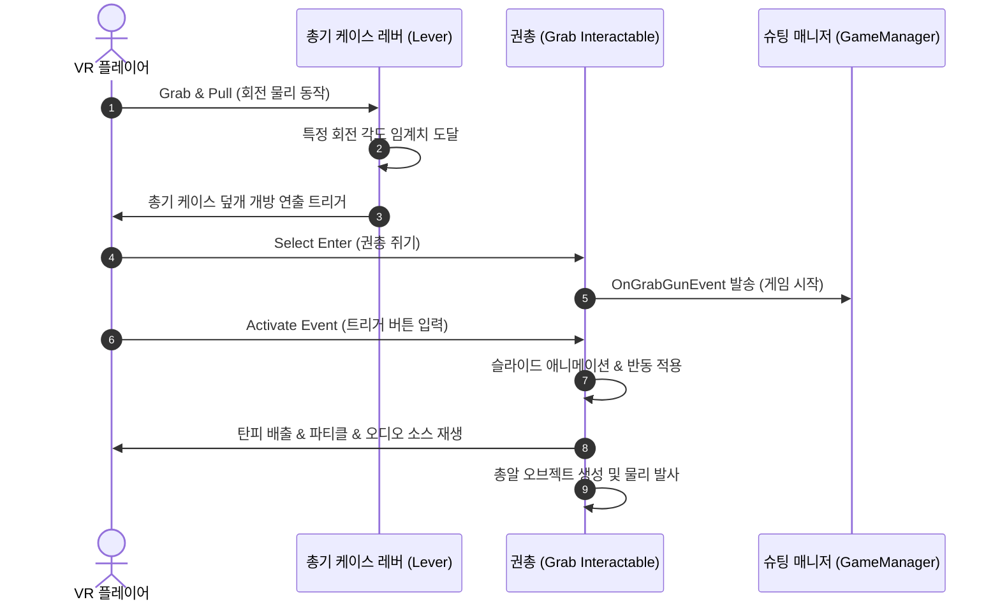

# XR Lab — VR Interaction & Shader Graph R&D

**Unity (2022.3 LTS) · Meta Quest 3S · XR Interaction Toolkit · 2인 팀 프로젝트**

본 문서는 가상 현실(VR) 환경에서 물리 상호작용의 자연스러움을 고도화하고, Shader Graph를 통해 실시간 생성/소멸 시각 효과를 구현한 XR 미니게임 패키지(사격 게임, 피규어 룸) 기술 명세서입니다.

---

## 1. 프로젝트 개요

* **목표**: Unity 공식 **XR Interaction Toolkit** 라이브러리의 상호작용 구조를 정립하고, VR 모바일 기기(Meta Quest 3S) 런타임 최적화 빌드 및 가상 드로잉(UV 페인팅) 기술을 연구합니다.
* **개발 기간**: 2025.06.09 - 2025.06.27 (총 18일)
* **담당 역할 (본인)**: 사격 미니게임 및 총기 케이스 레버 기믹 설계, 피규어 룸 도색(Paint in 3D 연계) 및 Lock Grid Socket 커스텀 컴포넌트 구현, Phase/Dissolve Shader Graph 제작.

---

## 2. 시스템 구조

XR 상호작용의 기본 뼈대는 컨트롤러의 입력 정보를 감지하는 **Interactor**와 물리 상호작용 대상인 **Interactable**, 그리고 상호 필터링을 조율하는 **Interaction Layer**로 분기 설계되었습니다.

```mermaid
flowchart LR
    subgraph Interactor (컨트롤러 측)
        A[XR Direct Interactor] ---|근거리 잡기| Layer{Interaction Layer 일치 검사}
        B[XR Ray Interactor] ---|원거리 레이저| Layer
        C[XR Socket Interactor] ---|소켓 거치대| Layer
    end

    subgraph Interactable (오브젝트 측)
        D[XR Grab Interactable] --- Layer
        E[XR Simple Interactable] --- Layer
    end

    Layer -->|일치| F[Interaction Event 트리거 발생]
    Layer -->|불일치| G[상호작용 무효화/차단]
```

---

## 3. 핵심 기술 구현

### 3.1. Lock Grid Socket (식별 키값 매칭 소켓)
기본 `XRSocketInteractor`는 `Interaction Layer` 일치성만을 검사하기 때문에, 동일한 레이어 상에 놓인 여러 피규어/부품들이 엉뚱한 진열 슬롯에 마구잡이로 꽂히는 예외가 발생했습니다. 이를 방어하기 위해 레이어 검사 후에 추가적으로 **고유 Key 코드 식별자**를 2중 체크하는 확장 컴포넌트를 직접 구현했습니다.

```csharp
// LockGridSocket.cs - XRSocketInteractor 확장 구현체
public class LockGridSocket : XRSocketInteractor
{
    [Header("진열 제한 키 식별자")]
    [SerializeField] private string m_requiredSocketKey;

    // 소켓에 호버/진입한 물체가 꽂힐 수 있는지 최종 판정하는 오버라이드 함수
    public override bool CanSelect(IXRSelectInteractable interactable)
    {
        // 1. 부모 클래스의 Interaction Layer 매칭 조건 선 검증
        bool bBaseCanSelect = base.CanSelect(interactable);
        if (!bBaseCanSelect) return false;

        // 2. 진입 물체의 고유 Key 데이터 컴포넌트 조회
        var figureKeyComp = interactable.transform.GetComponent<FigureKeyData>();
        if (figureKeyComp == null) return false;

        // 3. 소켓이 요구하는 Key 코드와 피규어의 Key 코드가 정확히 일치하는지 판별
        return figureKeyComp.FigureKey == m_requiredSocketKey;
    }
}
```
* **효과**: 동일한 레이아웃의 진열장 그리드 내부에서, 정확히 설계된 특정 번호의 피규어 모델만 지정 슬롯에 자화식 고정 장착(Snap)되도록 안전 제어 구현.

---

### 3.2. 사격 상호작용 및 물리 액티베이션 (사격 게임)
레버 물리 회전을 연계한 총기 케이스 개방 및 권총 파이어 로직을 이벤트 리액티브 방식으로 유기적으로 동기화했습니다.



---

### 3.3. 스프레이 페인팅 및 도색 UV 매핑 (피규어 룸)
* **스프레이 생성**: UI 컬러 피커(ColorPicker)에서 선택한 색 정보를 매개 변수로 전달받아, 소켓 상에 동적으로 스프레이 캔을 인스턴스화합니다. 이때 Shader Graph로 짠 **Phase 효과(스프레이 캔 외형이 스캔되듯 생성되는 라인 연출)**를 가동합니다.
* **실시간 도색**: 플레이어가 도색 스프레이 캔을 잡고 피규어를 겨냥해 분사(`Activate`)하면, 캔 끝에서 레이캐스트를 발사하여 피규어 메쉬 콜라이더에 접촉한 3D 월드 충돌 좌표를 획득합니다. 이를 2D 텍스처 좌표계(UV)로 해체 연산하는 `Paint in 3D` 모듈과 연계해, 피규어 머티리얼의 디퓨즈 맵에 동적으로 정밀 페인팅 픽셀을 적용합니다.

---

### 3.4. Dissolve Shader Graph (텔레포트 룸 전환)
피규어 룸의 도색 완료 후 공간을 전환하거나 씬을 이동할 때, 하이테크 느낌을 살리기 위해 노이즈 텍스처를 활용해 벽면과 공간이 붕괴/소멸되는 디졸브(Dissolve) 효과 셰이더를 탑재했습니다.

* **원리**: 3D 공간 상의 픽셀 좌표(World Position)에 Simplex Noise 텍스처를 투사하여, 시간에 따라 변화하는 `_DissolveThreshold` 값과 비교 연산합니다. 노이즈 세기가 임계치보다 높은 픽셀 영역은 `clip()` 처리하여 폐기하고, 경계선 주변부에는 이미시브(Emissive, 자가발광) 네온 컬러 밴드를 덧씌워 불에 타 소멸하는 역동적 공간감을 연출합니다.
