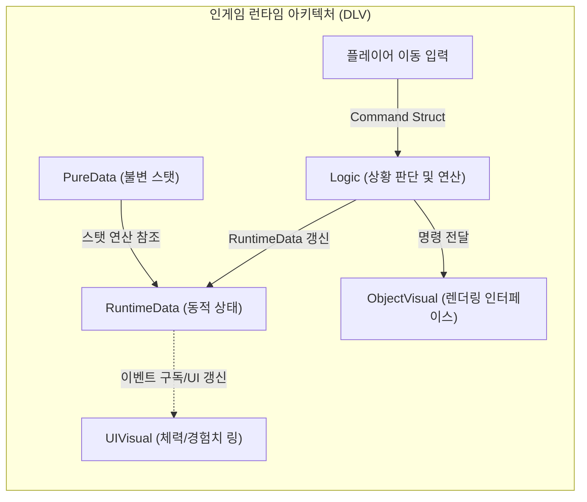
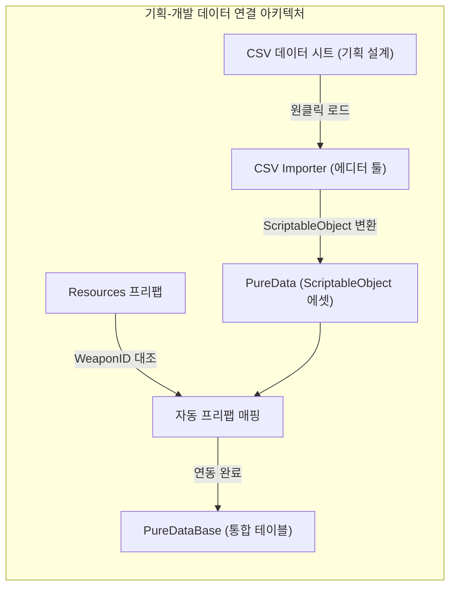
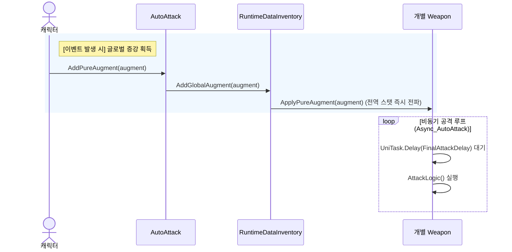
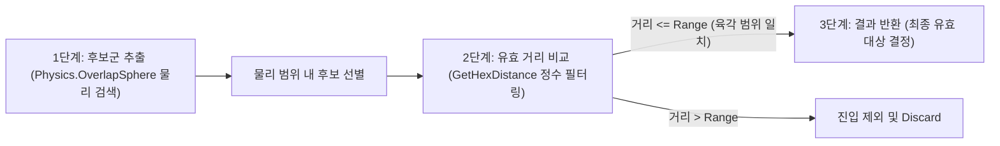

# Vampire Survivor Like
### Unity Shapes 에셋 및 3축 Cube Hex-Grid 기반 3D 서바이벌 로그라이크 기술 검증 프로젝트

<!-- link-github: https://github.com/WhiteAppleKo/3D-Vampire-Survivor-Like -->
<!-- link-video: https://youtube.com/watch?v=SomeVampireVideoUrl -->

<div class="meta-grid">
  <div class="meta-item">
    <div class="meta-label">제작 인원</div>
    <div class="meta-val">1인 (개인 프로젝트)</div>
  </div>
  <div class="meta-item">
    <div class="meta-label">개발 기간</div>
    <div class="meta-val">2025.12 - 2026.02 (3달)</div>
  </div>
  <div class="meta-item">
    <div class="meta-label">핵심 스택</div>
    <div class="meta-val">Unity / C# / HexGrid / Shapes Asset</div>
  </div>
</div>

**Unity · C# · HexGrid & Shapes**

---

## 1. 개요

### 1.1. 프로젝트 정의 및 배경
* **프로젝트 배경**: 서바이버 로그라이크 장르의 핵심적 쾌감인 '대규모 물량 통제'와 '콘텐츠의 무한한 확장성'을 구현하기 위해 진행한 1인 R&D 개발 프로젝트입니다.
* **핵심 기능**: 삼각함수 연산 부하 없이 정수 산술 연산만으로 거리를 구하는 **3축 Cube 육각형 그리드(HexGrid)** 물리 범위 판정 아키텍처를 수립하고, 기획 사양 변동에 독립적인 **데이터-로직-비주얼(DLV) 아키텍처**를 설계했으며, Shapes 에셋의 GPU 인스턴싱 배칭 기법을 적용해 드로우콜을 1회로 최적화했습니다.
* **문서의 기술 범위**: 본 문서는 단순한 뱀서 모작 기믹에 그치지 않고, 다중 오브젝트 물리 스캔 2단계 필터링, 데이터 주도 CSV 자동화 파이프라인, 그리고 하이브리드 UI 상태 머신에 대해 기술합니다.

### 1.2. 프로젝트 목차
| 장 번호 | 핵심 주제 | 구현 방식 |
| :--- | :--- | :--- |
| **02. 장르 분석 및 기획** | 서바이버 로그라이크 본질 분석 및 중앙 집중 UX 설계 | 장르 핵심 3대 지표 수립, 3대 증강 분류, 중앙 집중 HP/EXP 링 및 네온 컬러 스와치 정의 |
| **03. DLV 아키텍처** | 기획 사양 변동에 유연한 데이터-로직-비주얼 격리 구조 | 읽기 전용 PureData, 런타임 갱신 RuntimeData, 렌더링 Visual 인터페이스 분리 |
| **04. HexGrid 좌표 연산** | 실시간 대규모 몬스터 타겟 필터링 연산 최적화 | 3축 Cube 좌표계 `q+r+s=0` 제약 및 2단계 물리-정수 거리 스캔 구현 |
| **05. 무기 시스템 추상화 및 런타임 스탯 연산** | 자식 무기 개별 공격 구현 및 실시간 계층적 스탯 연산 | Weapon 추상 클래스 설계, 모디파이어 합산 연산, 3대 무기 유형 구현, 비동기 스파이럴 연출 |
| **06. 고민과 선택 : 대안 비교 및 결정 근거** | 그리드 기하학 및 스탯 연산 아키텍처 설계 트레이드오프 | HexGrid 채택 배경 및 SO 원본 훼손 방지를 위한 RuntimeData 분리 결정 |
| **07. 벡터 그래픽스 및 기획 데이터 연동** | 렌더링 최적화 및 에디터 변환 자동화 | Shapes GPU 인스턴싱 배칭 최적화 및 CSV Importer 툴링 구축 |

### 1.3. 전체 시스템 아키텍처
프로젝트 아키텍처는 게임 실행 중 작동하는 **인게임 런타임 시스템**과 게임 외적으로 설계 데이터를 연동하는 **에디터 파이프라인 시스템**으로 이원화하여 관리됩니다.

#### 인게임 런타임 아키텍처 (DLV)
플레이어의 조작 입력이 Logic을 거쳐 동적 데이터(RuntimeData)를 변경하고, 이를 구독하는 UI 및 렌더러로 시각 신호가 전파되는 흐름입니다.



#### 기획-개발 데이터 연결 아키텍처 (에디터 파이프라인)
CSV 파일에 적힌 정적 기획 수치를 유니티 에디터 툴(CSV Importer)을 통해 ScriptableObject로 변환하고 프리팹 링크를 자동 매핑하는 오프라인 파이프라인입니다.



---

## 2. 장르 분석 및 기획

### 2.1. 장르 핵심 및 3대 지표
* **장르의 본질**: 서바이버 로그라이크 장르의 본질은 '성장의 축적'과 '물량의 쾌감'입니다.
* **3대 설계 지표**:
  * **확장성**: 무기와 증강 시스템을 코드 수정 없이 데이터(PureData)만으로 무한 확장할 수 있는 구조 설계.
  * **가시성**: 육각형 그리드 시스템을 활용하여 난전 상황에서도 공격 범위와 안전 지대를 명확히 인지할 수 있는 가이드 제공.
  * **연속성**: 단일 세션으로 종료되지 않고 계정 포인트 시스템을 통해 다음 회차의 옵션을 해금하는 지속적 경험 제공.

### 2.2. 게임 루프 및 성장 밸런스
* **게임 루프**: 플레이어 이동/조작 ➡️ 적 처치 ➡️ 경험치 수집 ➡️ 레벨업 및 무기/증강 선택 ➡️ 캐릭터 실시간 강화 ➡️ 사망 시 계정 정산 및 해금의 유기적인 피드백 루프를 따릅니다.
* **성장 밸런스 가중치**:
  * **인게임 성장 (가중치 0.8)**: 매 판 독립적인 선택지에 기반한 실시간 스탯 반영 메커니즘.
  * **계정 성장 (가중치 0.2)**: 플레이 보상 포인트를 사용한 영구 능력치 강화 및 신규 무기/증강체 해금.

### 2.3. 증강 시스템 분류
* **캐릭터 증강**: 명중 시 추가 효과, 처치 시 버프 등 캐릭터 메커니즘 변화 유도.
* **저주 받은 증강**: 하이리스크 하이리턴 (예: 공격력 대폭 증가 및 최대 체력 감소).
* **장비 종속형 증강**: 소지한 특정 장비에 특화되어 극단적 강화를 부여하는 형태.

### 2.4. 중앙 집중식 UI 및 비주얼 테마
* **중앙 집중 UX**: 수백 마리의 적이 등장하는 혼란 속에서 시선 분산으로 인한 조작 실수를 방지하기 위해, 캐릭터 외곽에 링 형태로 체력(내부 원 %)과 경험치(외부 원 %)를 일괄 렌더링했습니다.
  <div class="image-card-text hover-image" data-image="portfolio/project4/images/2.4-1.png, portfolio/project4/images/2.4-2.png">
    <p>중앙 집중 UX 원형 링 게이지 구현 예시입니다. 캐릭터 발밑에 체력(내부 원)과 경험치(외부 원) 게이지를 동심원 링 형태로 통합 배치하여 시인성을 확보했습니다.</p>
  </div>
* **네온 컬러 스와치**: 아군 및 성장 요소는 `네온 블루` 테마를 적용하고, 적 몬스터 및 위협 요소는 `네온 레드` 테마로 통일하여 전투 가독성을 극대화했습니다.
  <div class="image-card-text hover-image" data-image="portfolio/project4/images/2.4-3.mp4">
    <p>네온 컬러 스와치 및 사거리 시각화 연출 영상입니다. 네온 블루와 네온 레드를 대조 적용하여 난전 속에서도 피아 식별 및 공격 범위를 명확히 분리했습니다.</p>
  </div>

---

## 3. 데이터-로직-비주얼 격리 설계

### 3.1. 관심사 분리 및 의존성 역전
* **Data Layer**: 
  - `PureData`: 기획 데이터 테이블(SO)로서 읽기 전용(Logic-free 및 Immutable) 성격을 가집니다.
  - `RuntimeData`: 런타임 수치 변경이 발생할 때 이벤트를 발송(`Observable`)하고 시간 경과를 반영(`Self-Update`)합니다.
* **Logic Layer**: 물리 상태를 직접 참조하지 않고 데이터 상태에 기초해 판정 및 명령 연산을 진행합니다.
* **Visual Layer**: `IWeaponVisualizer` 등의 인터페이스를 매개체로 하여 로직과 비주얼 렌더러 간의 의존성을 분리(DIP)했습니다.

### 3.2. 무기 및 자동 공격 흐름도
글로벌 증강 획득 시점에만 스탯을 실시간 1회 전파하며, 각 무기는 비동기 태스크(UniTask) 루프를 통해 독립적인 쿨다운 대기 및 공격을 수행하는 시퀀스입니다.



---

## 4. HexGrid 좌표 연산 및 2단계 필터링

### 4.1. 3축 Cube 좌표계 기하학 및 배치 설계
* **그리드 구조 선정**: 사각형 그리드(RectGrid)는 대각선 방향 거리가 직선 대비 멀어져 사거리 왜곡이 발생하지만, 육각형 그리드(HexGrid)는 주변 인접 6개 타일 방향 거리가 완전히 동일하여 이동 및 범위 판정의 논리적 일관성을 확보할 수 있습니다.
* **이동 시 보존 법칙**: 인접 타일로 이동할 때 한 축이 +1이 되면, 다른 축은 반드시 −1이 되며, 세 축의 합은 항상 0($(q + r + s = 0)$)으로 유지되는 물리 보존 법칙을 따릅니다.
* **대칭 연산 단순화**: 회전, 반사, 링 탐색 등 복잡한 기하학적 연산을 축 순서 변경과 부호 전환만으로 간결하게 처리할 수 있습니다.
* **수학적 안전장치**: $q + r + s = 0$ 제약 조건은 좌표가 그리드를 벗어나거나 비논리적인 위치에 놓이는 현상을 원천적으로 방지합니다.

<div class="image-card-text hover-image" data-image="portfolio/project4/images/4.1.png">
  <p>3축 Cube 좌표계 기하학 및 정렬 상태 예시입니다. q, r, s 세 방향 축의 물리 법칙 제약을 시각화하여 육각 그리드의 기하학적 대칭성과 정밀한 타일 배치 구조를 나타냅니다.</p>
</div>

### 4.2. 큐브 좌표 변환 및 맨해튼 거리 연산
* **맨해튼 거리 공식**: 세 축의 절댓값 차이 합을 2로 나누면 두 타일 간의 정확한 이동 거리가 도출됩니다.
  $$\text{Distance} = \frac{|dq| + |dr| + |ds|}{2}$$
* **연산의 단순화**: 복잡한 피타고라스 정리나 삼각함수를 완전히 배제하고, 그리드 사이의 간격을 단순한 덧셈, 뺄셈, 정수 나눗셈만으로 계산하여 런타임 성능을 극대화합니다.

```csharp
// HexGridRenderer.cs - 두 큐브 좌표 간 최단 격자 거리(맨해튼 거리) 연산
public int GetHexDistance(Vector3Int a, Vector3Int b)
{
    // 1. 두 큐브 좌표의 각 x, y, z 차이 절댓값의 합산 계산
    // 2. 삼각함수와 제곱근 연산 없이 정수 나눗셈(/ 2)으로 맨해튼 거리 최종 도출
    return (Mathf.Abs(a.x - b.x) + Mathf.Abs(a.y - b.y) + Mathf.Abs(a.z - b.z)) / 2;
}
```

* **Cube 좌표계 변환의 장점**: 2D Offset 배열을 연산에 최적화된 Cube 좌표로 즉시 변환합니다. 변환식 내의 `-q - r` 표현식이 s축을 자동 도출하여 제약 조건 $q + r + s = 0$을 코드 수준에서 강제하며, 별도의 좌표 유효성 검사가 필요 없습니다.

```csharp
// HexGridRenderer.cs - 2D Offset 좌표계를 3축 Cube 좌표계(q, r, s)로 변환
private Vector3Int OffsetToCube(int col, int row)
{
    // 1. 2D 지그재그식 Offset 좌표(열, 행)를 기반으로 3축 큐브 좌표계의 q, r 성분 연산
    var q = col - (row - (row & 1)) / 2;
    var r = row;
    
    // 2. 제약 식 q + r + s = 0 만족을 위한 s 차축 값을 산출하여 3차원 Vector3Int 최종 반환
    return new Vector3Int(q, -q - r, r);
}
```

* **World to Cube 좌표 보정**: `(row % 2 != 0)` 표현식을 통해 지그재그 홀수 행의 X축 절반 오프셋을 처리하는 홀수행 보정을 수행하고, `RoundToInt` 구문을 활용해 3D 공간 상의 연속 좌표를 가장 가까운 타일 인덱스로 정확히 수렴 처리합니다.

```csharp
// HexGridRenderer.cs - 월드 좌표(Vector3)를 육각형 Cube 좌표(Vector3Int)로 변환
public Vector3Int WorldToCube(Vector3 worldPos)
{
    float width = Mathf.Sqrt(3) * hexRadius;
    float height = 2f * hexRadius * 0.75f;

    // 1. RoundToInt로 연속 좌표를 가장 가까운 타일 인덱스로 변환
    int row = Mathf.RoundToInt(worldPos.z / height);
    
    // 2. 홀수 행의 X축 절반 오프셋을 자동 처리하여 열 인덱스 연산
    float xOffset = (row % 2 != 0) ? width * 0.5f : 0f;
    int col = Mathf.RoundToInt((worldPos.x - xOffset) / width);

    // 3. 최종 연산된 2D Offset(열, 행) 좌표를 3축 Cube 좌표로 변환하여 반환
    return OffsetToCube(col, row);
}
```

### 4.3. 2중 탐색 물리 검색 및 정밀 필터링 (OverlapHexGrid)
물리 검색을 통해 연산 대상을 1차적으로 좁히고 육각형 경계를 정확하게 적용하기 위한 2중 탐색 구조입니다.
* **1단계 : 후보군 추출**: `Physics.OverlapSphere`를 사용하여 물리 엔진 레벨에서 넓은 범위의 후보군을 먼저 추출하여 연산 범위를 1차 압축합니다.
* **2단계 : 유효 거리와 비교**: 수집된 후보군들을 순회하며 `GetHexDistance` 함수를 통해 각 후보가 실제 육각형 그리드 상의 유효 거리(range) 내에 있는 지 최종 판별합니다.
* **3단계 : 결과 반환**: 최종 판별을 거쳐 육각 범위 안에 있다고 최종 판정된 오브젝트들의 리스트를 반환합니다.

```csharp
// HexGridRenderer.cs - Physics.OverlapSphere 기반 2단계 물리-정수 타겟 선별 필터링
public List<Collider> ScanTargets(Vector3 centerPos, int range, LayerMask targetLayer)
{
    List<Collider> validTargets = new List<Collider>();
    
    // 1. 1단계 범위 추출: Physics.OverlapSphere를 사용하여 물리 엔진 레벨에서 넓은 범위 후보군 추출
    float hexWidth = Mathf.Sqrt(3f) * hexRadius;
    float searchRadius = (hexWidth * range) + hexWidth; 
    Collider[] hits = Physics.OverlapSphere(centerPos, searchRadius, targetLayer);
    Vector3Int centerCube = WorldToCube(centerPos);
    
    // 2. 2단계 타겟 정밀 검사: 후보군 월드 좌표를 큐브 좌표계로 변환하여 GetHexDistance 육각 범위 만족 여부 비교
    foreach (var hit in hits)
    {
        Vector3Int hitCube = WorldToCube(hit.transform.position);
        if (GetHexDistance(centerCube, hitCube) <= range)
        {
            validTargets.Add(hit);
        }
    }
    
    // 3. 3단계 결과 반환: 최종 판별을 통과한 유효 타겟 리스트 전달
    return validTargets;
}
```



<div class="image-card-text hover-image" data-image="portfolio/project4/images/page_27_img_1.png, portfolio/project4/images/page_32_img_1.png">
  <p>HexGrid 좌표계 렌더링 및 2단계 타겟 스캔 예시입니다. (좌측) Pointy-topped 형태로 30도 정렬 드로잉된 3축 Cube 좌표계, (우측) 1차 OverlapSphere 스캔 후 2차 GetHexDistance 필터링을 통해 육각 반경 이내의 적만 정확히 추출해 낸 런타임 결과 화면입니다.</p>
</div>

---

## 5. 무기 시스템 추상화 및 런타임 스탯 연산

### 5.1. 무기 아키텍처 개요 및 런타임 수치 연산
* **아키텍처 적용**: Data-Logic-Visual(DLV) 격리 원칙을 실제 구현의 핵심 축인 무기 시스템에 대응하여, 무기의 상태 로직과 표현 레이어를 완전히 격리했습니다.
* **DIP 의존성 분리**: 무기 로직은 `IWeaponVisualizer` 인터페이스만을 호출하며, 구체적인 렌더러나 이펙트 모듈을 직접 알 필요 없이 시각 신호를 발송합니다.

### 5.2. 계층적 스탯 연산 및 무기 모디파이어
* **무기 모디파이어**: 고정 가산치(Fixed)와 퍼센트 승산치(Percent)를 결합하여 다양한 형태의 스탯 중첩과 합산 연산을 지원하는 증강 수치 데이터 컨테이너입니다.
* **계층적 스탯 연산**: 무기 원본 ScriptableObject(PureData)의 훼손 및 오염을 차단하기 위해, 런타임 스탯 객체 내에서 불변 데이터와 모디파이어(Local 및 Global) 수치를 계층적으로 재연산하여 최종 전투 능력치(Final Stats)를 도출합니다.
* **이벤트 기반 동기화**: 재연산이 끝나는 즉시 `OnStatsChanged` 이벤트를 발신해 인게임 UI 링 게이지 갱신과 무기 공격 딜레이 변화에 실시간 반영합니다.

### 5.3. 무기 추상 클래스 및 특화 상속 구조
* **추상 클래스 설계**: 공통 데이터 관리, 쿨타임 연산, 컴포넌트 초기화 등 핵심 공통 코드는 부모 클래스 `Weapon`에 은닉하여 중복을 제거하고 유지보수 일관성을 달성했습니다.
* **자식 무기 오버라이드**: 각 무기 종류는 부모 클래스를 상속받아 개별적으로 오버라이드한 `AttackLogic()`을 구현하여 본연의 공격 특징에만 집중함으로써 구조적 다형성과 SRP(단일 책임 원칙)를 달성합니다.

### 5.4. 무기 종류별 특화 구현
* **폭발형 범위 무기 (ExplosiveWeapon)**: 차징 딜레이를 동반하는 고화력 격자 폭발 무기입니다. 차징 트리거인 `StartCharging` 로직과 폭발 판정을 내리는 `OnDetonate` 독자 수명주기를 가지며, `IWeaponVisualizer` 의존 역전(DIP)을 적용해 렌더러와 상태 논리를 실시간 동기화합니다.

<div class="image-card-text hover-image" data-image="portfolio/project4/images/폭발.mp4">
  <p>폭발형 범위 무기의 차징 및 격자 폭발 연출 예시입니다.</p>
</div>

* **광역 지속피해 무기 (AoEWeapon)**: 짧은 공격 딜레이와 낮은 총 대미지 속성으로 캐릭터 주변 영역에 지속 대미지를 주는 무기입니다. `HexGridRenderer` 단일 격자를 공유하여 판정 범위를 일치시키며, 투사체 비행 시간이나 차징 지연 없이 호출 즉시 타격을 가하는 **즉각 판정** 구조로 구현되었습니다.

<div class="image-card-text hover-image" data-image="portfolio/project4/images/주변 지속 데미지.mp4">
  <p>광역 지속피해 무기의 링 렌더링 예시입니다. 캐릭터 주변 일정 육각 격자 반경에 매 프레임 즉각 판정 대미지를 누적시키는 동작 화면입니다.</p>
</div>

* **돌진 기동 무기 (DashWeapon)**: 투사체를 발사하지 않고 플레이어 캐릭터의 충돌체(Collider) 자체를 무기화합니다. 공격 속도 스탯 변화량이 돌진 기동 속도에 정비례하여 기동성이 향상됩니다.

<div class="image-card-text hover-image" data-image="portfolio/project4/images/돌진.mp4">
  <p>몬스터 전용 돌진(ChargeDashWeapon) 무기의 돌진 경로 예시입니다. 캐릭터 본체가 충돌체화되어 빠르게 전진 궤적을 휩쓰는 돌진 연출 화면입니다.</p>
</div>

* **투사체 원거리 무기 (ProjectileWeapon)**: `FinalProjectileCount` 스탯과 실시간으로 연동되어 발사 투사체 개수가 확장됩니다. 가혹한 난전 상황에서 동적 생성 부하를 방지하기 위한 **오브젝트 풀링(Object Pooling)**을 적용하고, 발사된 투사체가 **카메라 영역 외부로 벗어나는 임계 시점을 판정하여 즉시 풀로 자동 회수 및 반환** 처리함으로써 런타임 순환 재사용 최적화를 완성했습니다.

<div class="image-card-text hover-image" data-image="portfolio/project4/images/투사체.mp4">
  <p>투사체 사출 및 오브젝트 풀링 예시입니다. 실시간으로 투사체 발사 개수가 늘어나며, 메모리 오버헤드 없이 수백 개의 투사체를 발포하는 화면입니다.</p>
</div>

### 5.5. 테마 데이터 연동 및 동적 시각 제어
* **테마 데이터 연동**: AutoAttack 공격 관리 허브에 탑재된 테마 데이터를 무기 인스턴스 생성 시점에 주입하여, 코드 수정 없이 런타임 이펙트의 색상과 투명도를 통합 제어합니다.
* **런타임 색상 변경**: 단일 무기 리소스를 공유하면서도 소유 주체 데이터에 따라 색상 값만 런타임에 동적으로 전이시키는 단순 구조를 수립하여 그래픽 부하를 최소화했습니다.

### 5.6. AutoAttack 중앙 집중 공격 제어 시스템
* **중앙 제어**: 개별 무기가 프레임별로 공격 시점을 직접 연산하던 구조를 배제하고, `AutoAttack` 컴포넌트가 모든 무기 객체의 공격 주기 결정 및 데이터 전파 권한을 중앙 집중식으로 통제하는 허브 역할을 담당합니다.
* **다형성 활용 및 일괄 동기화**: `List<Weapon>` 리스트를 관리하여 상속 계층의 구체적 무기 클래스 정보 없이도 루프를 일괄 제어하며, 증강을 획득할 때 1회 호출만으로 전역 수정치를 모든 무기 객체에 즉시 동기화 및 전파합니다.

### 5.7. AudioPool 독립 수명주기 사운드 최적화
* **수명주기 결함 해결**: 사망 몬스터 객체가 비활성화되거나 파괴될 때 객체 내장 AudioSource가 함께 제거되어 효과음이 도중에 끊기던 청각적 불일치를 해결했습니다.
* **독립 재생 오디오 풀링**: 몬스터와 수명주기가 완전히 분리된 독립 오디오 재생 컨테이너 `AudioPool Manager`를 구축했습니다. 재생 완료 전까지 객체를 풀에서 반환 상태로 안전하게 보존하고, 재생 완료 시점에만 다시 풀로 순환 재사용하여 메모리 할당 부하와 소리 유실을 완전히 제거했습니다.

---

## 6. 고민과 선택 : 대안 비교 및 결정 근거

### 6.1. 배경 및 물리 범위 판정 그리드 구조 선택
대규모 유닛 충돌 연산 처리와 광역 공격 범위 판정의 수학적 무결성을 만족하기 위한 결정입니다.

| 대안 | 방식 | 장점 | 단점 |
| :--- | :--- | :--- | :--- |
| **대안 A: 사각형 그리드 (RectGrid)** | 유니티 엔진 내 내장 Grid 시스템을 활용하므로 좌표 매핑 구현 난이도가 현저히 낮음 | 대각선 타일 거리가 상하좌우 대비 약 1.4배 이상 멀어져 광역 범위 판정 시 왜곡 발생 |
| **대안 B: 육각형 그리드 (HexGrid)** | 주변 인접 6개 타일 방향 거리가 정확히 동일하여 기하학적 일관성이 높음 | 3축 Cube 좌표 변환 연산식 추가 개발 리소스 발생 및 홀/짝수 행 Offset 보정 수식 필요 |

> **결정: 대안 B (육각형 그리드) 채택**
> 
> 수학적 변환 수식 작성을 위한 **초기 개발 공수**를 감수하고서라도, 광역 범위 연산의 부동소수점 연산 병목을 제거하고 삼각함수가 필요 없는 고속 정수 계산 식을 확보하여 **런타임 대규모 오브젝트 판정 무결성을 실현**하기 위해 대안 B를 최종 채택했습니다.

### 6.2. 스탯 연산 처리 모델 설계
다중 무기 및 Modifiers(증강) 수치 중첩 시 데이터 오염을 예방하기 위한 아키텍처 선택입니다.

| 대안 | 방식 | 장점 | 단점 |
| :--- | :--- | :--- | :--- |
| **대안 A: ScriptableObject 원본 데이터 직접 수정** | 구조적 복잡성 없이 원본 에셋 데이터를 직접 가감 연산하여 메모리 소요가 극히 적음 | 게임 세션이 끝난 뒤에도 원본 ScriptableObject 파일이 변형되어 **프로젝트 에셋 데이터가 영구적으로 훼손 및 오염**됨 |
| **대안 B: RuntimeData 격리 계층을 통한 스탯 중첩 연산** | 원본 SO(PureData)는 읽기 전용 상태로 두고, 런타임에 최종 변환 값을 임시 컨테이너에서 연산 | 런타임 스탯 상태 추적 및 이벤트(`OnStatsChanged`) 구독에 따른 소량의 참조 자원 추가 소요 |

> **결정: 대안 B (RuntimeData 계층 설계) 채택**
> 
> 이벤트 구독에 따르는 **미세 리소스**를 허용하더라도, 기획 리소스 원본 에셋의 오염 가능성을 원천 제거하여 **데이터 무결성을 100% 보장하고 샌드박스 안정성을 실현**하기 위해 대안 B를 필수적으로 채택했습니다.

---

## 7. 벡터 그래픽스 및 기획 데이터 연동

### 7.1. Shapes 에셋을 통한 GPU 인스턴싱 최적화
* **드로우콜 압축**: 3D 그래픽 에셋의 렌더 부하를 줄이기 위해 벡터 렌더러 Shapes를 채택하고, 수백 개 육각 타일 그리드를 단일 배칭 처리하여 드로우콜을 획득했습니다.
* **시각 효과**: 사이버펑크 네온 색조의 HDR Glow 효과를 소스 코드 레벨에서 통제했습니다.

### 7.2. 하이브리드 UI 상호작용 발전 과정 및 핵심 요소
사용자의 조작 피로도를 줄이고 가독성을 높이기 위해 단순 스크롤식 구조에서 출발하여 고정 클릭식을 거쳐 최종적으로 스냅 Lerp 애니메이션을 결합한 하이브리드 UI 시스템으로 진화했습니다.


#### UI 발전 과정 요약
| 단계 | 유형 | 특징 및 장점 | 문제점 및 한계 |
| :--- | :--- | :--- | :--- |
| **Step 1** | **단순 스크롤식** | 스와이프/스크롤 중심의 UI로 시각적 흥미 유발 | 정밀 조작 시 답답함과 사용자 피로도 유발 |
| **Step 2** | **순수 클릭식** | 고정형 구조로 명확하고 빠른 입력 지원 | 정적 구조로 인한 역동성 결여 |
| **Step 3** | **하이브리드 UI** | 스크롤의 동적 연출과 클릭의 명확성을 결합 | 두 방식의 장점을 통합하여 조작성과 연출력을 동시에 확보 |

#### UI 핵심 요소 : 실시간 동적 스케일링
* **Lerp 기반 스케일링**: 선택된 무기/증강 슬롯 카드가 포커싱되면 크기(Scale)와 HDR 광원 강도(Glow Intensity)를 선형 보간(`Lerp`)을 통해 실시간으로 부드럽게 조절합니다.
* **직관적 가이드**: 별도의 텍스트 강조 없이도 현재 사용자가 가리키고 있는 대상을 직관적이고 즉각적으로 인지할 수 있는 네온 하이라이팅 연출을 제공합니다.

<div class="image-card-text hover-image" data-image="portfolio/project4/images/UI.mp4">
  <p>하이브리드 UI 상호작용 및 동적 연출 시연 영상입니다.</p>
</div>

### 7.3. CSV Importer 및 데이터 자동화 툴링
* **WeaponID 체계**: 데이터의 효율적 시트 분류와 임포트 유효성을 보장하기 위해 `[시트 번호][타입][획득 경로][번호]` 규격의 명확한 **WeaponID 명명 규칙**을 정의했습니다.
* **CSV Importer 에디터 툴**: 기획 데이터 CSV 시트를 한 번의 클릭으로 ScriptableObject(PureData)로 자동 파싱하여 적재하는 유니티 커스텀 에디터 툴을 구축했습니다. 파싱 시 Resources 폴더 내의 무기 프리팹을 `WeaponID`와 대조하여 자동으로 레퍼런스 참조를 연결해 주는 프리팹 맵핑 자동화 툴링을 함께 내장했습니다.

<div class="image-card-text hover-image" data-image="portfolio/project4/images/page_68_img_1.png">
  <p>CSV Importer 에디터 툴 실행 화면입니다.</p>
</div>

---