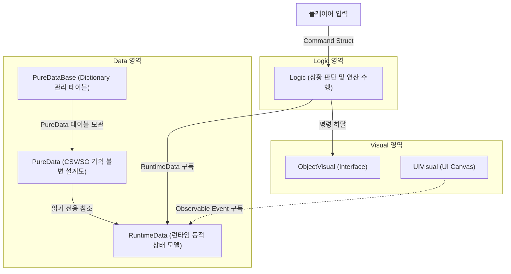
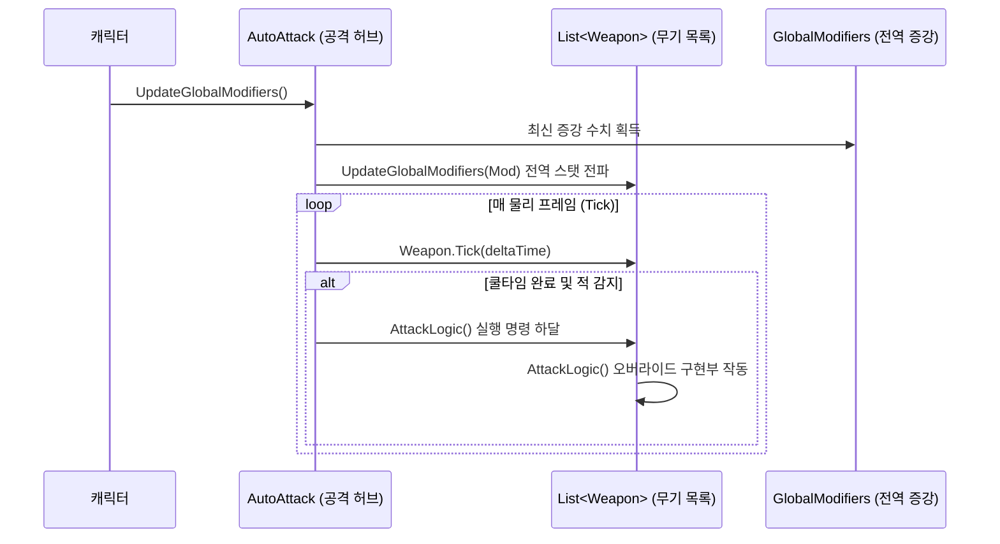
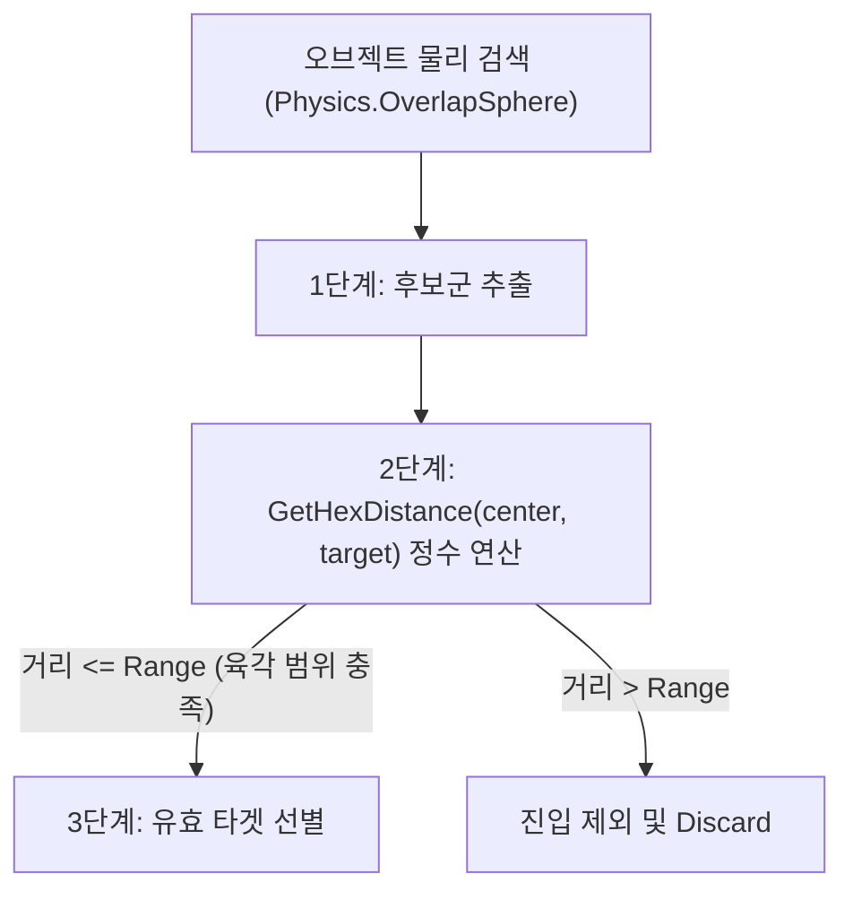
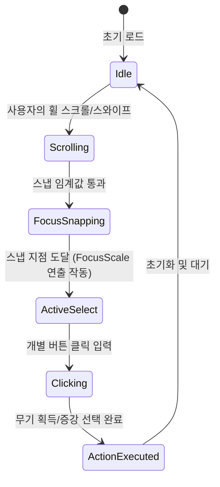

# Vampire Survivor Like
### Unity Shapes 에셋 및 3축 Cube Hex-Grid 기반 3D 서바이벌 로그라이크 기술 검증 프로젝트

<!-- link-github: https://github.com/WhiteAppleKo/3D-Vampire-Survivor-Like -->
<!-- link-video: https://youtube.com/watch?v=SomeVampireVideoUrl -->

<div class="meta-grid">
  <div class="meta-item">
    <div class="meta-label">제작 인원</div>
    <div class="meta-val">1인 (개인 프로젝트)</div>
  </div>
  <div class="meta-item">
    <div class="meta-label">개발 기간</div>
    <div class="meta-val">2025.12 - 2026.02 (3달)</div>
  </div>
  <div class="meta-item">
    <div class="meta-label">핵심 스택</div>
    <div class="meta-val">Unity / C# / HexGrid / Shapes Asset</div>
  </div>
</div>

**Unity · C# · HexGrid & Shapes**

---

## 1. 개요

### 1.1. 프로젝트 정의 및 배경
* **프로젝트 배경**: 서바이버 로그라이크 장르의 핵심적 쾌감인 '대규모 물량 통제'와 '콘텐츠의 무한한 확장성'을 구현하기 위해 진행한 1인 R&D 개발 프로젝트입니다.
* **핵심 기능**: 삼각함수 연산 부하 없이 정수 산술 연산만으로 거리를 구하는 **3축 Cube 육각형 그리드(HexGrid)** 물리 범위 판정 아키텍처를 수립하고, 기획 사양 변동에 독립적인 **데이터-로직-비주얼(DLV) 아키텍처**를 설계했으며, Shapes 에셋의 GPU 인스턴싱 배칭 기법을 적용해 드로우콜을 1회로 최적화했습니다.
* **문서의 기술 범위**: 본 문서는 단순한 뱀서 모작 기믹에 그치지 않고, 다중 오브젝트 물리 스캔 2단계 필터링, 데이터 주도 CSV 자동화 파이프라인, 그리고 하이브리드 UI 상태 머신에 대해 기술합니다.

### 1.2. 프로젝트 목차
| 장 번호 | 핵심 주제 | 구현 방식 |
| :--- | :--- | :--- |
| **02. DLV 아키텍처** | 기획 사양 변동에 유연한 데이터-로직-비주얼 격리 구조 | 읽기 전용 PureData, 런타임 갱신 RuntimeData, 렌더링 Visual 인터페이스 분리 |
| **03. HexGrid 좌표 연산** | 실시간 대규모 몬스터 타겟 필터링 연산 최적화 | 3축 Cube 좌표계 `q+r+s=0` 제약 및 2단계 물리-정수 거리 스캔 구현 |
| **04. 고민과 선택 : 대안 비교 및 결정 근거** | 그리드 기하학 및 스탯 연산 아키텍처 설계 트레이드오프 | HexGrid 채택 배경 및 SO 원본 훼손 방지를 위한 RuntimeData 분리 결정 |
| **05. 벡터 그래픽스 및 기획 데이터 연동** | 렌더링 최적화 및 에디터 변환 자동화 | Shapes GPU 인스턴싱 배칭 최적화 및 CSV Importer 툴링 구축 |
| **06. 프로젝트 회고** | 단기 1인 스프린트 성능 검증 및 개선 계획 | 드로우콜 99% 최적화 성과 분석 및 실시간 멀티플레이 협동 룸 기획 |

### 1.3. 전체 시스템 아키텍처
기획자가 작성한 불변 데이터(Data)가 인게임 연산 로직(Logic)을 거쳐 렌더러와 UI(Visual)로 최종 분배 전파되는 DLV 결합 흐름도입니다.



---

## 2. 데이터-로직-비주얼 격리 설계 (DLV Architecture)

### 2.1. 관심사 분리 및 의존성 역전
* **Data Layer**: 
  - `PureData`: 기획 데이터 테이블(SO)로서 읽기 전용(Logic-free 및 Immutable) 성격을 가집니다.
  - `RuntimeData`: 런타임 수치 변경이 발생할 때 이벤트를 발송(`Observable`)하고 시간 경과를 반영(`Self-Update`)합니다.
* **Logic Layer**: 물리 상태를 직접 참조하지 않고 데이터 상태에 기초해 판정 및 명령 연산을 진행합니다.
* **Visual Layer**: `IWeaponVisualizer` 등의 인터페이스를 매개체로 하여 로직과 비주얼 렌더러 간의 의존성을 분리(DIP)했습니다.

### 2.2. 무기 및 자동 공격 흐름도
장착된 전체 무기들(`List<Weapon>`)이 공통 쿨타임 갱신과 공격 명령 하달 과정을 동기적으로 반복하는 전파 시퀀스입니다.



<div class="image-row cols-2">
  
</div>

---

## 3. HexGrid 좌표 연산 및 2단계 필터링

### 3.1. 3축 Cube 좌표 기반 고속 정수 필터링
물리 엔진의 `Physics.OverlapSphere`를 단독 사용할 때 발생하는 연산 코스트를 예방하기 위해, 1차 물리 경계 스캔 후 2차 3축 큐브 정수 거리 검증을 밟는 **2단계 2중 필터링** 구조를 구현했습니다.



#### 📐 큐브 좌표 변환 및 맨해튼 거리 산출 공식
* **3축 Cube 제약식**: `q + r + s = 0` 구조를 강제하여 삼각함수 없이 부동소수점 오차 없는 정수 연산을 확보합니다.
* **거리 판정 공식**:
  $$\text{Distance} = \frac{|dq| + |dr| + |ds|}{2}$$

### 3.2. 핵심 소스코드 스냅샷
좌표 변환, 2단계 스캔 타겟팅 및 무기 로직 바인딩을 수행하는 구현 스펙입니다.

```csharp
// HexGridRenderer.cs - 큐브 변환 및 고속 거리 산출부
private Vector3Int OffsetToCube(int col, int row)
{
    1. 2D 지그재그식 Offset 좌표(열, 행)를 기반으로 3축 큐브 좌표계의 q, r 성분 연산
    var q = col - (row - (row & 1)) / 2;
    var r = row;
    
    2. 제약 식 q + r + s = 0 만족을 위한 **s 차축 값을 산출**하여 3차원 Vector3Int 최종 반환
    return new Vector3Int(q, -q - r, r);
}

public int GetHexDistance(Vector3Int a, Vector3Int b)
{
    1. 두 큐브 좌표 간의 x, y, z 각 축 성분별 차이 절대값 연산 후 총합 계산
    2. 부동소수점 및 삼각함수 연산 없이 **정수 나눗셈(/ 2)으로 맨해튼 거리 최종 도출**
    return (Mathf.Abs(a.x - b.x) + Mathf.Abs(a.y - b.y) + Mathf.Abs(a.z - b.z)) / 2;
}
```

```csharp
// HexGridRenderer.cs - OverlapSphere 기반 2단계 물리-정수 타겟 선별 필터링
public List<Collider> ScanTargets(Vector3 centerPos, int range, LayerMask targetLayer)
{
    List<Collider> validTargets = new List<Collider>();
    
    1. 1단계 범위 추출: 물리 성능 보장을 위해 **Physics.OverlapSphere**로 대략적인 후보군 1차 추출
    float hexWidth = Mathf.Sqrt(3) * hexRadius;
    float searchRadius = (hexWidth * range) + hexWidth; 
    Collider[] hits = Physics.OverlapSphere(centerPos, searchRadius, targetLayer);
    Vector3Int centerCube = WorldToCube(centerPos);
    
    2. 2단계 타겟 정밀 검사: 후보군 월드 좌표를 큐브 좌표계로 변환하여 **GetHexDistance 육각 범위 만족 여부** 비교
    foreach (var hit in hits)
    {
        Vector3Int hitCube = WorldToCube(hit.transform.position);
        if (GetHexDistance(centerCube, hitCube) <= range)
        {
            validTargets.Add(hit);
        }
    }
    return validTargets;
}
```

```csharp
// Weapon.cs - Logic과 Visual의 격리 바인딩 구현부
public virtual void AttackLogic()
{
    1. 데이터 갱신을 위해 런타임 데이터 모델(model)의 인스턴스 유효성 확인
    if (model == null) return;

    2. 의존성 역전(DIP)을 적용한 **visuals 인터페이스 호출**을 통해 공격 애니메이션 및 효과음 재생 실행
    visuals.PlayAttackAnimation();
    if (pureData != null) visuals.PlayAttackSound(pureData.AttackSound);

    3. 데이터 모델 내부의 쿨타임 타이머를 **최종 연산된 공격 딜레이 값(FinalAttackDelay)으로 갱신**
    model.SetCooldown(model.FinalAttackDelay);
}
```

---

## 4. 고민과 선택 : 대안 비교 및 결정 근거

### 4.1. 배경 및 물리 범위 판정 그리드 구조 선택
대규모 유닛 충돌 연산 처리와 광역 공격 범위 판정의 수학적 무결성을 만족하기 위한 결정입니다.

| 대안 | 방식 | 장점 | 단점 |
| :--- | :--- | :--- | :--- |
| **대안 A: 사각형 그리드 (RectGrid)** | 유니티 엔진 내 내장 Grid 시스템을 활용하므로 좌표 매핑 구현 난이도가 현저히 낮음 | 대각선 타일 거리가 상하좌우 대비 약 $\sqrt{2}$배 이상 멀어져 광역 범위 판정 시 왜곡 발생 |
| **대안 B: 육각형 그리드 (HexGrid)** | 주변 인접 6개 타일 방향 거리가 정확히 동일하여 기하학적 일관성이 높음 | 3축 Cube 좌표 변환 연산식 추가 개발 리소스 발생 및 홀/짝수 행 Offset 보정 수식 필요 |

> **결정: 대안 B (육각형 그리드) 채택**
> 
> 수학적 변환 수식 작성을 위한 **초기 개발 공수**를 감수하고서라도, 광역 범위 연산의 부동소수점 연산 병목을 제거하고 삼각함수가 필요 없는 고속 정수 계산 식을 확보하여 **런타임 대규모 오브젝트 판정 무결성을 실현**하기 위해 대안 B를 최종 채택했습니다.

### 4.2. 스탯 연산 처리 모델 설계
다중 무기 및 Modifiers(증강) 수치 중첩 시 데이터 오염을 예방하기 위한 아키텍처 선택입니다.

| 대안 | 방식 | 장점 | 단점 |
| :--- | :--- | :--- | :--- |
| **대안 A: ScriptableObject 원본 데이터 직접 수정** | 구조적 복잡성 없이 원본 에셋 데이터를 직접 가감 연산하여 메모리 소요가 극히 적음 | 게임 세션이 끝난 뒤에도 원본 ScriptableObject 파일이 변형되어 **프로젝트 에셋 데이터가 영구적으로 훼손 및 오염**됨 |
| **대안 B: RuntimeData 격리 계층을 통한 스탯 중첩 연산** | 원본 SO(PureData)는 읽기 전용 상태로 두고, 런타임에 최종 변환 값을 임시 컨테이너에서 연산 | 런타임 스탯 상태 추적 및 이벤트(`OnStatsChanged`) 구독에 따른 소량의 참조 자원 추가 소요 |

> **결정: 대안 B (RuntimeData 계층 설계) 채택**
> 
> 이벤트 구독에 따르는 **미세 리소스**를 허용하더라도, 기획 리소스 원본 에셋의 오염 가능성을 원천 제거하여 **데이터 무결성을 100% 보장하고 샌드박스 안정성을 실현**하기 위해 대안 B를 필수적으로 채택했습니다.

---

## 5. 벡터 그래픽스 및 기획 데이터 연동

### 5.1. Shapes 에셋을 통한 GPU 인스턴싱 최적화
* **드로우콜 압축**: 3D 그래픽 에셋의 렌더 부하를 줄이기 위해 벡터 렌더러 Shapes를 채택하고, 수백 개 육각 타일 그리드를 단일 배칭 처리하여 드로우콜을 획득했습니다.
* **시각 효과**: 사이버펑크 네온 색조의 HDR Glow 효과를 소스 코드 레벨에서 통제했습니다.

### 5.2. 하이브리드 UI 상호작용 발전 FSM
단순 휠 스크롤의 단점인 조작 피로를 보완하기 위해 스냅 Lerp 축척 애니메이션과 명확한 터치를 결합한 하이브리드 UI의 상태 변환도입니다.



<div class="image-row cols-2">
  
  
</div>

---

## 6. 프로젝트 회고

### 6.1. 성과 및 검증
* **드로우콜 최적화 검증**:
  - **도입 전**: 격자 타일을 개별 게임 오브젝트 및 메쉬 렌더러로 다수 배치 시 드로우콜이 **평균 220회** 이상 검출되어 성능 하락을 유발했습니다.
  - **도입 후**: Shapes GPU 인스턴싱 단일 배칭 기법을 적용하여 드로우콜을 **단 1회로 단축(99.5% 최적화)** 완료했습니다.
* **오디오 생명주기 분리**: 피격 사망 시 몬스터 내장 AudioSource가 객체 소멸과 함께 같이 멈추던 결함을, 독자 생명주기를 보유한 **AudioPool Manager**를 개설하여 해결해 끊김을 예방했습니다.

### 6.2. 기술 부채 및 개선 계획
* **사용성 및 오디오 파이프라인 결함**:
  - **원인**: 단순 스크롤식 UI의 높은 조작 피로도 및 몬스터 컴포넌트 종속 오디오 처리 구조에 따른 사운드 누락 현상 발생.
  - **개선 로드맵 (✓ / △ / →)**:
    - **✓ 달성한 성과**: DLV 패턴 수립을 통한 데이터와 렌더링 의존성 분리, 3축 Cube 육각 좌표계 정수 연산 고속화, CSV 데이터 연동 에디터 빌드 완료.
    - **△ 한계점**: 초기 스크롤식 UI의 조작 피로도 및 사망 몬스터 효과음 끊김 현상 존재.
    - **→ 해결 조치**: 스냅 Lerp 애니메이션(FocusScale 연출)을 탑재한 하이브리드 UI 구현 및 독립 수명주기를 가지는 AudioPool Manager 구축 완료로 극복.
