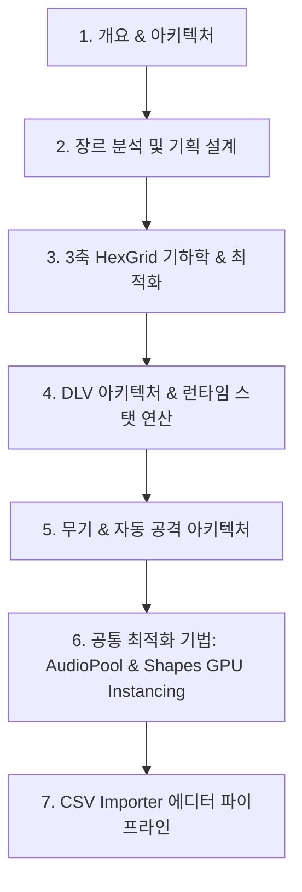

# README.md 문서 흐름 비판적 분석 보고서

[raw_vampire.txt](file:///C:/Users/kot77/Desktop/GitPortfolio/portfolio/project4/raw_vampire.txt)를 원천으로 가공된 [README.md](file:///C:/Users/kot77/Desktop/GitPortfolio/portfolio/project4/README.md)의 구조와 흐름에 대하여 비판적으로 분석한 결과입니다.

---

## 1. 개요 비교

* **원천 소스 (raw_vampire.txt)**: 슬라이드 기반의 발표 자료 구조. 직관적인 흐름을 유지하며, 개요 ➡️ 장르 기획 ➡️ 설계 구조(DLV) ➡️ 핵심 기술(Shapes, Grid) ➡️ 상세 사이클(무기/오디오) ➡️ 데이터 연동 순으로 전개.
* **가공 문서 (README.md)**: 포트폴리오를 위한 종합 기술 문서 형태. 그러나 과도한 챕터 세분화 및 연관성 낮은 기술 요소의 병합으로 인해 독자의 인지 흐름 방해.

---

## 2. 핵심 문제점 및 흐름적 한계

### ① 역행적인 정보 배치 (인지 부조화)
* **현상**: `3. 데이터-로직-비주얼 격리 설계` 장에서 `AutoAttack` 컴포넌트와 무기 시스템의 공격 시퀀스 다이어그램이 먼저 등장함.
* **비판**: 독자는 무기 추상화 및 `AutoAttack`이 무엇인지 파악하지 못한 상태에서(해당 내용은 `5장`에서 설명됨) 복잡한 흐름도를 먼저 마주하게 되어 흐름 파악의 논리적 단절이 발생함.

### ② 연관성 없는 주제들의 인위적 병합 (7장의 이질성)
* **현상**: `7. 벡터 그래픽스 및 기획 데이터 연동` 장에 **Shapes 에셋을 통한 GPU 인스턴싱**, **하이브리드 UI**, **CSV Importer**가 혼재함.
* **비판**: 
  * '벡터 그래픽스'와 '기획 데이터'는 논리적 공통분모가 없음.
  * `Shapes` 벡터 렌더링은 `4. HexGrid` 장의 시각 피드백 부분과 밀접하므로 분리 서술이 부적절함.
  * 무작위로 남은 기계적 요소를 마지막 장에 욱여넣은 느낌을 주어 포트폴리오의 완성도를 떨어뜨림.

### ③ UI 관련 정보의 파편화
* **현상**: UI 디자인 철학과 네온 컬러 스와치는 `2.4`에 기술된 반면, 하이브리드 UI의 진화 과정(Step 1~3)과 구체적인 구현 특징은 `7.2`에 배치됨.
* **비판**: 독자는 UI에 대한 내용을 한 흐름으로 읽지 못하고 책을 앞뒤로 넘나들듯 읽어야 하므로 사용자 경험(UX) 측면에서 불친절한 설계임.

### ④ 카테고리 분류 오류 (부적절한 하위 항목 배치)
* **현상**: `5.7 AudioPool 독립 수명주기 사운드 최적화`가 `5. 무기 시스템` 내부에 포함됨.
* **비판**: 오디오 풀링은 몬스터 피격음 재생 시의 수명주기 결함을 해결하기 위한 공통 시스템임. 이를 무기 시스템 하위에 배치한 것은 명백한 분류 오류이며, 무기 아키텍처에 집중해야 할 흐름을 방해함.

### ⑤ 기술 서술 수준의 비일관성
* **현상**: `4. HexGrid` 장은 구체적인 코드 세 조각(`GetHexDistance`, `OffsetToCube`, `WorldToCube`, `ScanTargets`)을 동원해 깊게 설명하는 반면, 핵심 아키텍처인 `3. DLV`나 `5. 무기 시스템`은 구체적 코드 없이 텍스트 설명에 의존함.
* **비판**: 특정 기술 파트만 코드 설명이 과도하여 문서 전체의 기술적 깊이가 불균일하고 편향된 느낌을 줌.

---

## 3. 구조적 개선 방향 제안

독자가 프로젝트의 핵심 가치(R&D 성과)를 가장 부드럽게 인지할 수 있도록 재배치한 흐름안입니다.

### [개선 방향 세부안]
1. **HexGrid 장을 앞으로 전진**: 장르 기획에서 '육각 그리드'를 핵심 지표로 선정했으므로, 기하학과 거리를 구하는 최적화 연산이 앞부분에 나오는 것이 독자가 이후 '공격 범위 판정' 및 '무기 로직'을 이해하는 데 유용함.
2. **DLV와 무기/스탯 연산을 결합**: 3장과 5장으로 분산된 아키텍처 설계를 하나로 병합하여, DLV 설계 원칙이 실제 무기 시스템 및 런타임 스탯 연산에 어떻게 대칭되는지 자연스럽게 보여줌.
3. **UI 단일 통합**: UI 철학(2장)과 하이브리드 UI 구현(7장)을 한데 묶어 `UI 아키텍처` 장으로 독립시킴.
4. **공통 최적화 세션 분리**: `AudioPool`과 `Shapes GPU 인스턴싱`은 공통 비주얼/사운드 성능 개선 주제이므로 별도 장으로 묶어 다룸.
5. **CSV 임포터 독립**: 에디터 데이터 파이프라인은 런타임 시스템과 완전히 다르므로 문서의 마지막에 깔끔한 자동화 도구로 단독 배치.
