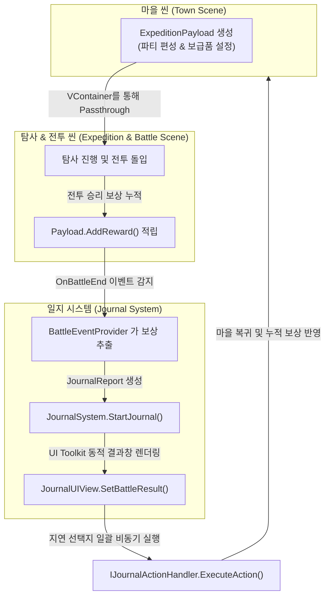
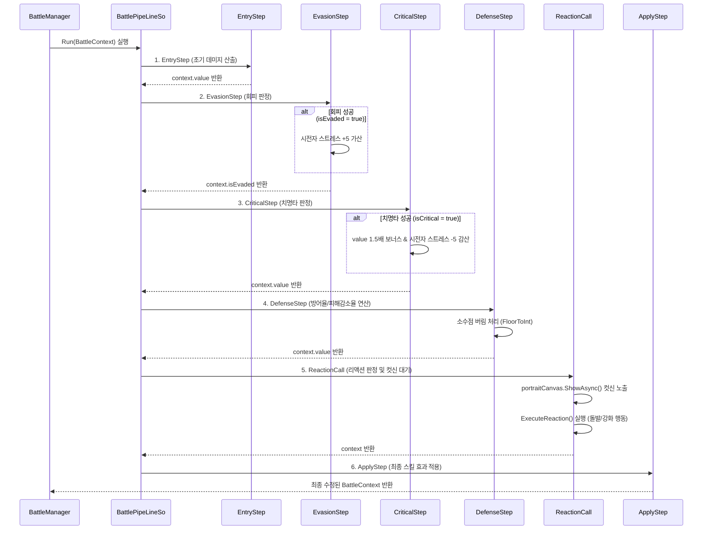

---

## 1. 개요 및 목차

### 1.1. 기술 구현 개요
* **핵심 구현**: 씬 간 상태 무중단 동기화를 보장하는 Payload 전달 프레임워크를 수립하고, 전투 연산을 제어하는 다단계 계산 파이프라인 및 상태 기반 동적 일지/캠핑의 지연 비동기 일괄 처리 시스템을 설계·개발했습니다.

### 1.2. 목차
* **1. 개요 및 목차**
* **2. 기술 개발 배경 및 범위**
* **3. 전체 시스템 아키텍처**
* **4. 개발자 구현 명세**
  - *4.1. 일지 시스템*
  - *4.2. 전투 시스템 및 BattlePipeLine 연동*
  - *4.3. 공용 파이프라인 시스템*
  - *4.4. 캠핑 시스템*
  - *4.5. 외부 데이터 연동 및 UI 시각화*
* **5. 팀장 주도 시스템 통합**
* **6. 고민과 선택 : 데이터 모델 및 아키텍처 결정 근거**
* **7. 프로젝트 회고**
  - *7.1. 트러블 슈팅 (Troubleshooting)*
  - *7.2. 결과 및 회고 (Retrospective)*

---

## 2. 기술 개발 배경 및 범위

* **R&D 배경 및 범위**: 마을-탐사-전투 씬 분할 개발 시 발생하는 상태 전송 문제 및 수치 연산 단계의 결합도를 제어하고자, 단일 의존성 주입 스코프(`VContainer`) 및 파이프라인 기반 계산 엔진을 수립하고 모바일/PC 환경의 안전한 데이터 동기화와 UI Toolkit 기반 동적 렌더링 최적화를 목표로 합니다.

---

## 3. 전체 시스템 아키텍처

마을 씬에서 생성된 캐릭터와 상태 정보가 탐사 및 전투 씬을 경유하여 누적 전리품을 획득하고, 다시 마을 씬으로 수송되는 전체 데이터 아키텍처 흐름도입니다.



---

## 4. 개발자 구현 명세

### 4.1. 일지 시스템
* **사용자 경험**:
  - 전투/탐사가 끝나면 딱딱한 수치창 대신 리더의 서사적 보고서(일지) 형태로 팝업되어 탐사 결과의 스토리를 순차 체감하고 하단 선택지를 통해 의사결정을 조작함.
  <div class="image-card-text hover-image" data-image="portfolio/project5/images/expedition_journal_ui.png">
    <p>탐사 진행 및 선택지를 노출하는 탐사 일지 UI 구현 예시입니다. 탐사가 완료되면 수치창 대신 서사 보고서 형태로 노출되어 스토리와 선택지를 직접 조작합니다. (이미지 준비 중)</p>
  </div>

* **시스템 동작**:
  - 각 서브시스템(`IJournalContentProvider`)의 리포트 데이터를 동적 버퍼링.
  - 유저 선택 시 즉시 변경을 방지하고 버퍼에 기록을 유예한 뒤, 일지 최종 종료(`IsLastPage`) 타이밍에 `IJournalActionHandler`들을 통해 일괄 비동기 병렬 실행(`UniTask.WhenAll`)하여 데이터 안정성 보장.

```csharp
// JournalSystem.cs - 지연 선택지 일괄 비동기 실행
namespace Bond.WT.Journal
{
    public class JournalSystem : IInitializable
    {
        private readonly JournalModel _model;
        private readonly List<IJournalActionHandler> _actionHandlers = new();

        public void NextPage()
        {
            // 1. 마지막 페이지 도달 시 그동안 임시 누적된 선택 결과를 비동기 일괄 실행
            if (_model.IsLastPage.Value)
            {
                ExecuteAllDeferredOptions().Forget();
            }
            _model.NextPage();
        }

        private async UniTaskVoid ExecuteAllDeferredOptions()
        {
            var tasks = new List<UniTask>();

            // 2. 일지 리포트 목록을 순회하며 선택된 옵션의 ActionKey 추출
            foreach (var report in _model.Reports.ToArray())
            {
                if (report.SelectedOption.HasValue)
                {
                    var opt = report.SelectedOption.Value;
                    if (string.IsNullOrEmpty(opt.actionKey)) continue;

                    // 3. 해당 ActionKey를 처리할 수 있는 핸들러를 찾아 비동기 실행 태스크 등록
                    foreach (var handler in _actionHandlers.ToArray())
                    {
                        if (handler.CanHandle(opt.actionKey))
                        {
                            tasks.Add(handler.ExecuteAction(opt.actionKey, report));
                        }
                    }
                }
            }

            // 4. 모든 지연 액션 핸들러 작업이 끝날 때까지 병렬 비동기 동기화 대기
            if (tasks.Count > 0)
            {
                await UniTask.WhenAll(tasks);
                Debug.Log($"[JournalSystem] 선택지 일괄 처리 완료 ({tasks.Count}건)");
            }
        }
    }
}
```

<br>

<div class="image-card">
  
  <span class="image-caption">그림 2: 캠핑 단계에서 노출되는 리더의 일지 UI (이미지 준비 중)</span>
</div>

---

### 4.2. 전투 시스템 및 BattlePipeLine 연동
전투 행동 발생 시 `BattlePipeLineSo`를 통해 데미지와 회피, 스트레스 변화, 그리고 리액션 개입이 순차적으로 정합 처리되는 흐름입니다.


* **개발적 시스템 장점**:
  - **계산 순서 유동 조율**: ScriptableObject 기반으로 전투 연산 Step의 처리 순서를 코드 수정 없이 유동적으로 재구성.
  - **입출력(Input/Output) 정합성 보장**: `BattleContext` 런타임 데이터의 명확한 시작(진입)과 최종 결과 적용(완결)을 구조적으로 강제.
  - **파이프라인 스왑(Swappability)**: 전투 규칙이나 상황에 따라 파이프라인 SO 자체를 자유롭게 교체(스왑)하여 모듈 간 결합도 완화.
* **시스템 동작**:
  - `BattleManager`와 `BattleFlowManager`가 전투의 시작/종료 턴 루프 실행.
  - `BattlePipeLineSo` 파이프라인 프레임워크를 기반으로 런타임 데이터인 `BattleContext`를 순차 전달하여 스탯 보정, 회피 확률 계산, 크리티컬 계산, 방어력 피해 감쇄(FloorToInt 버림 처리)를 점진적으로 연산하고 리액션 초상화 연출(`ShowAsync`) 대기 후 연동 실행.

```csharp
// BattlePipeLineSo.cs - 회피 판정 Step 및 리액션 컷신 대기 Step
namespace PipeLine
{
    [System.Serializable]
    public class EvasionStep : IPipeLineStep<BattleContext>
    {
        public UniTask<BattleContext> Execute(BattleContext context)
        {
            if (context.target == null || context.target.IsDead) return UniTask.FromResult(context);
            if (context.runtimeSkill.Data.Type == SkillType.SUPPORT) return UniTask.FromResult(context);

            // 1. 명중률(acc)에서 타겟 회피율(eva)을 차감하여 최종 명중 확률 산출 및 난수 비교
            float hitRate = Mathf.Max(0.05f, context.caster.Stat.acc - context.target.Stat.eva);
            context.isEvaded = Random.value > hitRate;

            // 2. 공격 회피당할 시 시전자 스트레스 +5 패널티 누적 및 타겟 회피 이벤트 트리거
            if (context.isEvaded)
            {
                context.caster.IncreaseInsanity(5);
                context.target.Evade();
            }
            return UniTask.FromResult(context);
        }
    }

    [System.Serializable]
    public class ReactionCall : IPipeLineStep<BattleContext>
    {
        public E_ReactionPhase Phase = E_ReactionPhase.None;
        private ReactionSystem reactionSystem;
        private IReactionPortraitCanvas portraitCanvas;

        public async UniTask<BattleContext> Execute(BattleContext context)
        {
            if (context.target == null || reactionSystem == null) return context;

            // 3. 현재 전투 페이즈에 발동 조건이 충족된 대원의 리액션 액션 목록 조회
            IReadOnlyList<ReactionExecution> executions = reactionSystem.Resolve(context, Phase);

            foreach (ReactionExecution execution in executions)
            {
                // 4. 리액션 발동 유닛의 초상화 컷신 연출이 끝날 때까지 비동기 대기
                if (portraitCanvas != null)
                {
                    await portraitCanvas.ShowAsync(execution.Agent.ImageAddress, execution.Result);
                }

                // 5. 연쇄 개입 리액션 실행 및 유닛별 턴 리액션 사용 횟수 카운터 증가
                await execution.Agent.ExecuteReaction(execution, context, reactionSystem.BattleManager);
                execution.Agent.IncrementReactionCount();
            }
            return context;
        }
    }
}
```

<br>

<div class="image-card">
  
  <span class="image-caption">그림 3: 전투 중 아군 스트레스 경고 및 리액션 개입 UI (이미지 준비 중)</span>
</div>

---

### 4.3. 공용 파이프라인 시스템
* **개발적 시스템 장점**:
  - **독립적 프레임워크**: 전투뿐만 아니라 임의의 다단계 연산 프로세스에 범용적으로 적용할 수 있는 독립 아키텍처.
  - **유연한 흐름 제어**: 파이프라인 브레이크(`ShouldBreak`) 지원을 통해 연산 중단 조건 분기를 깔끔하게 격리.
* **시스템 동작**:
  - 임의의 데이터 타입에 대해 개별 Step들을 순서대로 통과시켜, 계산 연산의 명확한 진입(시작)과 끝(최종 완결)을 프레임워크 수준에서 강제하고 보장하는 공용 아키텍처 수립.
  - 계산 도중 특정 조건 만족 시 파이프라인 브레이크(`ShouldBreak`) 분기를 통해 불필요한 계산 차단 및 자원 낭비 방지.

```csharp
// PipeLineSO.cs - 순차 진입/완결 보장 파이프라인 베이스
namespace PipeLine.PipeLineBase
{
    public abstract class PipeLineSo<T> : ScriptableObject, IPipeLine<T>
    {
        [SerializeField] protected List<IPipeLineStep<T>> steps = new();

        public virtual async UniTask<T> Run(T context)
        {
            // 1. 등록된 연산 Step들을 순회하며 차례대로 실행
            foreach (var step in steps)
            {
                // 2. 파이프라인 브레이크 조건(예: 회피 성공 등) 만족 시 실행 루프 즉시 중단
                if (ShouldBreak(context))
                {
                    break;
                }
                // 3. 전달된 Context 데이터를 각 Step 연산 결과로 연속 갱신하며 완결 보장
                context = await step.Execute(context);
            }
            return context;
        }

        protected abstract bool ShouldBreak(T context);
    }
}
```

---

### 4.4. 캠핑 시스템
* **사용자 경험**:
  - 모닥불 캠프 화면에서 대원들의 결핍 수치(부상, 정신 상태)를 보며 남은 붕대/진정제를 선별 분배하거나, 자원을 아끼고 패널티를 감수하는 서바이벌 자원 배분 조작.
* **시스템 동작**:
  - `GenerateCampingReport()`가 대원의 HP 및 Insanity 결핍 상태를 전수 검사하여 조건 매칭 유닛에 맞게 붕대 치료 일지 및 정신력 진정 일지를 동적으로 조립하고 발행.
  - 선택지 조작 결과를 버퍼링한 뒤 씬 귀환(`ACTION_RETURN_MAP`) 액션 처리 시 데이터 반영 및 씬 언로드 진행.

```csharp
// CampingSystem.cs - 대원 상태 기반 맞춤 정비 일지 생성
namespace Bond.WT.Camping
{
    public class CampingSystem
    {
        private readonly ExpeditionPayload _payload;
        private readonly JournalSystem _journalSystem;

        public void GenerateCampingReport()
        {
            _locationProvider.ClearBuffer();
            
            // 1. 파티 대원들의 실시간 부상(HP 결핍) 및 정신 상태(스트레스) 결핍 여부 검사
            bool hasBandageTarget = _payload.Party.Any(c => c.Stat.current_Hp < c.Stat.max_Hp);
            bool hasSedativeTarget = _payload.Party.Any(c => c.Insanity > 0);

            // 2. 부상자가 존재할 경우 붕대 치료 전용 정비 일지 옵션 동적 생성
            if (hasBandageTarget)
            {
                var bandageOptions = BuildBandageOptions();
                _locationProvider.SetDiscovery("EVT_CAMP_START", bandageOptions, "캠핑 정비 - 붕대 치료");
            }
            
            // 3. 스트레스 누적 대원이 존재할 경우 진정제 복용 정비 일지 옵션 동적 생성
            if (hasSedativeTarget)
            {
                var sedativeOptions = BuildSedativeOptions();
                _locationProvider.SetDiscovery("EVT_CAMP_START", sedativeOptions, "캠핑 정비 - 정신력 회복");
            }
            
            // 4. 수집된 일지 리포트들을 일지 시스템으로 전달하여 동적 팝업 가동
            _journalSystem.CollectDailyLogs();
        }
    }
}
```

---

### 4.5. 외부 데이터 연동 및 UI 시각화
* **사용자 경험**:
  - 전투 승리 시 전리품 획득 상황과 대원의 생존 체력/스트레스 바 게이지가 실시간으로 차오르는 화면 연출 피드백 체감.
* **시스템 동작**:
  - VContainer DI 컨테이너를 통해 `ExpeditionPayload`가 씬 전환 간 소멸하지 않고 파티 데이터와 보급품, 누적 보상 정보를 무중단 전송(Passthrough).
  - 전투 종료 시 `BattleEventProvider`가 보상 및 사망 상태를 가공하여 동적 일지 리포트로 발행하며, `JournalUIView`가 UI Toolkit을 활용해 동적 슬롯 카드를 빌드하고 스타일시트의 `Length.Percent`를 이용해 체력/스트레스 바의 길이를 퍼센트로 동적 제어함.

```csharp
// JournalUIView.cs - UI Toolkit 동적 카드 및 게이지 바 바인딩
namespace Bond.WT.Journal
{
    public class JournalUIView : MonoBehaviour, IJournalVisualizer
    {
        private VisualElement _battleResultContainer;

        public void SetBattleResult(BattleEndStatus status, IReadOnlyList<BaseCharacter> party, int frontier, int wood, int ore)
        {
            _battleResultContainer = new VisualElement();
            _battleResultContainer.AddToClassList("result-panel-inner");

            // 1. 생존 파티원 수만큼 결과창 캐릭터 슬롯 카드를 동적 인스턴스화
            foreach (var character in party)
            {
                var card = new VisualElement();
                card.AddToClassList("character-card");

                // 2. 파티원의 최대 체력 대비 현재 체력 비율(%)을 연산
                var hpBar = new VisualElement();
                hpBar.AddToClassList("hp-bar");
                float hpPercent = character.Stat.max_Hp > 0 ? (float)character.Stat.current_Hp / character.Stat.max_Hp * 100f : 0f;
                
                // 3. UI Toolkit 스타일시트 퍼센트(Length.Percent)로 게이지 바 길이를 동적 적용
                hpBar.style.width = Length.Percent(hpPercent);
                
                card.Add(hpBar);
                _battleResultContainer.Add(card);
            }
        }
    }
}
```

<br>

<div class="image-card">
  
  <span class="image-caption">그림 4: 전투 종료 후 보상 획득 및 생존자 상태를 노출하는 UI Toolkit 결과창 (이미지 준비 중)</span>
</div>

---

## 5. 팀장 주도 시스템 통합

김우태 팀장은 단순 기술 구현에 머무르지 않고, 전체 프로젝트 아키텍처의 균형과 협업 속도 최적화를 위해 아래 3가지 통합 제어를 주도했습니다.

### 5.1. 아키텍처 모니터링 및 코드 리뷰 가이드
* 팀원들의 개발 진척도를 정기 추적하고 커밋 코드를 교차 모니터링하여 강한 결합(Tight Coupling)을 방지.
* 각자가 담당한 서브시스템(전투 연출, 지도 생성 등)이 사전에 공유된 전체 아키텍처 결합 지점에 맞춰 빌드되도록 기술 가이드를 수행하여 통합 시의 충돌 가능성을 원천 예방.

### 5.2. 모듈 간 인터페이스 규격 표준화
* 한 시스템의 아웃풋이 다른 시스템의 인풋으로 전달될 때, 각 컴포넌트의 데이터 통신 포맷과 필드 규격을 표준화.
* 이를 통해 씬 전환 간의 상태 손실 없이 월드 씬과 전투/캠핑 씬 간에 데이터가 유기적으로 연쇄되도록 인터페이스 아키텍처를 설계.

### 5.3. 독립 모듈 간 데이터 흐름 조율 및 시스템 통합
* 지도 이동, 전투 승패 판정, 튜토리얼 씬 로딩 등 각자 다른 개발 환경에서 제작된 독립 모듈의 데이터 흐름(Data Pipeline)을 하나의 Payload 구조로 엮어내어, 전체 모험 및 전투 시퀀스가 완전한 무중단 순환 루프(Loop)를 그리도록 종합 게임 빌드로 통합 완료.

---

## 6. 고민과 선택 : 데이터 모델 및 아키텍처 결정 근거

### 6.1. 씬 간 무중단 파티 데이터 수송 (ExpeditionPayload)
* **결정 근거**: 마을-탐사-전투 등 개별 씬으로 나뉜 구조에서 씬 전환 시 파티 체력, 보급품 및 전리품 데이터 유실을 방지하기 위해 VContainer DI 스코프에 바인딩된 단일 `ExpeditionPayload` 데이터 컨테이너를 설계하여 무중단 전달(`Passthrough`) 구조를 결정함.

### 6.2. 일지 선택지 지연 일괄 비동기 실행 (JournalSystem)
* **결정 근거**: 플레이어가 일지 조작 시 페이지를 넘길 때마다 즉각 데이터를 변경하면 연산 꼬임 및 취소가 불가능한 문제가 발생함. 이를 방지하기 위해 일지 닫기(`IsLastPage`) 최종 시점에 버퍼의 선택 결과(`actionKey`)를 `IJournalActionHandler`들에 전달하여 `UniTask.WhenAll`로 일괄 병렬 실행하도록 구현 결정함.

---

## 7. 프로젝트 회고

### 7.1. 트러블 슈팅 (Troubleshooting)

#### 1) Addressable 리소스 로드 시 세팅 오류 및 Null 반환 버그 해결
* **문제 상황**: 전투 연출 시 유대적 각성 및 리액션 초상화 로드를 위해 Addressable Asset을 비동기 참조할 때, 간헐적으로 세팅 오류로 인해 에셋이 Null로 반환되어 런타임 NullReferenceException이 발생하고 게임 루프가 중단됨.
* **원인 분석**: 팀 프로젝트 빌드 과정에서 Addressable Groups 캐시 및 설정 변경이 빈번하게 덮어쓰여져 레퍼런스 주소가 유실되거나, 이전 로드 작업이 완료되기 전에 해제가 요청되어 동기화 불일치 발생.
* **해결 방안**: 에셋 참조 로더에 널 방어 및 로드 완료 상태를 보증하는 예외 예방 코드를 구축하고, 컷신이 끝난 후 명시적으로 `Addressables.Release`를 순차 실행하는 자원 클리닝 로직을 보완하여 런타임 예외를 완전히 차단함.

#### 2) 퇴각 처리 및 씬 전환 시 이벤트 구독 메모리 누수 방지
* **문제 상황 및 배경**: 퇴각 처리 및 씬 전환 시 `BattleEventProvider`가 `BattleFlowManager`의 이벤트를 지속 참조하여 오브젝트 소멸 주기와 맞물린 메모리 누수 및 예외 발생 위험 존재.
* **해결 방안**: `BattleEventProvider`에 `IDisposable` 인터페이스를 장착하여 씬 언로드/소멸 타이밍에 리스너를 명시적으로 해제(`_battleFlowManager.OnBattleEnd -= HandleBattleEnd`)하도록 파괴 주기 이벤트 해제 구체화.

### 7.2. 결과 및 회고 (Retrospective)

* **성능 및 연동 최적화 성과**:
  - UI Toolkit 도입을 통해 복잡한 전투 결과창 슬롯 카드와 체력/스트레스 충전용 게이지 바를 동적으로 생성 시, UXML 템플릿과 C# 레퍼런스를 연동하여 동적 UI 레이아웃의 실시간 갱신 구조를 구축함.
* **기술 부채 및 향후 개선 계획**:
  - 일지 선택지 일괄 비동기 실행 루프(`ExecuteAllDeferredOptions`) 도중 특정 모듈에서 비동기 예외(Exception)가 발생할 경우, 병렬 대기 중인 다른 비동기 작업까지 연쇄 차단될 위험이 남아 있음.
  - 향후 개별 태스크에 엄격한 `try-catch` 및 타임아웃 예외 처리를 덧씌워, 예외 발생 시 해당 예외를 로깅하고 나머지 핸들러들은 정상적으로 끝까지 완결을 맺도록 비동기 안전성을 향상시킬 계획임.
