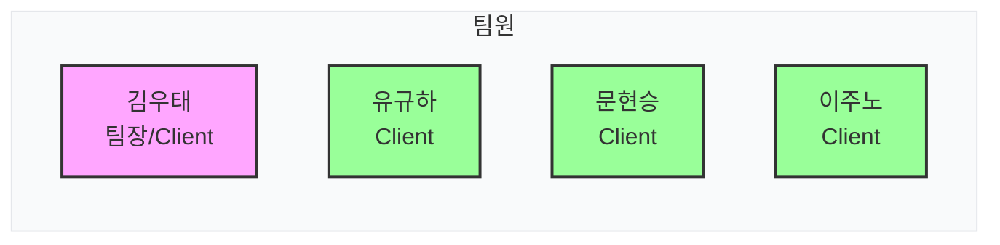

---

## 1. 개요 및 목차

### 1.1. 프로젝트 정의
* **프로젝트 정의**: 역할군 의무와 고유 성향이 전투 데이터로 충돌 및 연계되는 1인 조종 + 3인 자동 리액션 기반의 턴제 전술 로그라이크 팀 프로젝트입니다.
* **본 문서의 기술 범위**: 본 문서는 팀장 관점에서 진행한 총 13종 기획 문서의 정량 설계 내역과 이중 리액션 전술 메커니즘, 리더의 일지(Journal) 흐름 설계 등의 핵심 시스템 기획 철학을 다룹니다.

### 1.2. 목차
* **1. 개요 및 목차**
* **2. 팀원 구성 및 역할**
* **3. R&D 동기 및 협업 배경**
* **4. 기획 및 시스템 설계 (팀장 기여)**
  - *4.1. 기획 문서 정량 명세*
  - *4.2. 기획 설계 핵심*

---

## 2. 팀원 구성 및 역할

본 프로젝트는 총 4인의 개발진으로 구성되었으며, 역할 분담 하에 유기적인 협업을 거쳐 타이틀을 완성했습니다.

* **김우태 (팀장 / Game Client Programmer & Designer)**
  - 프로젝트 기획/설계 및 전체 마일스톤 관리.
  - 서브시스템(일지, 전투, 캠핑, 공용 파이프라인, 데이터 연동) 개발 및 시스템 통합 주도.
* **유규하 (Game Client Programmer)**
  - 플레이어 이동 및 맵 이벤트 트리거 연동 개발.
* **문현승 (Game Client Programmer)**
  - 전투 시각 연출(Dim, Focus) 및 자동 전투(AutoBattle), 온보딩 튜토리얼 구현.
* **이주노 (Game Client Programmer)**
  - 지도 생성 아키텍처 및 월드 탐사 노드 연동 개발.

---

## 3. R&D 동기 및 협업 배경

* **R&D 동기 및 배경**: 기존 RPG의 단조로운 영웅 서사 구조에서 벗어나, '역할은 의무를 만들고, 성향은 변수를 만든다'는 전술 로그라이크 기획 모토 하에 대원들의 고유 인간 성향과 결핍 상태가 실제 아군의 턴제 전투 및 탐사 연쇄 반응으로 연결되도록 실증하는 전술 프레임워크 연구를 목적으로 삼았습니다.
* **협업 배경**: 각 컴포넌트(탐사 노드 생성, 전투 이동, 스탯 연산)가 서로 다른 개발자의 샌드박스 영역에서 병렬 개발되는 중 상태 유실을 방지하고 매끄러운 턴 전이를 보장하기 위해 사전 인터페이스 규격을 표준화할 기획 브릿지가 요구되었습니다.

---

## 4. 기획 및 시스템 설계 (팀장 기여)

### 4.1. 기획 문서 정량 명세
* **기획 문서 총 13개 파일 (누적 650KB 용량)** 단독 설계 및 명세 수립.
* **00. Concept**: 세계관 및 게임 디자인 방향성 기획 1종 (`컨셉 기획.md` - 583KB).
* **01. System**: 개요, 기획서, 캐릭터 요소, 인공지능 AI, UIUX 전투 시스템, 캠핑 시스템, 전투 시스템, 이벤트 시스템, 사운드 VFX, 튜토리얼 작동 기획 등 시스템 상세 설계서 10종.
* **WorkGuide**: 개발 협업 룰 및 태스크 카드 포맷 가이드 2종.

### 4.2. 기획 설계 핵심
* **이중 리액션 기획**: 전술 역할(탱커/딜러/서포터)과 캐릭터 고유의 본능 성향(겁쟁이, 이기주의 등)이 상호 충돌 및 보완하며 리액션으로 이어지는 연쇄 전투(Chain) 메커니즘을 정의함.
* **리더의 일지(Journal) 연계 기획**: 모험 과정과 전투 결과가 단순 정보 스탯 팝업에 머무르지 않고, 하나의 유기적인 모험 연대기 보고서(일지) 형식으로 조합되어 유저에게 서사적으로 환류되는 게임 루프 기획.
* **모듈 간 인터페이스 규격 설계**: 각 컴포넌트(지도 생성, 전투 연출)가 결합 지점에서 데이터를 주고받을 수 있는 Payload 데이터 구조 및 씬 상태 연동 규격 설계.

 

  
  그림 1: 리액션 에디터 전술 교리 편집 UI 기획 목업 (이미지 준비 중)

