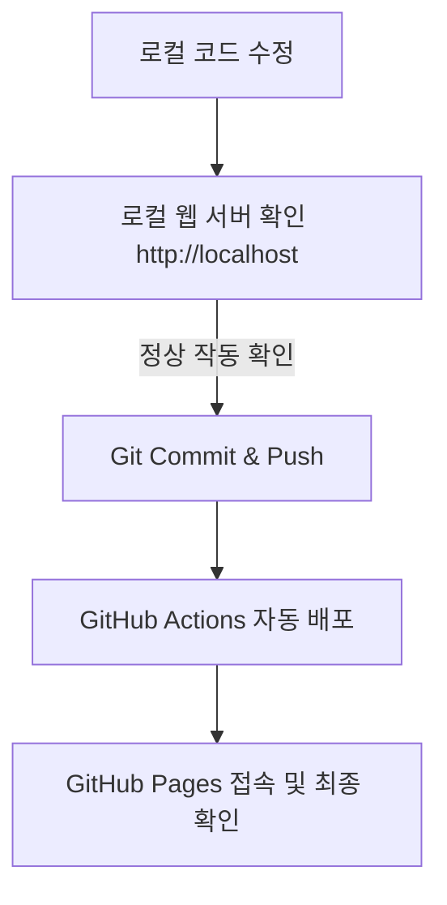

# 로컬 개발 및 배포 가이드

본 문서는 프로젝트 개발 시 발생하는 로컬 보안 이슈(CORS) 및 배포 흐름을 정리한 가이드입니다.

---

## 1. 프로젝트 특징 (무설치 개발)
- **CDN(Content Delivery Network) 방식**을 활용하여 React, Babel, Tailwind CSS 등을 로드합니다.
- 로컬 환경에 별도의 npm 패키지 설치(`node_modules` 생성)나 복잡한 빌드 사전 작업이 필요 없습니다.
- 웹브라우저와 텍스트 에디터만으로 즉시 개발이 가능합니다.

---

## 2. CORS 보안 정책 및 프로토콜 차이
로컬 HTML 파일이 외부 마크다운 파일 등을 불러올 때(Fetch API 사용 시) 브라우저 보안 정책에 의해 실행이 차단될 수 있습니다.

### ① 파일 직접 실행 (`file://`)
- **경로 예시**: `file:///C:/Users/kot77/Desktop/포트폴리오/쌤%20포폴/index.html`
- **보안 차단**: 브라우저는 출처(Origin)가 불분명한 것으로 간주하여, 악성 스크립트가 로컬 디스크 파일(예: 중요 개인 정보)을 탈취하는 것을 방지하기 위해 로컬 파일 간의 데이터를 읽어오는 행위(`fetch`)를 원천 차단합니다.
- **결과**: 화면에 마크다운 문서 본문이 렌더링되지 않고 빈 화면 또는 오류가 발생합니다.

### ② 웹 서버 실행 (`http://`)
- **경로 예시**: `http://localhost:3000/index.html`
- **보안 허용**: 특정 포트 기준의 명확한 출처가 부여되며 브라우저의 안전한 샌드박스 제어권 안에서 동작하므로, 내부 파일 리소스 요청을 정상적으로 허용합니다.

---

## 3. 로컬 서버 실행 방법
GitHub Pages에 최종 업로드하기 전, 로컬 PC에서 수정 사항을 실시간으로 확인하기 위해 가상 웹 서버를 구동해야 합니다.

### 방법 A. VS Code (Live Server 플러그인)
1. VS Code 에디터에서 `쌤 포폴` 폴더를 엽니다.
2. `Live Server` 확장 프로그램을 설치합니다.
3. 에디터 우측 하단의 **Go Live** 버튼을 클릭합니다.
4. 브라우저 창이 열리며 주소창이 `http://127.0.0.1:5500/...`으로 시작하는 것을 확인합니다.

### 방법 B. Node.js 터미널 (`npx serve`)
1. 터미널(명령 프롬프트 또는 PowerShell)을 실행합니다.
2. 프로젝트 폴더로 이동합니다:
   ```bash
   cd "C:\Users\kot77\Desktop\포트폴리오\쌤 포폴"
   ```
3. 정적 서버를 실행합니다:
   ```bash
   npx serve
   ```
4. 터미널에 출력된 주소(`http://localhost:3000` 등)를 브라우저 주소창에 입력하여 접속합니다.

---

## 4. 권장 개발 및 배포 워크플로우



1. **로컬 수정 및 검증**: 로컬 서버를 통해 즉시(실시간) 반영 결과를 테스트합니다.
2. **Git 업로드**: 검증된 코드를 Git Push를 통해 리포지토리에 반영합니다.
3. **배포**: GitHub Actions에 의해 자동으로 배포된 실시간 웹 사이트 링크에서 최종본을 확인하고 배포 링크를 공유합니다.
